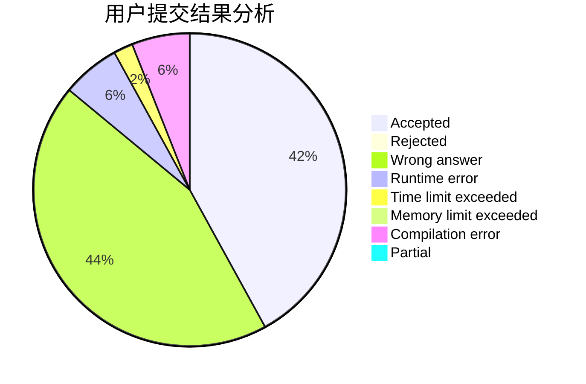
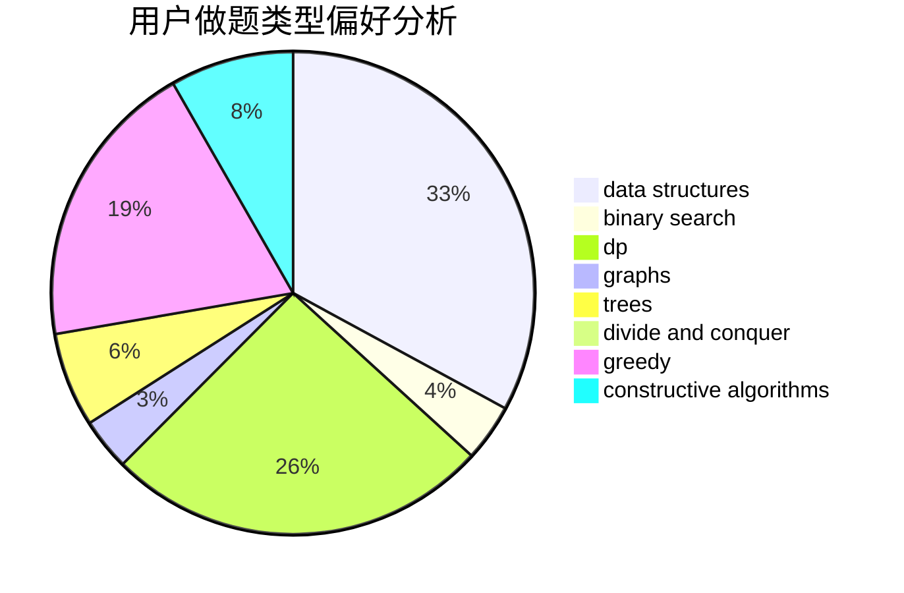
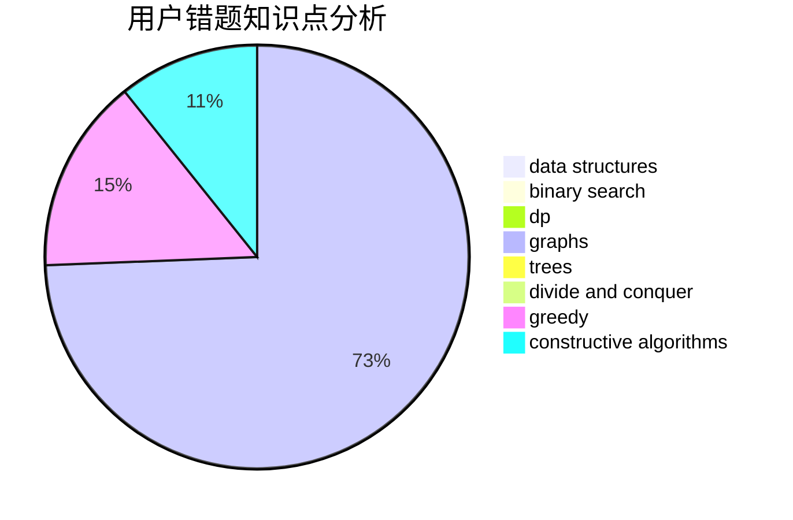

# 100yearsleft

<!-- tabs:start -->

#### **用户提交结果分析**

#### **用户做题类型偏好分析**

#### **用户错题知识点分析**

<!-- tabs:end -->
# 推荐题目
[1076E](https://codeforces.com/contest/1076/problem/E)		data structures,
                        trees		  
[1070L](https://codeforces.com/contest/1070/problem/L)		constructive algorithms		  
[1077D](https://codeforces.com/contest/1077/problem/D)		binary search,
                        sortings		  
[1073C](https://codeforces.com/contest/1073/problem/C)		binary search,
                        two pointers		  
[1072B](https://codeforces.com/contest/1072/problem/B)		dsu,graphs,sortings,trees		  
[106A](https://codeforces.com/contest/106/problem/A)		implementation		  
[1072D](https://codeforces.com/contest/1072/problem/D)		dsu,graphs,sortings,trees		  
[1076A](https://codeforces.com/contest/1076/problem/A)		greedy,
                        strings		  
[1073F](https://codeforces.com/contest/1073/problem/F)		dfs and similar,
                        dp,
                        greedy,
                        trees		  
[1074B](https://codeforces.com/contest/1074/problem/B)		dsu,graphs,sortings,trees		  
