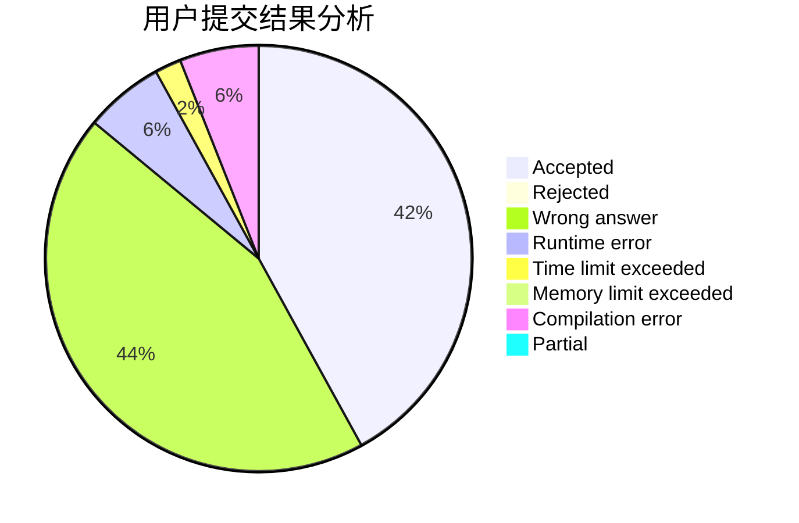
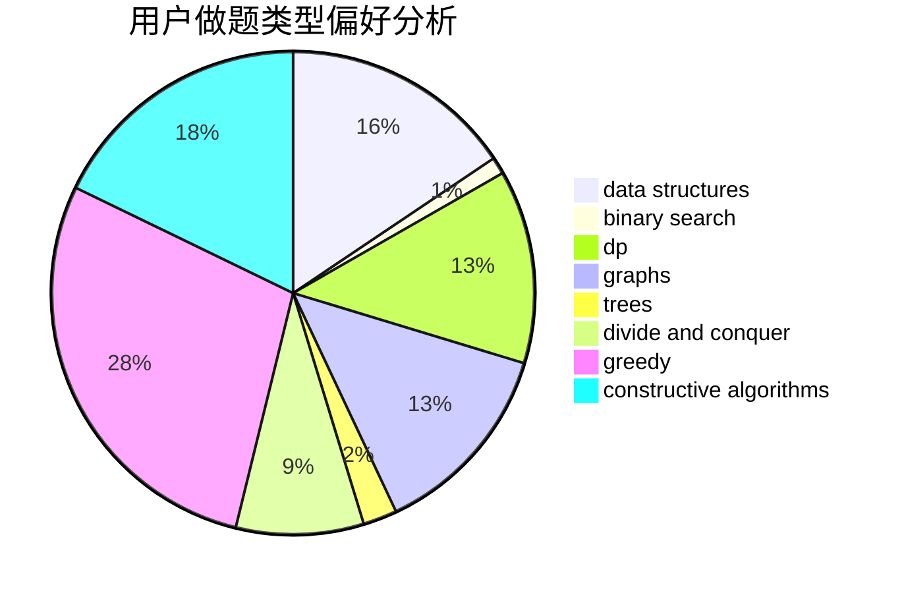
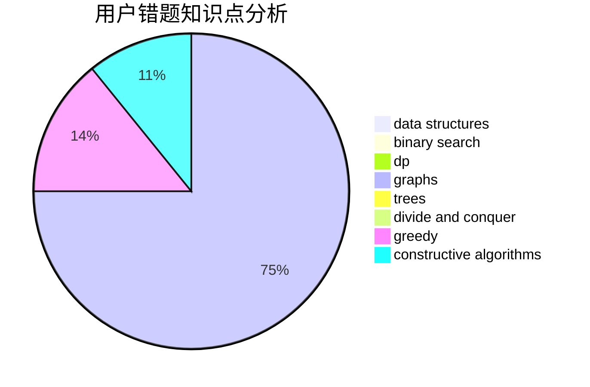

# 100yearsleft

<!-- tabs:start -->

#### **用户提交结果分析**

#### **用户做题类型偏好分析**

#### **用户错题知识点分析**

<!-- tabs:end -->
# 推荐题目
[10772](https://codeforces.com/contest/1077/problem/2)		dsu,graphs,sortings,trees		  
[1071B](https://codeforces.com/contest/1071/problem/B)		dsu,graphs,sortings,trees		  
[1077E](https://codeforces.com/contest/1077/problem/E)		greedy,
                        sortings		  
[1073F](https://codeforces.com/contest/1073/problem/F)		dfs and similar,
                        dp,
                        greedy,
                        trees		  
[1073A](https://codeforces.com/contest/1073/problem/A)		implementation,
                        strings		  
[1070A](https://codeforces.com/contest/1070/problem/A)		dp,
                        graphs,
                        number theory,
                        shortest paths		  
[1073C](https://codeforces.com/contest/1073/problem/C)		binary search,
                        two pointers		  
[1076D](https://codeforces.com/contest/1076/problem/D)		graphs,
                        greedy,
                        shortest paths		  
[1074B](https://codeforces.com/contest/1074/problem/B)		dsu,graphs,sortings,trees		  
[1076A](https://codeforces.com/contest/1076/problem/A)		greedy,
                        strings		  
