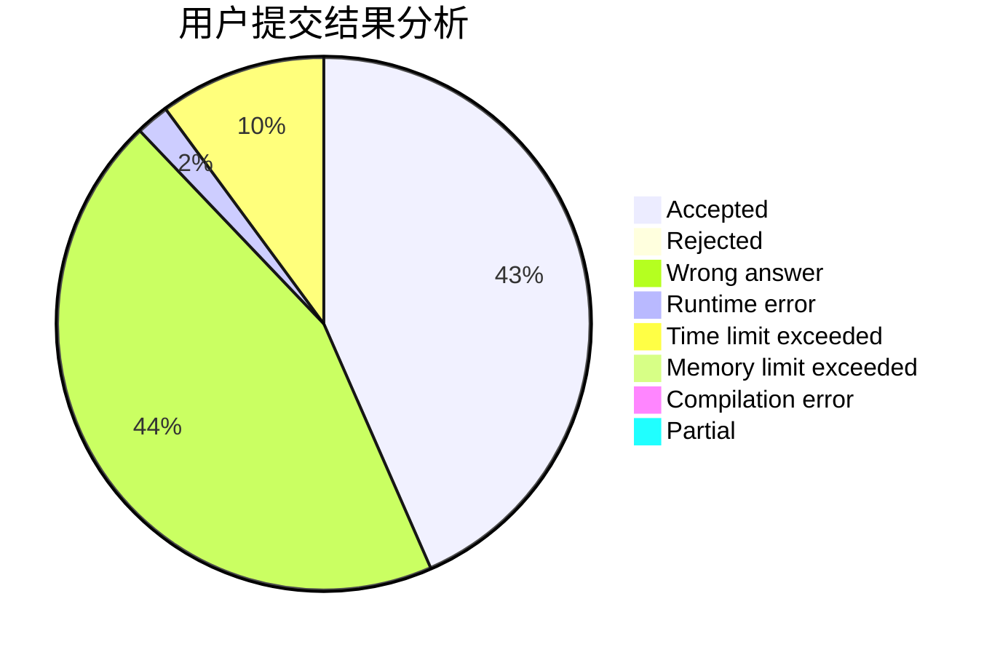
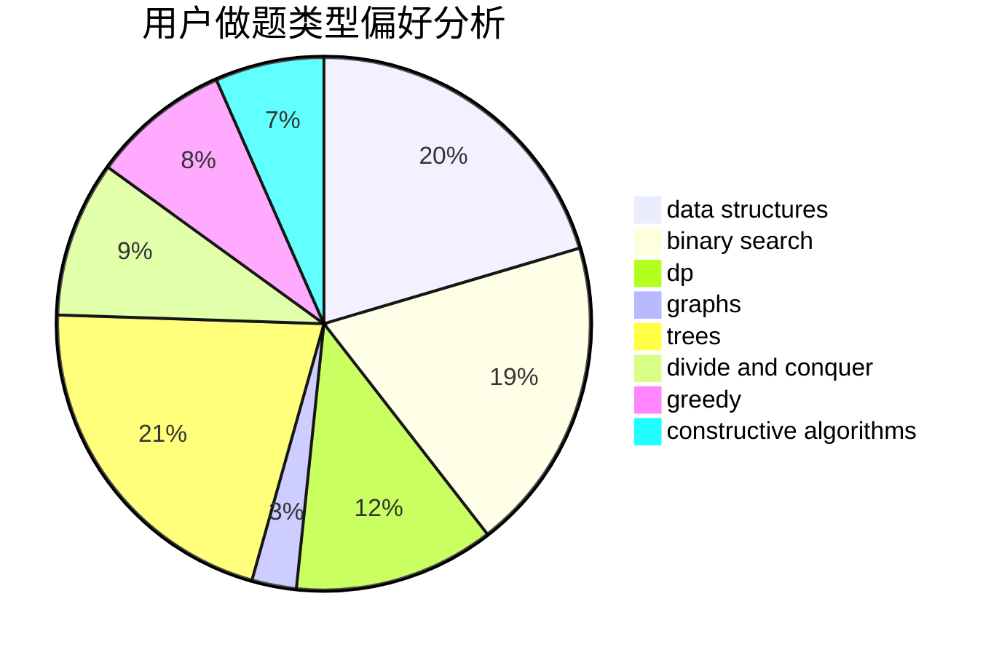
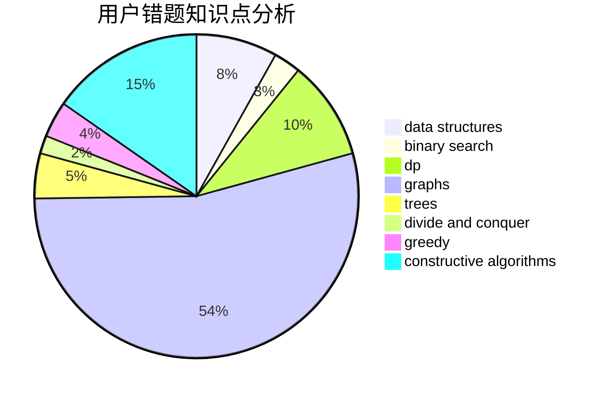

# A_Fan_of_the_AK_King--lk

<!-- tabs:start -->

#### **用户提交结果分析**

#### **用户做题类型偏好分析**

#### **用户错题知识点分析**

<!-- tabs:end -->
# 推荐题目
[1470E](https://codeforces.com/contest/1470/problem/E)		binary search,
                        combinatorics,
                        data structures,
                        dp,
                        graphs,
                        implementation,
                        two pointers		  
[1321B](https://codeforces.com/contest/1321/problem/B)		dsu,graphs,sortings,trees		  
[1298D](https://codeforces.com/contest/1298/problem/D)		dsu,graphs,sortings,trees		  
[1509F](https://codeforces.com/contest/1509/problem/F)		dsu,graphs,sortings,trees		  
[160A](https://codeforces.com/contest/160/problem/A)		greedy,
                        sortings		  
[11302](https://codeforces.com/contest/1130/problem/2)		dsu,graphs,sortings,trees		  
[159D](https://codeforces.com/contest/159/problem/D)		*special problem,
                        brute force,
                        dp,
                        strings		  
[158C](https://codeforces.com/contest/158/problem/C)		*special problem,
                        data structures,
                        implementation		  
[160D](https://codeforces.com/contest/160/problem/D)		dfs and similar,
                        dsu,
                        graphs,
                        sortings		  
[158E](https://codeforces.com/contest/158/problem/E)		*special problem,
                        dp,
                        sortings		  
