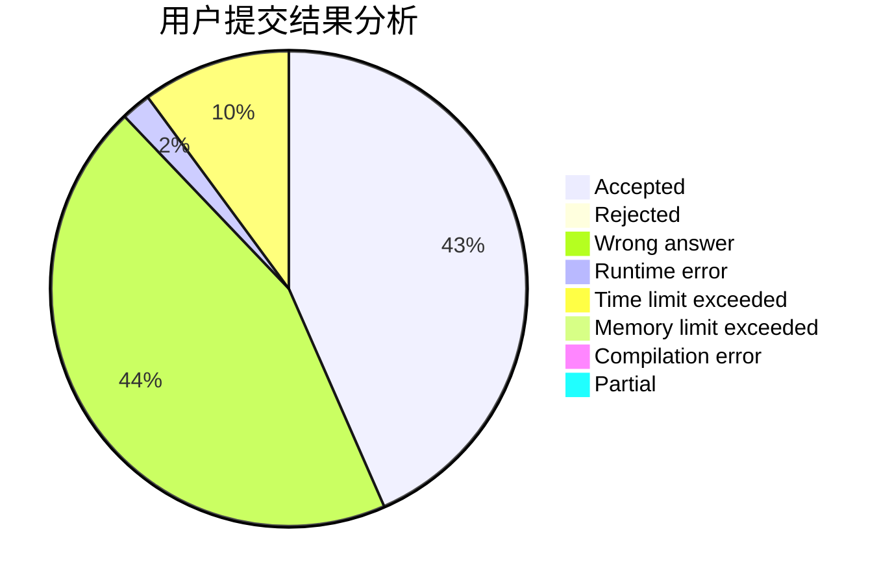
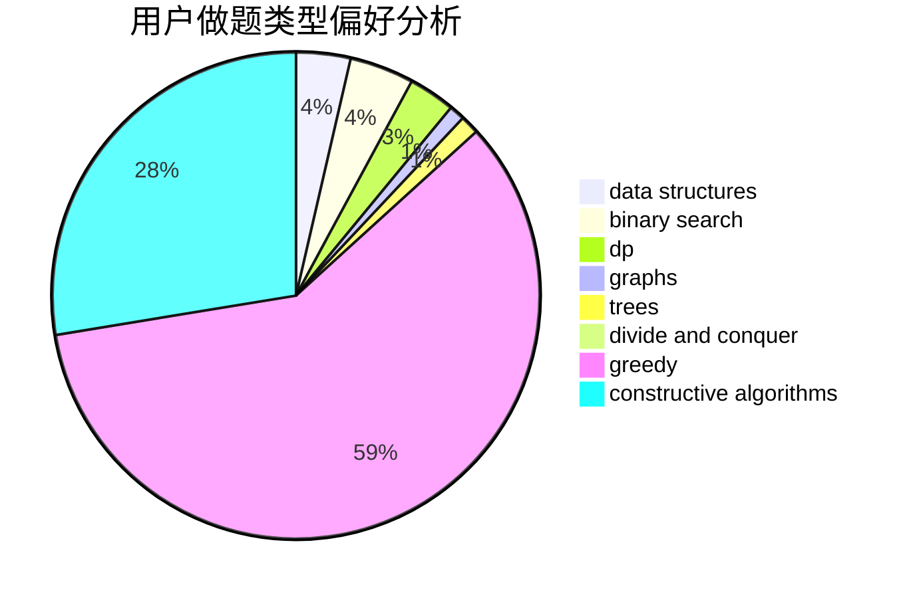
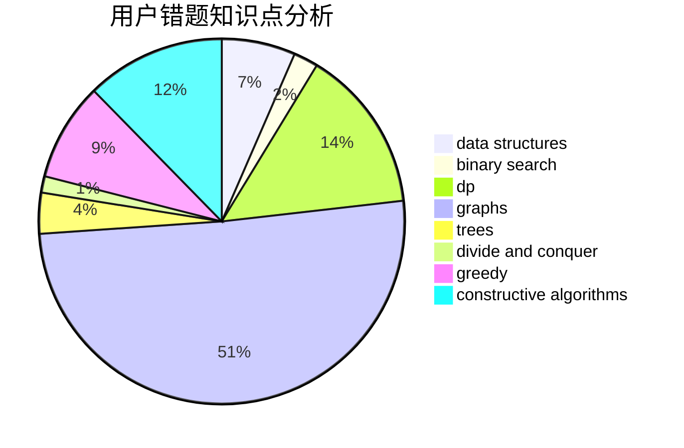

# A_Fan_of_the_AK_King--lk

<!-- tabs:start -->

#### **用户提交结果分析**

#### **用户做题类型偏好分析**

#### **用户错题知识点分析**

<!-- tabs:end -->
# 推荐题目
[1463D](https://codeforces.com/contest/1463/problem/D)		binary search,
                        constructive algorithms,
                        greedy,
                        two pointers		  
[1311F](https://codeforces.com/contest/1311/problem/F)		data structures,
                        divide and conquer,
                        implementation,
                        sortings		  
[1291E](https://codeforces.com/contest/1291/problem/E)		dsu,graphs,sortings,trees		  
[1499F](https://codeforces.com/contest/1499/problem/F)		combinatorics,
                        dfs and similar,
                        dp,
                        trees		  
[1509C](https://codeforces.com/contest/1509/problem/C)		dp,
                        greedy		  
[1120F](https://codeforces.com/contest/1120/problem/F)		data structures,
                        dp,
                        greedy		  
[1508B](https://codeforces.com/contest/1508/problem/B)		binary search,
                        bitmasks,
                        combinatorics,
                        constructive algorithms,
                        implementation,
                        math		  
[1506F](https://codeforces.com/contest/1506/problem/F)		constructive algorithms,
                        graphs,
                        math,
                        shortest paths,
                        sortings		  
[1509F](https://codeforces.com/contest/1509/problem/F)		dsu,graphs,sortings,trees		  
[1508A](https://codeforces.com/contest/1508/problem/A)		constructive algorithms,
                        greedy,
                        implementation,
                        math,
                        strings,
                        two pointers		  
