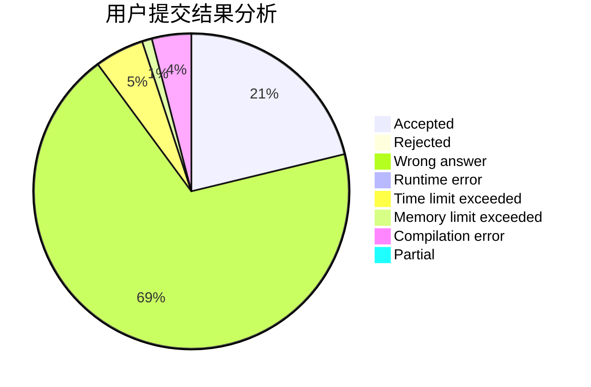
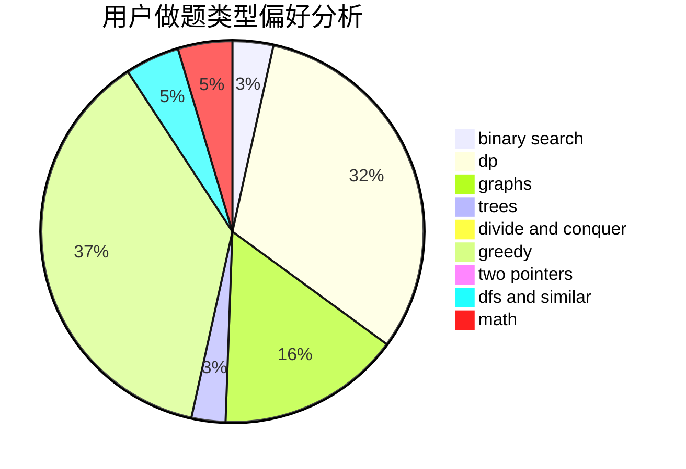

# So_Fool_OvO

<!-- tabs:start -->

#### **用户提交结果分析**

#### **用户做题类型偏好分析**

<!-- tabs:end -->
# 推荐题目
[1442B](https://codeforces.com/contest/1442/problem/B)
[1038D](https://codeforces.com/contest/1038/problem/D)
[835E](https://codeforces.com/contest/835/problem/E)
[121E](https://codeforces.com/contest/121/problem/E)
[100A](https://codeforces.com/contest/100/problem/A)
[575H](https://codeforces.com/contest/575/problem/H)
[592D](https://codeforces.com/contest/592/problem/D)
[1205B](https://codeforces.com/contest/1205/problem/B)
[476E](https://codeforces.com/contest/476/problem/E)
[1239F](https://codeforces.com/contest/1239/problem/F)
