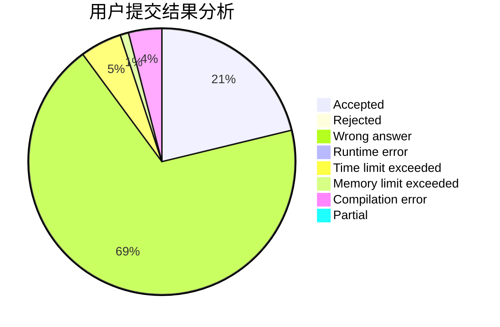
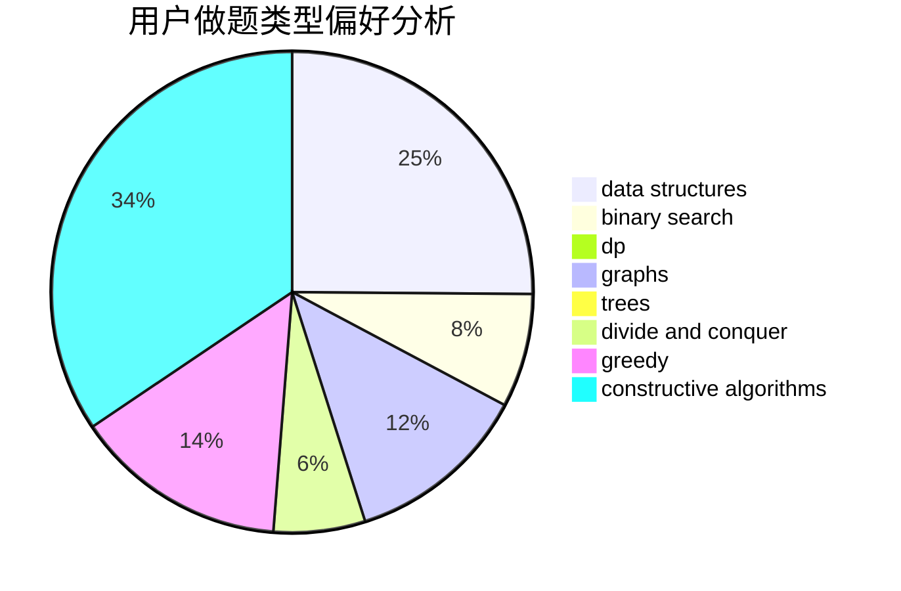
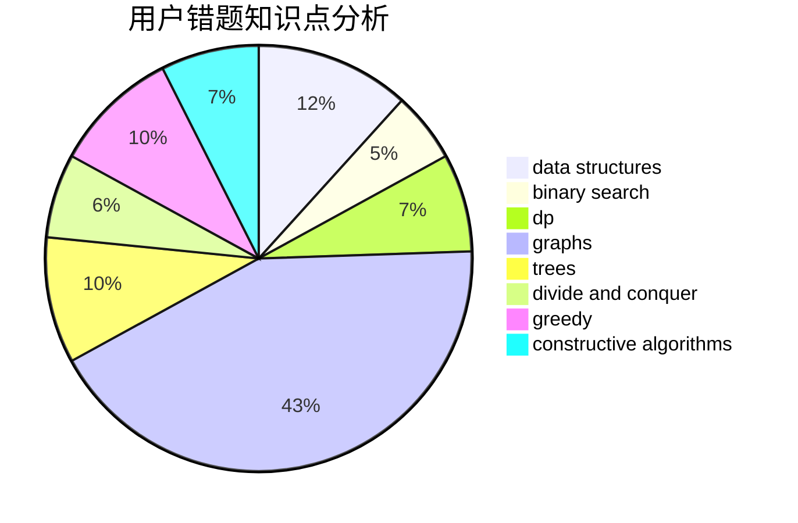

# So_Fool_OvO

<!-- tabs:start -->

#### **用户提交结果分析**

#### **用户做题类型偏好分析**

#### **用户错题知识点分析**

<!-- tabs:end -->
# 推荐题目
[1432C](https://codeforces.com/contest/1432/problem/C)		dsu,graphs,sortings,trees		  
[1038A](https://codeforces.com/contest/1038/problem/A)		implementation,
                        strings		  
[816D](https://codeforces.com/contest/816/problem/D)		dsu,graphs,sortings,trees		  
[1214D](https://codeforces.com/contest/1214/problem/D)		dfs and similar,
                        dp,
                        flows,
                        hashing		  
[1009E](https://codeforces.com/contest/1009/problem/E)		combinatorics,
                        math,
                        probabilities		  
[550D](https://codeforces.com/contest/550/problem/D)		constructive algorithms,
                        graphs,
                        implementation		  
[573B](https://codeforces.com/contest/573/problem/B)		binary search,
                        data structures,
                        dp,
                        math		  
[1200C](https://codeforces.com/contest/1200/problem/C)		math,
                        number theory		  
[455D](https://codeforces.com/contest/455/problem/D)		data structures		  
[1234B1](https://codeforces.com/contest/1234B/problem/1)		implementation		  
