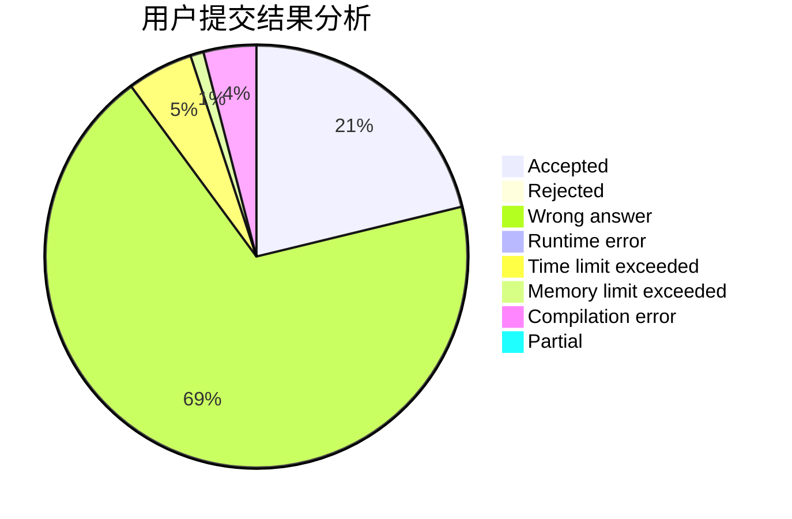
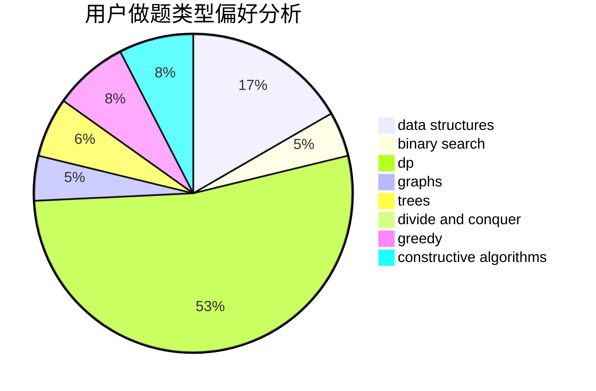
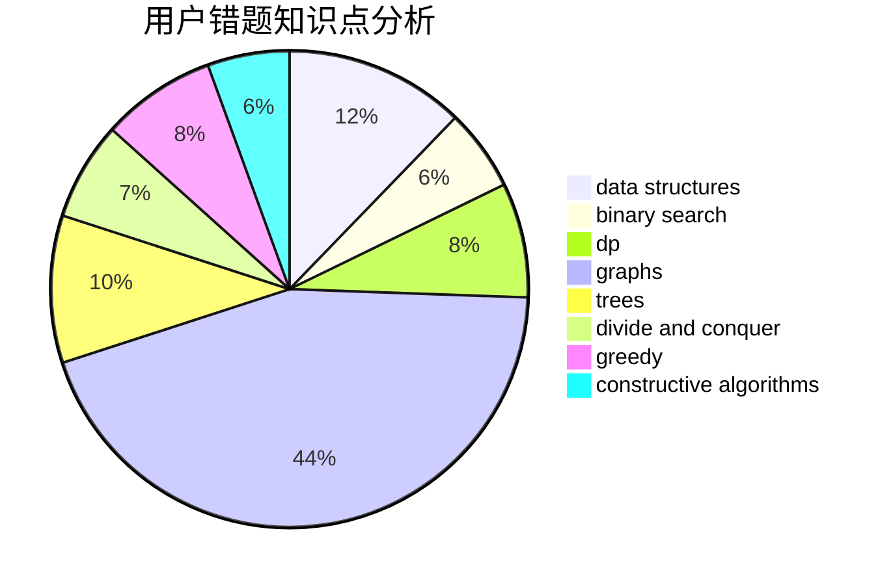

# So_Fool_OvO

<!-- tabs:start -->

#### **用户提交结果分析**

#### **用户做题类型偏好分析**

#### **用户错题知识点分析**

<!-- tabs:end -->
# 推荐题目
[1442B](https://codeforces.com/contest/1442/problem/B)		combinatorics,
                        data structures,
                        dsu,
                        greedy,
                        implementation		  
[1038D](https://codeforces.com/contest/1038/problem/D)		dp,
                        greedy,
                        implementation		  
[835E](https://codeforces.com/contest/835/problem/E)		binary search,
                        constructive algorithms,
                        interactive		  
[121E](https://codeforces.com/contest/121/problem/E)		data structures		  
[100A](https://codeforces.com/contest/100/problem/A)		*special problem,
                        implementation		  
[575H](https://codeforces.com/contest/575/problem/H)		combinatorics,
                        number theory		  
[592D](https://codeforces.com/contest/592/problem/D)		dfs and similar,
                        dp,
                        graphs,
                        trees		  
[1205B](https://codeforces.com/contest/1205/problem/B)		bitmasks,
                        brute force,
                        graphs,
                        shortest paths		  
[476E](https://codeforces.com/contest/476/problem/E)		dp,
                        strings		  
[1239F](https://codeforces.com/contest/1239/problem/F)		graphs,
                        implementation		  
