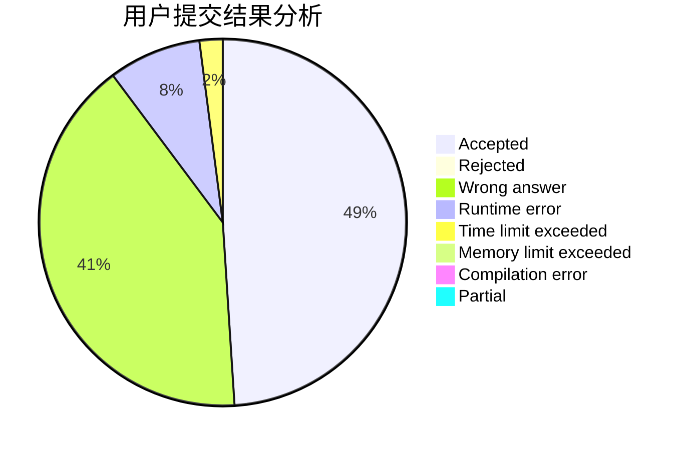
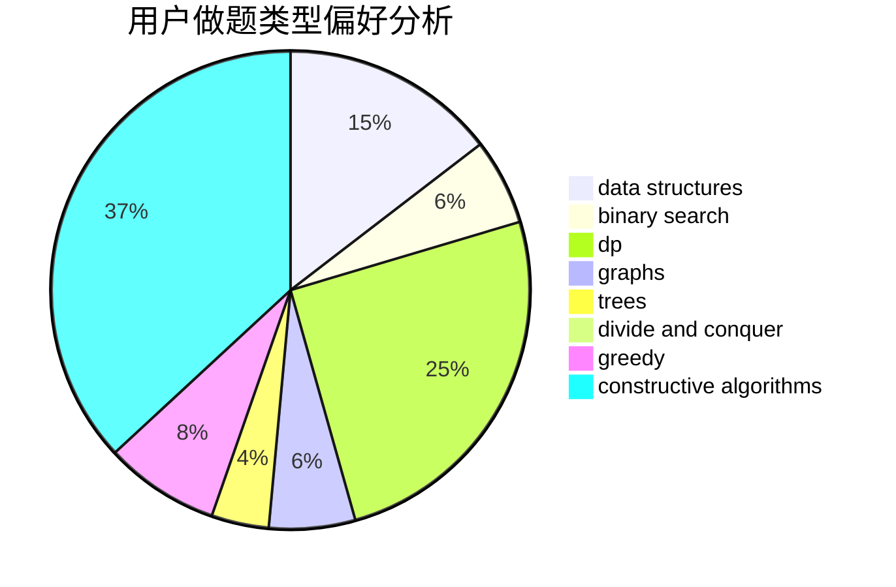

# Solashiro

<!-- tabs:start -->

#### **用户提交结果分析**

#### **用户做题类型偏好分析**

#### **用户错题知识点分析**

<!-- tabs:end -->
# 推荐题目
[895B](https://codeforces.com/contest/895/problem/B)		binary search,
                        math,
                        sortings,
                        two pointers		  
[1059A](https://codeforces.com/contest/1059/problem/A)		implementation		  
[1267F](https://codeforces.com/contest/1267/problem/F)		graphs		  
[936A](https://codeforces.com/contest/936/problem/A)		binary search,
                        implementation,
                        math		  
[560A](https://codeforces.com/contest/560/problem/A)		implementation,
                        sortings		  
[30C](https://codeforces.com/contest/30/problem/C)		dp,
                        probabilities		  
[549B](https://codeforces.com/contest/549/problem/B)		constructive algorithms,
                        dfs and similar,
                        graphs,
                        greedy		  
[216C](https://codeforces.com/contest/216/problem/C)		greedy		  
[1200A](https://codeforces.com/contest/1200/problem/A)		brute force,
                        data structures,
                        implementation		  
[856E](https://codeforces.com/contest/856/problem/E)		nan		  
