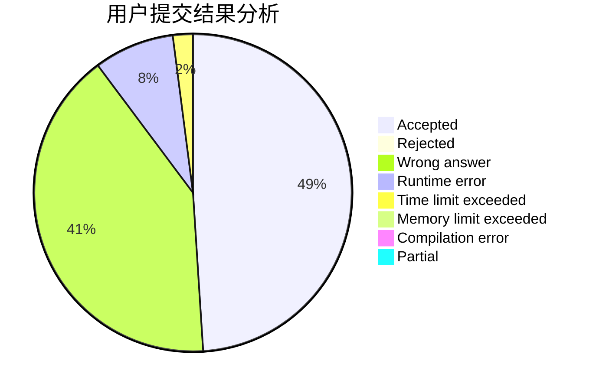
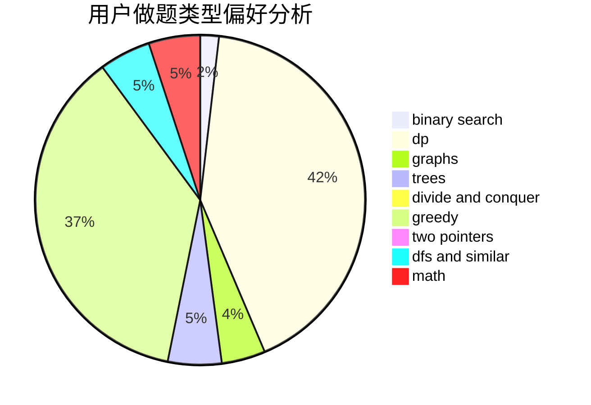

# Solashiro

<!-- tabs:start -->

#### **用户提交结果分析**

#### **用户做题类型偏好分析**

<!-- tabs:end -->
# 推荐题目
[895B](https://codeforces.com/contest/895/problem/B)
[1059A](https://codeforces.com/contest/1059/problem/A)
[1267F](https://codeforces.com/contest/1267/problem/F)
[936A](https://codeforces.com/contest/936/problem/A)
[560A](https://codeforces.com/contest/560/problem/A)
[30C](https://codeforces.com/contest/30/problem/C)
[549B](https://codeforces.com/contest/549/problem/B)
[216C](https://codeforces.com/contest/216/problem/C)
[1200A](https://codeforces.com/contest/1200/problem/A)
[856E](https://codeforces.com/contest/856/problem/E)
