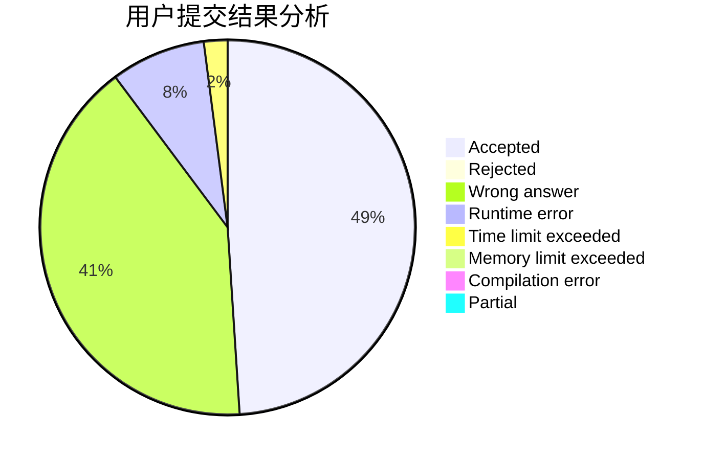
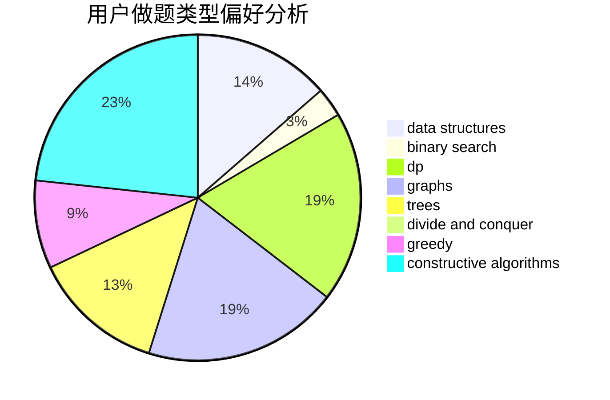

# Solashiro

<!-- tabs:start -->

#### **用户提交结果分析**

#### **用户做题类型偏好分析**

#### **用户错题知识点分析**

<!-- tabs:end -->
# 推荐题目
[875B](https://codeforces.com/contest/875/problem/B)		dsu,
                        implementation,
                        sortings,
                        two pointers		  
[1058C](https://codeforces.com/contest/1058/problem/C)		dsu,graphs,sortings,trees		  
[1261E](https://codeforces.com/contest/1261/problem/E)		dsu,graphs,sortings,trees		  
[916A](https://codeforces.com/contest/916/problem/A)		brute force,
                        implementation,
                        math		  
[53D](https://codeforces.com/contest/53/problem/D)		sortings		  
[294B](https://codeforces.com/contest/294/problem/B)		dp,
                        greedy		  
[524E](https://codeforces.com/contest/524/problem/E)		data structures,
                        sortings		  
[193B](https://codeforces.com/contest/193/problem/B)		brute force		  
[1196D2](https://codeforces.com/contest/1196D/problem/2)		data structures,
                        dp,
                        implementation,
                        two pointers		  
[838E](https://codeforces.com/contest/838/problem/E)		dp		  
