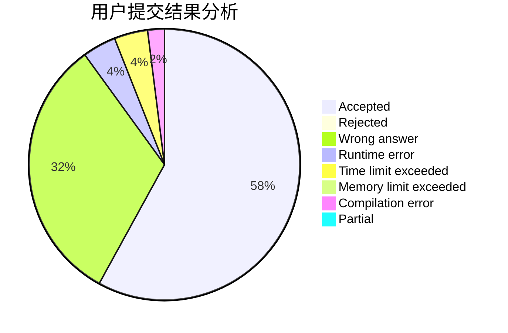
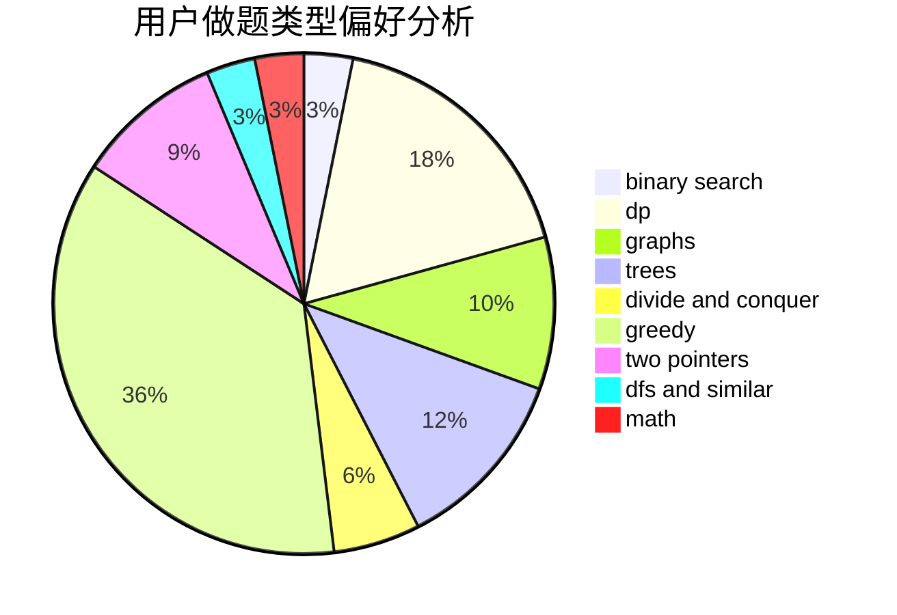

# SongGG

<!-- tabs:start -->

#### **用户提交结果分析**

#### **用户做题类型偏好分析**

<!-- tabs:end -->
# 推荐题目
[67A](https://codeforces.com/contest/67/problem/A)
[1339C](https://codeforces.com/contest/1339/problem/C)
[940A](https://codeforces.com/contest/940/problem/A)
[908F](https://codeforces.com/contest/908/problem/F)
[11962](https://codeforces.com/contest/1196/problem/2)
[281D](https://codeforces.com/contest/281/problem/D)
[260B](https://codeforces.com/contest/260/problem/B)
[1019E](https://codeforces.com/contest/1019/problem/E)
[67B](https://codeforces.com/contest/67/problem/B)
[1033B](https://codeforces.com/contest/1033/problem/B)
