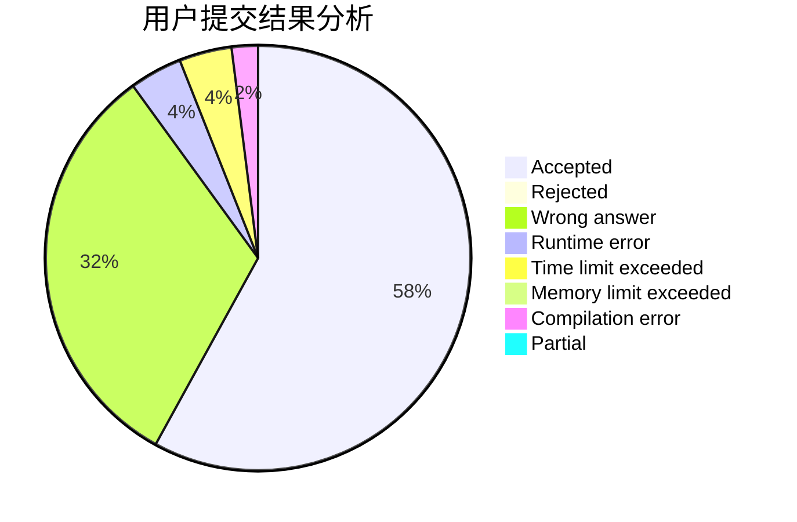
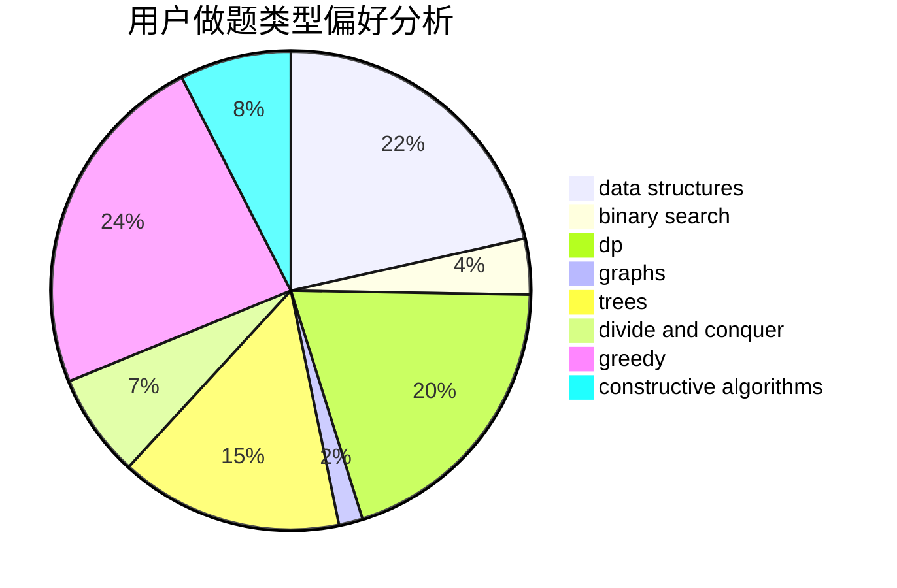
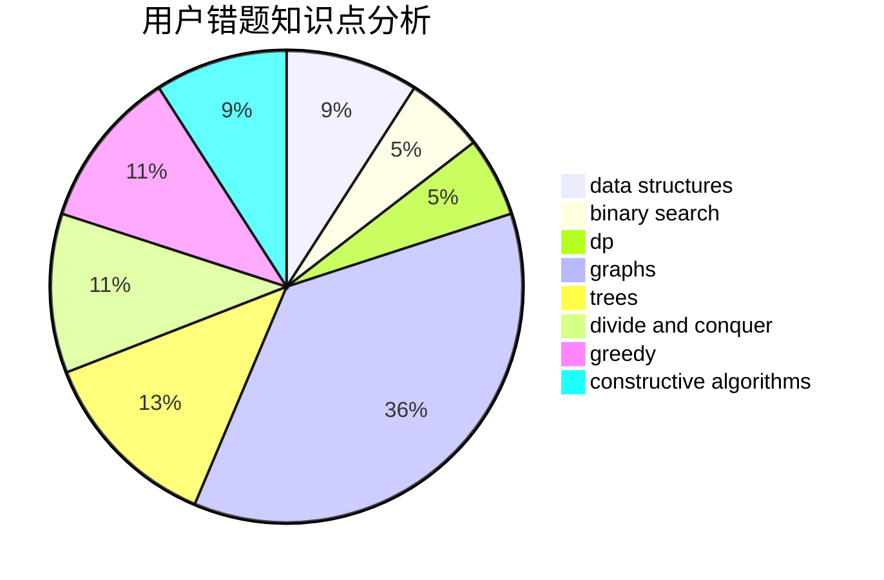

# SongGG

<!-- tabs:start -->

#### **用户提交结果分析**

#### **用户做题类型偏好分析**

#### **用户错题知识点分析**

<!-- tabs:end -->
# 推荐题目
[67A](https://codeforces.com/contest/67/problem/A)		dp,
                        graphs,
                        greedy,
                        implementation		  
[1339C](https://codeforces.com/contest/1339/problem/C)		dsu,graphs,sortings,trees		  
[940A](https://codeforces.com/contest/940/problem/A)		brute force,
                        greedy,
                        sortings		  
[908F](https://codeforces.com/contest/908/problem/F)		graphs,
                        greedy,
                        implementation		  
[11962](https://codeforces.com/contest/1196/problem/2)		dsu,graphs,sortings,trees		  
[281D](https://codeforces.com/contest/281/problem/D)		dsu,graphs,sortings,trees		  
[260B](https://codeforces.com/contest/260/problem/B)		brute force,
                        implementation,
                        strings		  
[1019E](https://codeforces.com/contest/1019/problem/E)		data structures,
                        divide and conquer,
                        trees		  
[67B](https://codeforces.com/contest/67/problem/B)		greedy		  
[1033B](https://codeforces.com/contest/1033/problem/B)		math,
                        number theory		  
