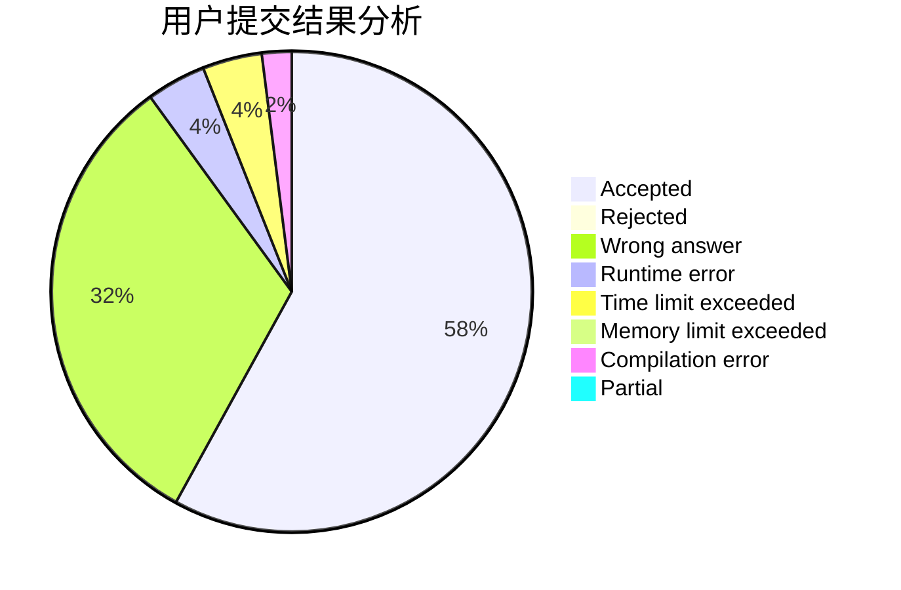
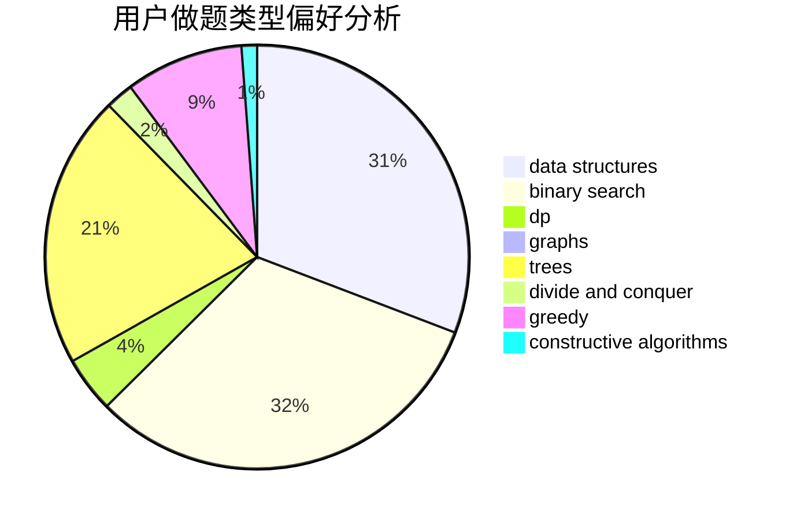
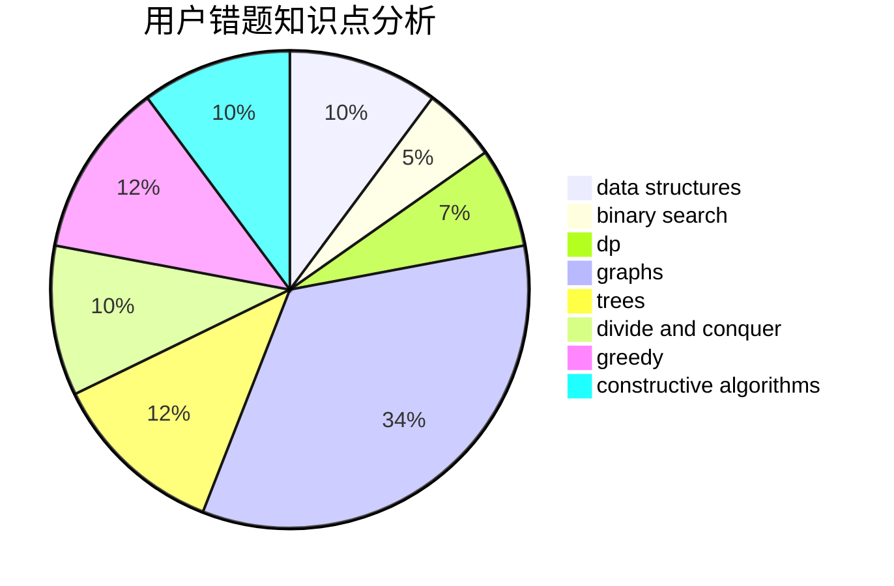

# SongGG

<!-- tabs:start -->

#### **用户提交结果分析**

#### **用户做题类型偏好分析**

#### **用户错题知识点分析**

<!-- tabs:end -->
# 推荐题目
[659F](https://codeforces.com/contest/659/problem/F)		dfs and similar,
                        dsu,
                        graphs,
                        greedy,
                        sortings		  
[1332F](https://codeforces.com/contest/1332/problem/F)		dfs and similar,
                        dp,
                        trees		  
[920A](https://codeforces.com/contest/920/problem/A)		implementation		  
[888G](https://codeforces.com/contest/888/problem/G)		bitmasks,
                        constructive algorithms,
                        data structures		  
[1190B](https://codeforces.com/contest/1190/problem/B)		games		  
[266A](https://codeforces.com/contest/266/problem/A)		implementation		  
[238E](https://codeforces.com/contest/238/problem/E)		dp,
                        graphs,
                        shortest paths		  
[1019A](https://codeforces.com/contest/1019/problem/A)		brute force,
                        greedy		  
[659G](https://codeforces.com/contest/659/problem/G)		combinatorics,
                        dp,
                        number theory		  
[1032E](https://codeforces.com/contest/1032/problem/E)		dp,
                        math		  
