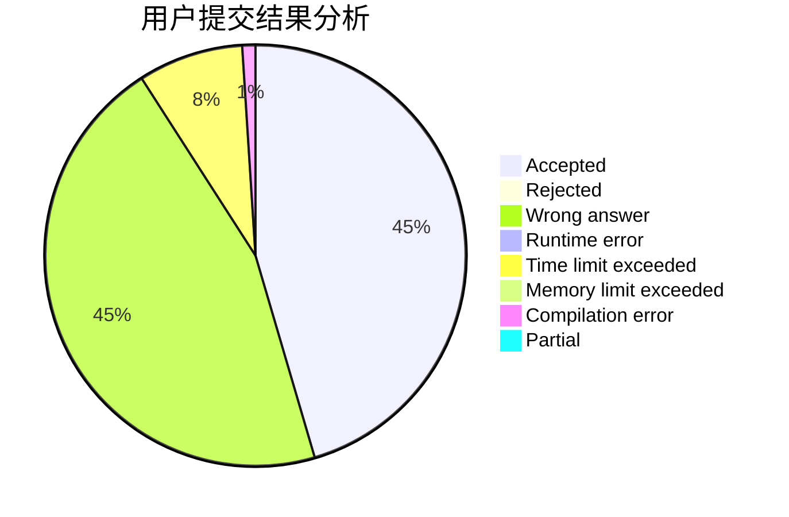
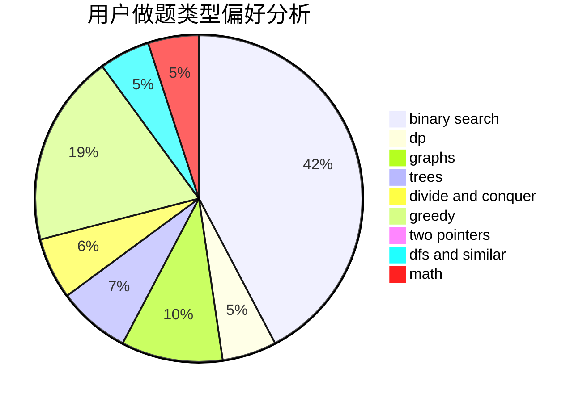

# Sooke

<!-- tabs:start -->

#### **用户提交结果分析**

#### **用户做题类型偏好分析**

<!-- tabs:end -->
# 推荐题目
[1039B](https://codeforces.com/contest/1039/problem/B)
[353A](https://codeforces.com/contest/353/problem/A)
[689A](https://codeforces.com/contest/689/problem/A)
[1300C](https://codeforces.com/contest/1300/problem/C)
[1423H](https://codeforces.com/contest/1423/problem/H)
[218C](https://codeforces.com/contest/218/problem/C)
[474B](https://codeforces.com/contest/474/problem/B)
[1488B](https://codeforces.com/contest/1488/problem/B)
[222E](https://codeforces.com/contest/222/problem/E)
[11851](https://codeforces.com/contest/1185/problem/1)
