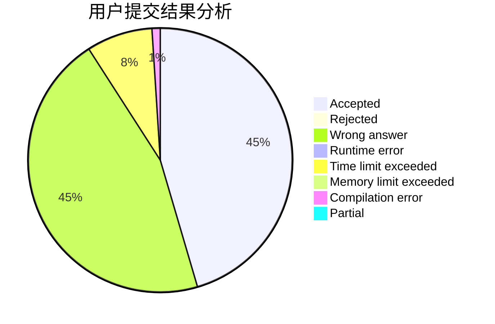
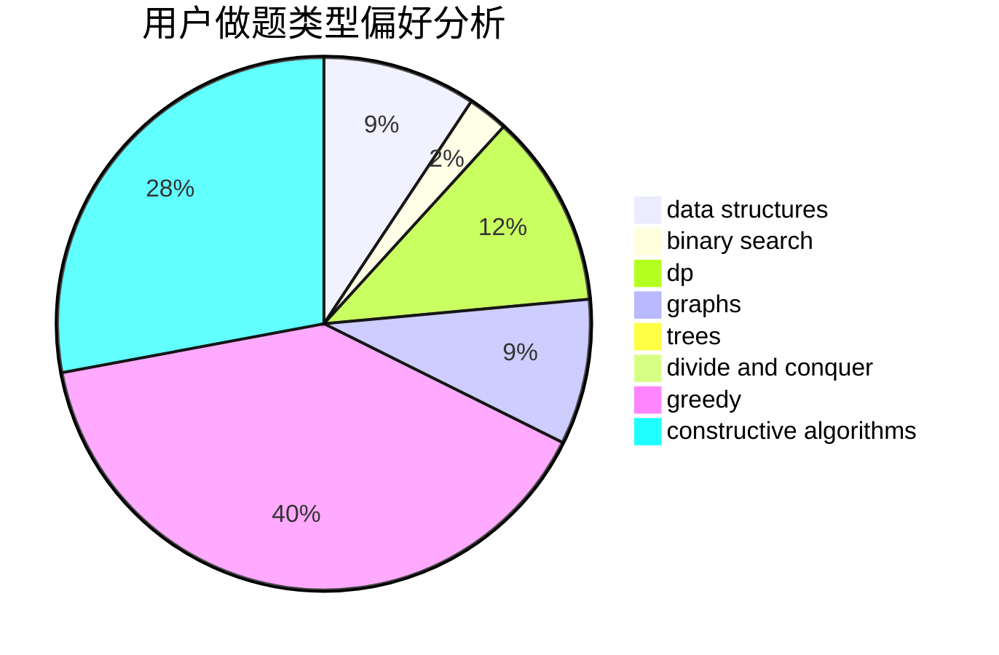

# Sooke

<!-- tabs:start -->

#### **用户提交结果分析**

#### **用户做题类型偏好分析**

#### **用户错题知识点分析**

<!-- tabs:end -->
# 推荐题目
[1038D](https://codeforces.com/contest/1038/problem/D)		dp,
                        greedy,
                        implementation		  
[321D](https://codeforces.com/contest/321/problem/D)		dp,
                        greedy,
                        math		  
[667A](https://codeforces.com/contest/667/problem/A)		geometry,
                        math		  
[1294A](https://codeforces.com/contest/1294/problem/A)		math		  
[1415D](https://codeforces.com/contest/1415/problem/D)		bitmasks,
                        brute force,
                        constructive algorithms		  
[195C](https://codeforces.com/contest/195/problem/C)		expression parsing,
                        implementation		  
[452B](https://codeforces.com/contest/452/problem/B)		brute force,
                        constructive algorithms,
                        geometry,
                        trees		  
[1479D](https://codeforces.com/contest/1479/problem/D)		binary search,
                        bitmasks,
                        brute force,
                        data structures,
                        probabilities,
                        trees		  
[19C](https://codeforces.com/contest/19/problem/C)		greedy,
                        hashing,
                        string suffix structures		  
[1182C](https://codeforces.com/contest/1182/problem/C)		data structures,
                        greedy,
                        strings		  
