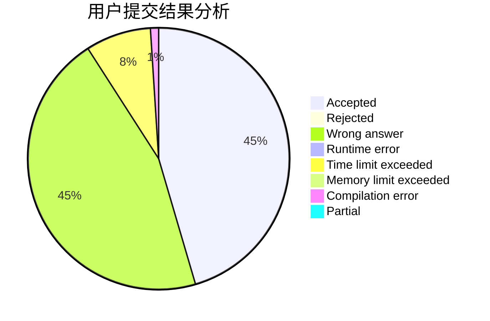
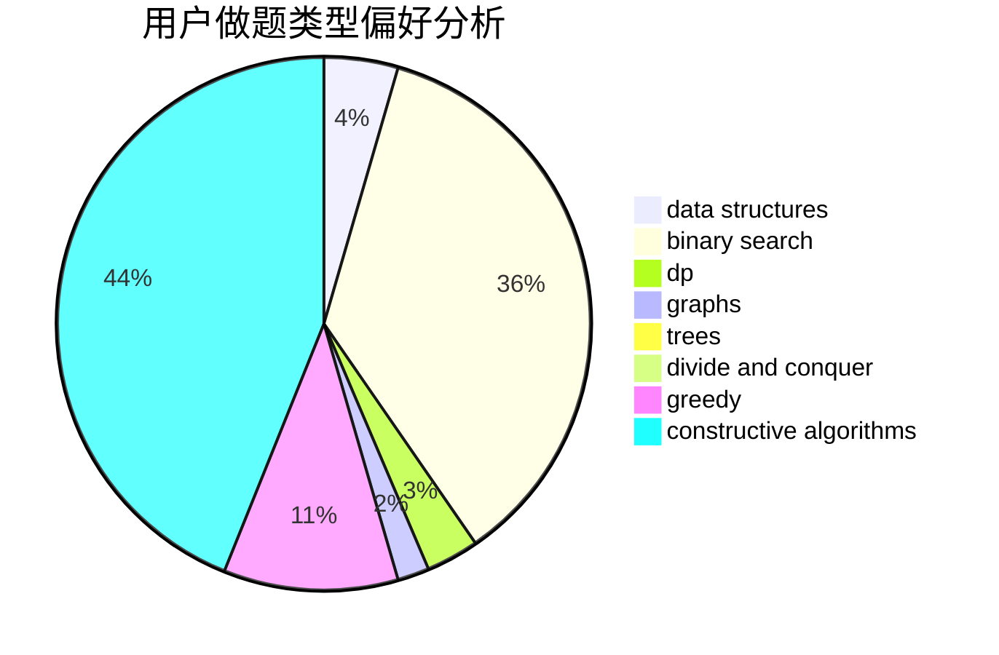

# Sooke

<!-- tabs:start -->

#### **用户提交结果分析**

#### **用户做题类型偏好分析**

#### **用户错题知识点分析**

<!-- tabs:end -->
# 推荐题目
[1039B](https://codeforces.com/contest/1039/problem/B)		binary search,
                        interactive,
                        probabilities		  
[353A](https://codeforces.com/contest/353/problem/A)		implementation,
                        math		  
[689A](https://codeforces.com/contest/689/problem/A)		brute force,
                        constructive algorithms,
                        implementation		  
[1300C](https://codeforces.com/contest/1300/problem/C)		dsu,graphs,sortings,trees		  
[1423H](https://codeforces.com/contest/1423/problem/H)		data structures,
                        divide and conquer,
                        dsu,
                        graphs		  
[218C](https://codeforces.com/contest/218/problem/C)		dsu,graphs,sortings,trees		  
[474B](https://codeforces.com/contest/474/problem/B)		binary search,
                        implementation		  
[1488B](https://codeforces.com/contest/1488/problem/B)		*special problem,
                        greedy		  
[222E](https://codeforces.com/contest/222/problem/E)		dp,
                        matrices		  
[11851](https://codeforces.com/contest/1185/problem/1)		dsu,graphs,sortings,trees		  
