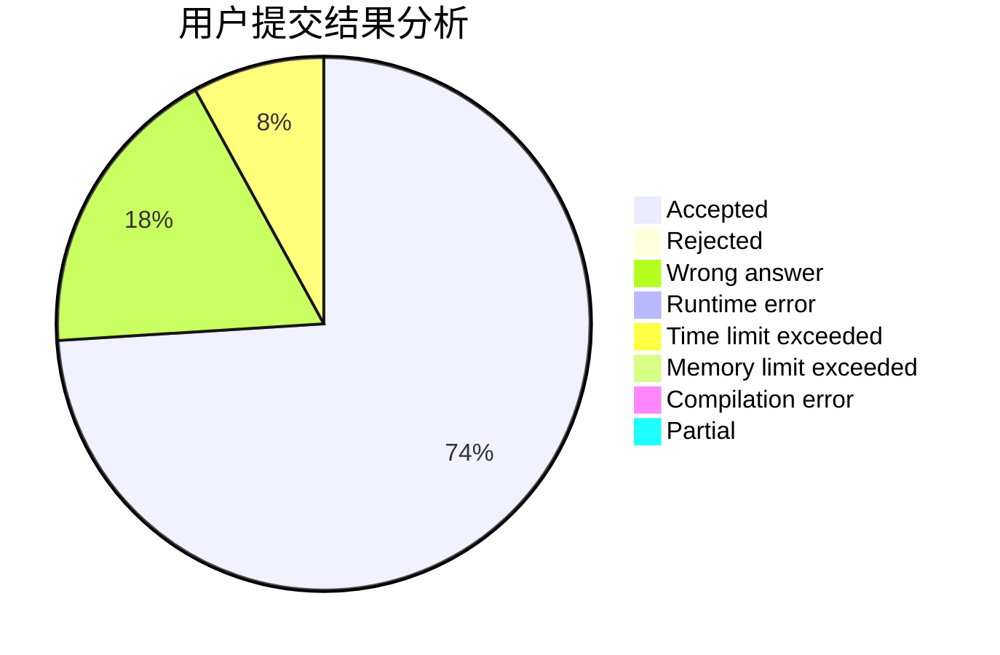
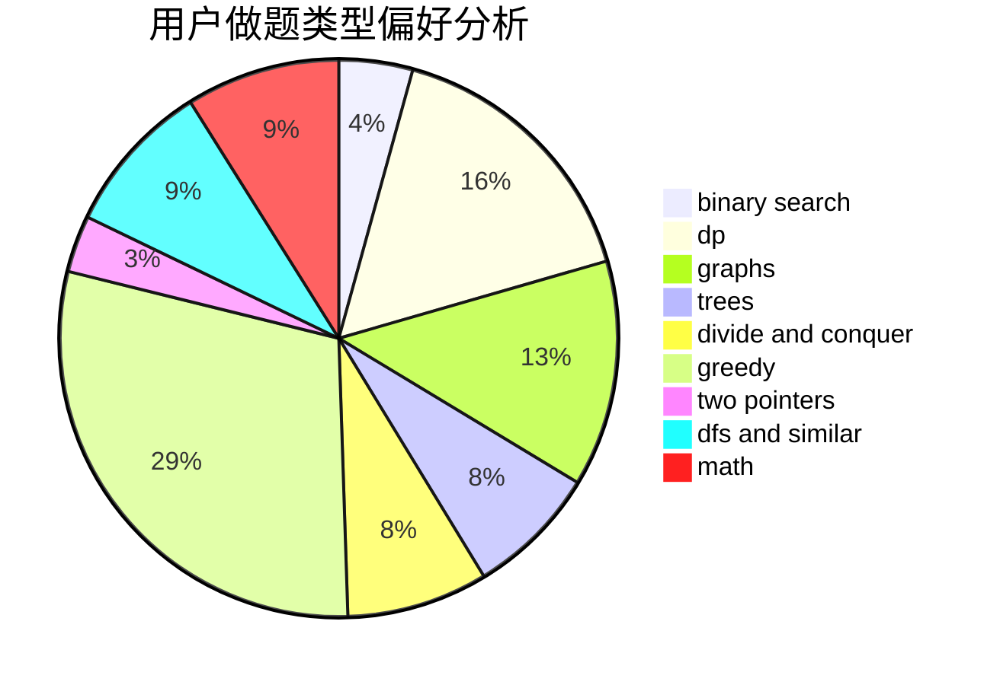

# Sophon1984

<!-- tabs:start -->

#### **用户提交结果分析**

#### **用户做题类型偏好分析**

<!-- tabs:end -->
# 推荐题目
[234A](https://codeforces.com/contest/234/problem/A)
[1131A](https://codeforces.com/contest/1131/problem/A)
[58E](https://codeforces.com/contest/58/problem/E)
[1145B](https://codeforces.com/contest/1145/problem/B)
[1091H](https://codeforces.com/contest/1091/problem/H)
[925F](https://codeforces.com/contest/925/problem/F)
[681E](https://codeforces.com/contest/681/problem/E)
[1168C](https://codeforces.com/contest/1168/problem/C)
[671E](https://codeforces.com/contest/671/problem/E)
[764C](https://codeforces.com/contest/764/problem/C)
