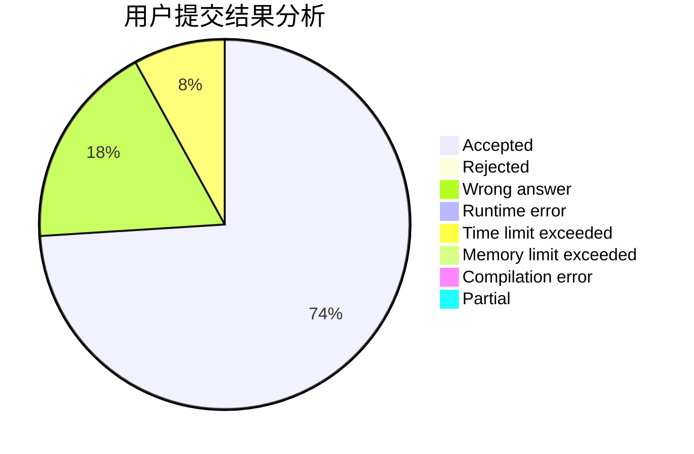
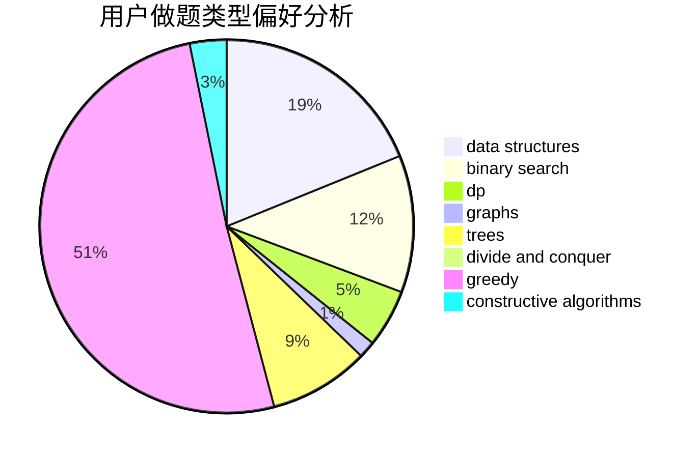
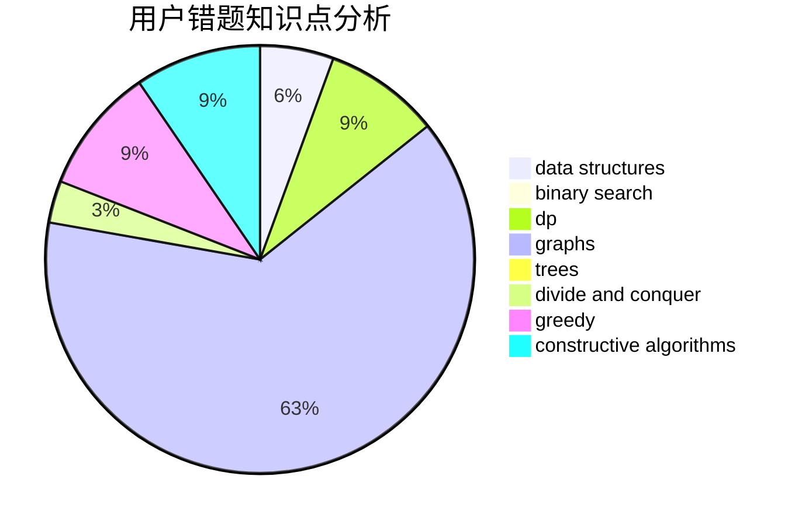

# Sophon1984

<!-- tabs:start -->

#### **用户提交结果分析**

#### **用户做题类型偏好分析**

#### **用户错题知识点分析**

<!-- tabs:end -->
# 推荐题目
[215B](https://codeforces.com/contest/215/problem/B)		greedy,
                        math		  
[1129A2](https://codeforces.com/contest/1129A/problem/2)		brute force,
                        greedy		  
[56B](https://codeforces.com/contest/56/problem/B)		implementation		  
[1143B](https://codeforces.com/contest/1143/problem/B)		brute force,
                        math,
                        number theory		  
[1091E](https://codeforces.com/contest/1091/problem/E)		binary search,
                        data structures,
                        graphs,
                        greedy,
                        implementation,
                        math,
                        sortings		  
[911A](https://codeforces.com/contest/911/problem/A)		implementation		  
[660F](https://codeforces.com/contest/660/problem/F)		binary search,
                        data structures,
                        geometry,
                        ternary search		  
[1165F2](https://codeforces.com/contest/1165F/problem/2)		binary search,
                        greedy,
                        implementation		  
[645D](https://codeforces.com/contest/645/problem/D)		binary search,
                        dp,
                        graphs		  
[744B](https://codeforces.com/contest/744/problem/B)		bitmasks,
                        divide and conquer,
                        interactive		  
