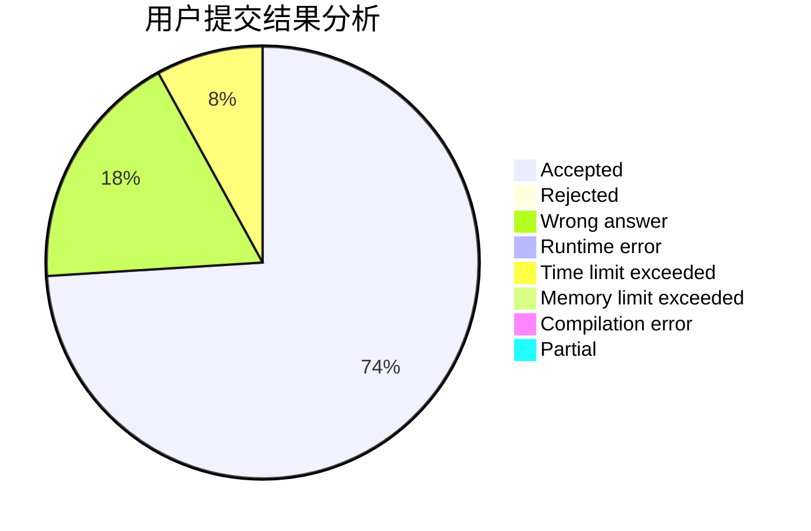
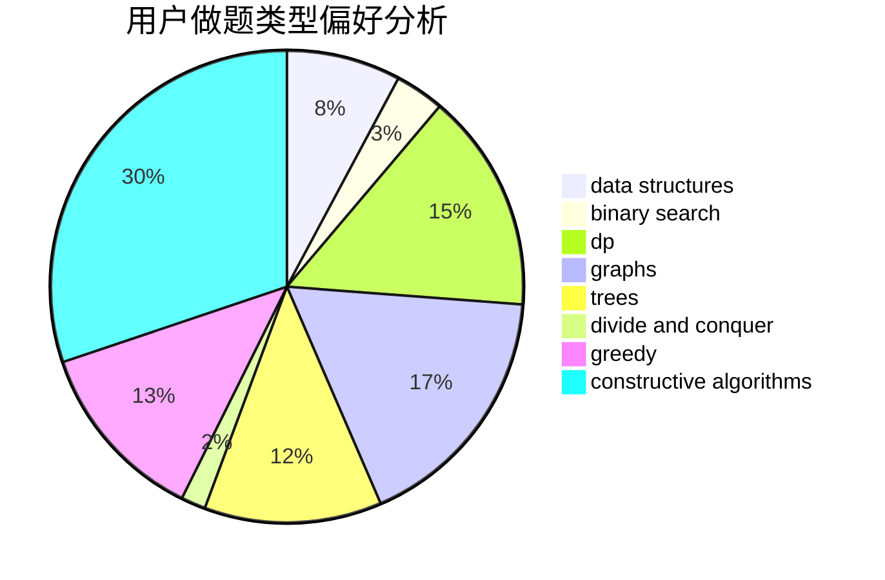
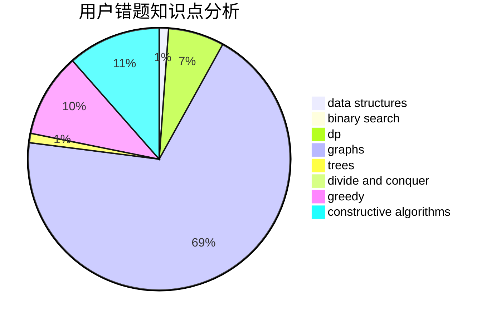

# Sophon1984

<!-- tabs:start -->

#### **用户提交结果分析**

#### **用户做题类型偏好分析**

#### **用户错题知识点分析**

<!-- tabs:end -->
# 推荐题目
[234A](https://codeforces.com/contest/234/problem/A)		implementation		  
[1131A](https://codeforces.com/contest/1131/problem/A)		math		  
[58E](https://codeforces.com/contest/58/problem/E)		dp		  
[1145B](https://codeforces.com/contest/1145/problem/B)		brute force		  
[1091H](https://codeforces.com/contest/1091/problem/H)		games		  
[925F](https://codeforces.com/contest/925/problem/F)		binary search,
                        flows		  
[681E](https://codeforces.com/contest/681/problem/E)		geometry,
                        sortings		  
[1168C](https://codeforces.com/contest/1168/problem/C)		bitmasks,
                        dp		  
[671E](https://codeforces.com/contest/671/problem/E)		data structures,
                        greedy		  
[764C](https://codeforces.com/contest/764/problem/C)		dsu,graphs,sortings,trees		  
