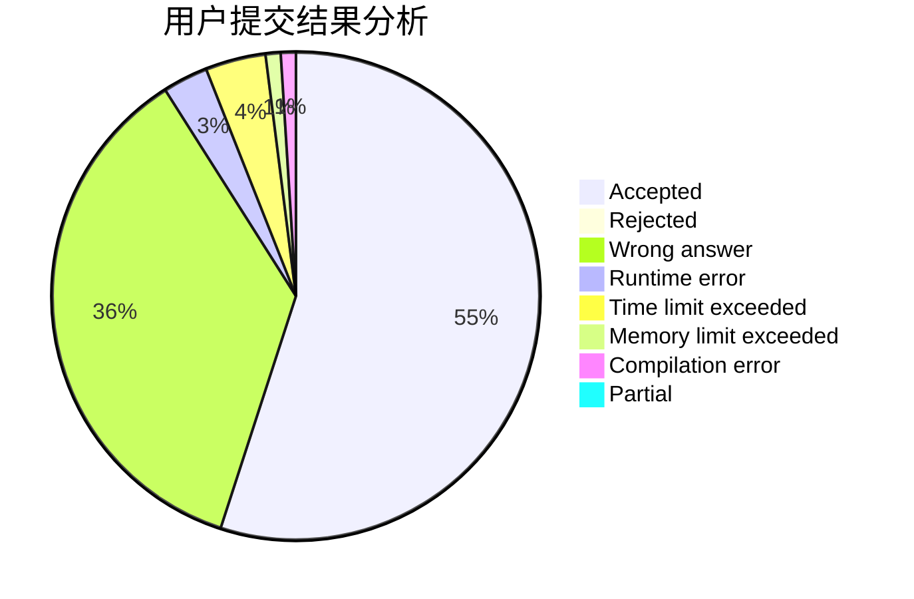
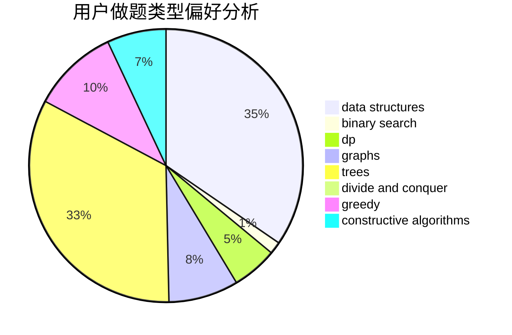
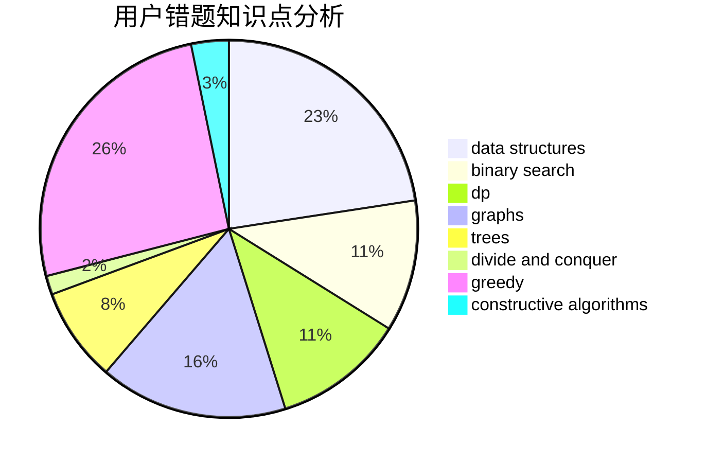

# SorryNaCN

<!-- tabs:start -->

#### **用户提交结果分析**

#### **用户做题类型偏好分析**

#### **用户错题知识点分析**

<!-- tabs:end -->
# 推荐题目
[914C](https://codeforces.com/contest/914/problem/C)		brute force,
                        combinatorics,
                        dp		  
[1238B](https://codeforces.com/contest/1238/problem/B)		greedy,
                        sortings		  
[1349F1](https://codeforces.com/contest/1349F/problem/1)		dp,
                        fft,
                        math		  
[112A](https://codeforces.com/contest/112/problem/A)		implementation,
                        strings		  
[1194D](https://codeforces.com/contest/1194/problem/D)		games,
                        math		  
[1413F](https://codeforces.com/contest/1413/problem/F)		data structures,
                        trees		  
[1506F](https://codeforces.com/contest/1506/problem/F)		constructive algorithms,
                        graphs,
                        math,
                        shortest paths,
                        sortings		  
[1206A](https://codeforces.com/contest/1206/problem/A)		math,
                        sortings		  
[1115G2](https://codeforces.com/contest/1115G/problem/2)		*special problem		  
[1187C](https://codeforces.com/contest/1187/problem/C)		constructive algorithms,
                        greedy,
                        implementation		  
