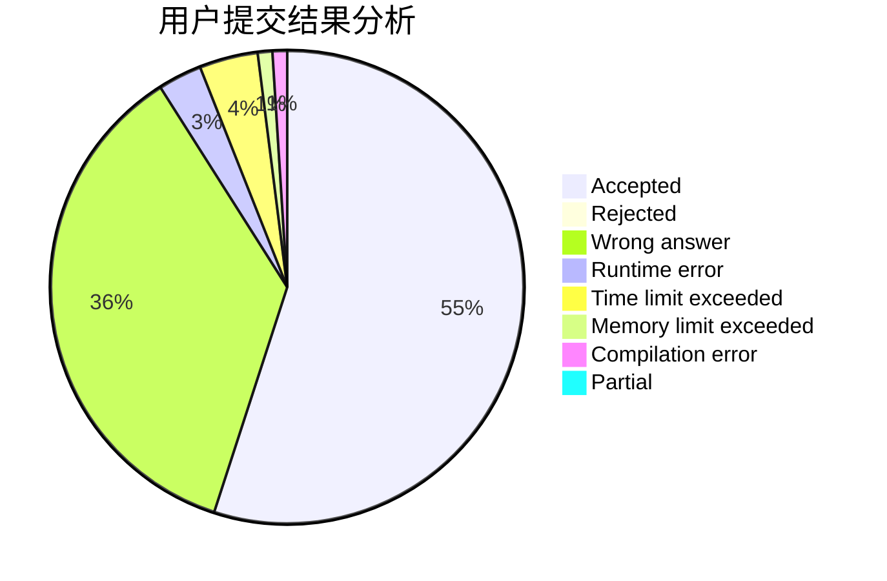
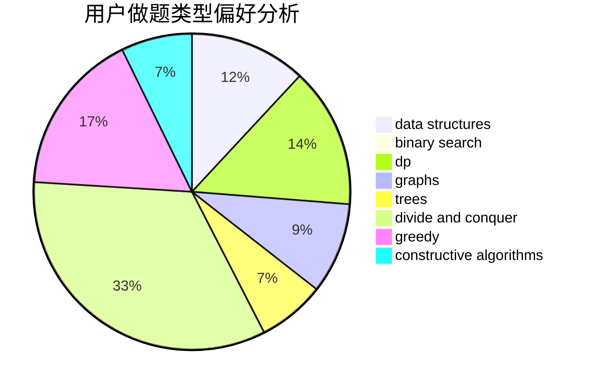
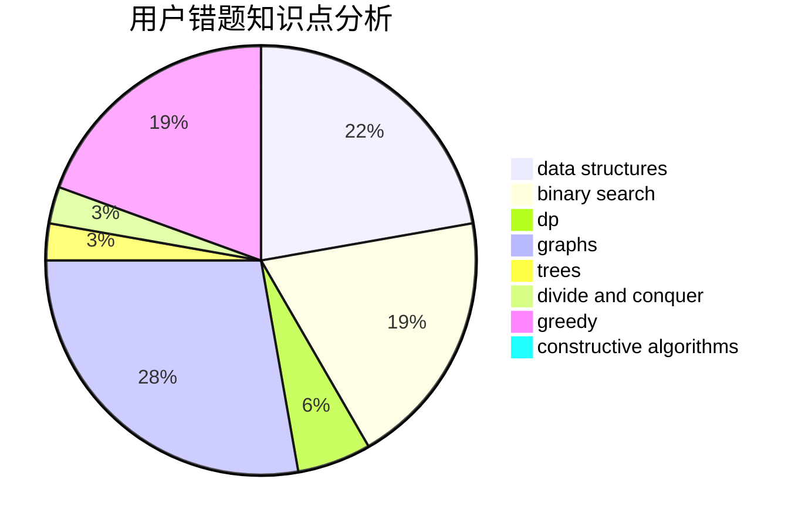

# SorryNaCN

<!-- tabs:start -->

#### **用户提交结果分析**

#### **用户做题类型偏好分析**

#### **用户错题知识点分析**

<!-- tabs:end -->
# 推荐题目
[933B](https://codeforces.com/contest/933/problem/B)		math		  
[1243A](https://codeforces.com/contest/1243/problem/A)		implementation		  
[13571](https://codeforces.com/contest/1357/problem/1)		dsu,graphs,sortings,trees		  
[1131F](https://codeforces.com/contest/1131/problem/F)		constructive algorithms,
                        dsu		  
[1198F](https://codeforces.com/contest/1198/problem/F)		greedy,
                        number theory,
                        probabilities		  
[1423C](https://codeforces.com/contest/1423/problem/C)		divide and conquer,
                        graphs,
                        trees		  
[158C](https://codeforces.com/contest/158/problem/C)		*special problem,
                        data structures,
                        implementation		  
[12102](https://codeforces.com/contest/1210/problem/2)		dsu,graphs,sortings,trees		  
[11162](https://codeforces.com/contest/1116/problem/2)		dsu,graphs,sortings,trees		  
[1190E](https://codeforces.com/contest/1190/problem/E)		binary search,
                        greedy		  
