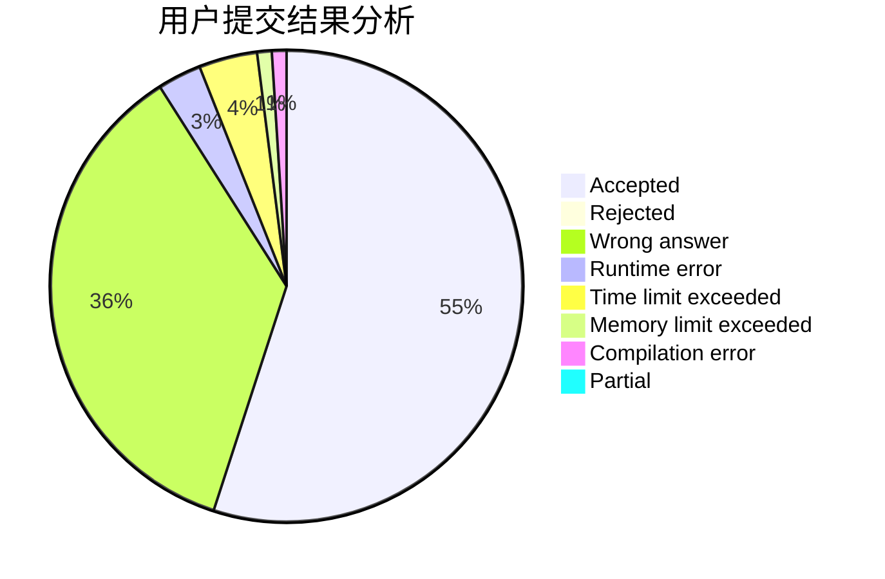
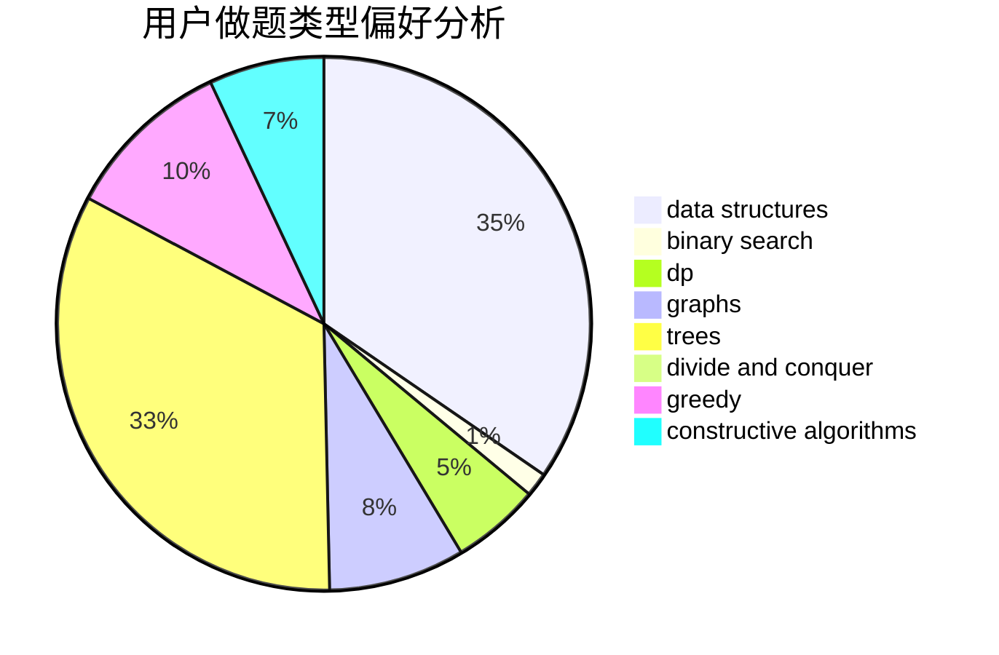
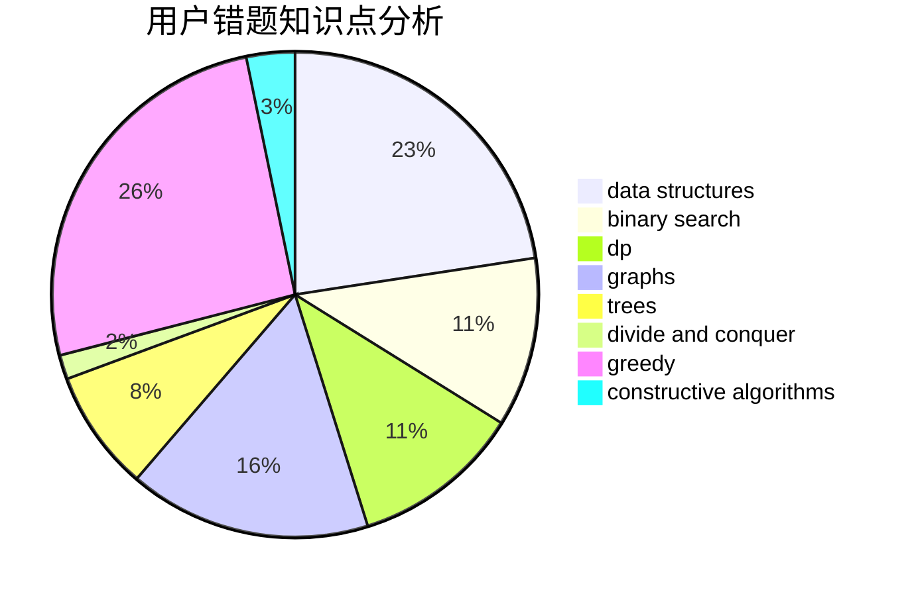

# SorryNaCN
<!-- tabs:start -->
#### **用户提交结果分析**

#### **用户做题类型偏好分析**

#### **用户错题知识点分析**

<!-- tabs:end -->
# 推荐题目
[Matrix Sorting](http://codeforces.com/problemset/problem/1500/C)		bitmasks,
                        brute force,
                        constructive algorithms,
                        greedy,
                        two pointers		  
[In a Trap](http://codeforces.com/problemset/problem/840/E)		trees		  
[Travelling Salesman and Special Numbers](http://codeforces.com/problemset/problem/914/C)		brute force,
                        combinatorics,
                        dp		  
[Kill `Em All](http://codeforces.com/problemset/problem/1238/B)		greedy,
                        sortings		  
[Paint the Tree](http://codeforces.com/problemset/problem/1223/E)		dp,
                        sortings,
                        trees		  
[Petya and Strings](http://codeforces.com/problemset/problem/112/A)		implementation,
                        strings		  
[OR oracle](http://codeforces.com/problemset/problem/1115/G2)		*special problem		  
[Nudist Beach](http://codeforces.com/problemset/problem/553/D)		binary search,
                        graphs,
                        greedy		  
[Search for Pretty Integers](https://codeforces.com/contest/872/problem/A)		brute force,
                        implementation		  
[Merge Sort](http://codeforces.com/problemset/problem/873/D)		constructive algorithms,
                        divide and conquer		  
<!-- tabs:start -->
#### **data structures**
[Matrix Sorting](http://codeforces.com/problemset/problem/371/D)		data structures,
                        dsu,
                        implementation,
                        trees		  
[In a Trap](https://codeforces.com/contest/1261/problem/B2)		data structures,
                        greedy		  
[Travelling Salesman and Special Numbers](http://codeforces.com/problemset/problem/173/E)		data structures,
                        sortings		  
[Kill `Em All](http://codeforces.com/problemset/problem/1063/F)		data structures,
                        dp,
                        string suffix structures		  
[Paint the Tree](http://codeforces.com/problemset/problem/1413/F)		data structures,
                        trees		  
[Petya and Strings](http://codeforces.com/problemset/problem/1320/C)		brute force,
                        data structures,
                        sortings		  
[OR oracle](http://codeforces.com/problemset/problem/1492/C)		binary search,
                        data structures,
                        dp,
                        greedy,
                        two pointers		  
[Nudist Beach](http://codeforces.com/problemset/problem/1490/G)		binary search,
                        data structures,
                        math		  
[Search for Pretty Integers](http://codeforces.com/problemset/problem/1479/D)		binary search,
                        bitmasks,
                        brute force,
                        data structures,
                        probabilities,
                        trees		  
[Merge Sort](http://codeforces.com/problemset/problem/1497/A)		brute force,
                        data structures,
                        greedy,
                        sortings		  
#### **binary search**
[Matrix Sorting](http://codeforces.com/problemset/problem/553/D)		binary search,
                        graphs,
                        greedy		  
[In a Trap](http://codeforces.com/problemset/problem/474/B)		binary search,
                        implementation		  
[Travelling Salesman and Special Numbers](http://codeforces.com/problemset/problem/1492/C)		binary search,
                        data structures,
                        dp,
                        greedy,
                        two pointers		  
[Kill `Em All](http://codeforces.com/problemset/problem/1463/D)		binary search,
                        constructive algorithms,
                        greedy,
                        two pointers		  
[Paint the Tree](http://codeforces.com/problemset/problem/1490/G)		binary search,
                        data structures,
                        math		  
[Petya and Strings](http://codeforces.com/problemset/problem/1479/D)		binary search,
                        bitmasks,
                        brute force,
                        data structures,
                        probabilities,
                        trees		  
[OR oracle](http://codeforces.com/problemset/problem/1436/E)		binary search,
                        data structures,
                        two pointers		  
[Nudist Beach](http://codeforces.com/problemset/problem/1461/D)		binary search,
                        brute force,
                        data structures,
                        divide and conquer,
                        implementation,
                        sortings		  
[Search for Pretty Integers](http://codeforces.com/problemset/problem/1493/C)		binary search,
                        brute force,
                        constructive algorithms,
                        greedy,
                        strings		  
[Merge Sort](http://codeforces.com/problemset/problem/1487/D)		binary search,
                        brute force,
                        math,
                        number theory		  
#### **dp**
[Matrix Sorting](http://codeforces.com/problemset/problem/914/C)		brute force,
                        combinatorics,
                        dp		  
[In a Trap](http://codeforces.com/problemset/problem/1223/E)		dp,
                        sortings,
                        trees		  
[Travelling Salesman and Special Numbers](http://codeforces.com/problemset/problem/78/C)		dp,
                        games,
                        number theory		  
[Kill `Em All](http://codeforces.com/problemset/problem/809/C)		combinatorics,
                        divide and conquer,
                        dp		  
[Paint the Tree](http://codeforces.com/problemset/problem/1063/F)		data structures,
                        dp,
                        string suffix structures		  
[Petya and Strings](http://codeforces.com/problemset/problem/1349/F1)		dp,
                        fft,
                        math		  
[OR oracle](http://codeforces.com/problemset/problem/1228/E)		combinatorics,
                        dp,
                        math		  
[Nudist Beach](http://codeforces.com/problemset/problem/1455/D)		dp,
                        greedy,
                        sortings		  
[Search for Pretty Integers](http://codeforces.com/problemset/problem/1492/C)		binary search,
                        data structures,
                        dp,
                        greedy,
                        two pointers		  
[Merge Sort](https://codeforces.com/contest/1457/problem/C)		brute force,
                        dp,
                        implementation		  
#### **graph**
[Matrix Sorting](http://codeforces.com/problemset/problem/553/D)		binary search,
                        graphs,
                        greedy		  
[In a Trap](http://codeforces.com/problemset/problem/1316/D)		constructive algorithms,
                        dfs and similar,
                        graphs,
                        implementation		  
[Travelling Salesman and Special Numbers](http://codeforces.com/problemset/problem/858/F)		constructive algorithms,
                        dfs and similar,
                        graphs		  
[Kill `Em All](http://codeforces.com/problemset/problem/164/C)		flows,
                        graphs		  
[Paint the Tree](http://codeforces.com/problemset/problem/545/E)		graphs,
                        greedy,
                        shortest paths		  
[Petya and Strings](http://codeforces.com/problemset/problem/715/E)		combinatorics,
                        fft,
                        graphs,
                        math		  
[OR oracle](http://codeforces.com/problemset/problem/1506/F)		constructive algorithms,
                        graphs,
                        math,
                        shortest paths,
                        sortings		  
[Nudist Beach](http://codeforces.com/problemset/problem/1487/C)		brute force,
                        constructive algorithms,
                        dfs and similar,
                        graphs,
                        greedy,
                        implementation,
                        math		  
[Search for Pretty Integers](http://codeforces.com/problemset/problem/1437/C)		dp,
                        flows,
                        graph matchings,
                        greedy,
                        math,
                        sortings		  
[Merge Sort](http://codeforces.com/problemset/problem/1470/D)		constructive algorithms,
                        dfs and similar,
                        graph matchings,
                        graphs,
                        greedy		  
#### **trees**
[Matrix Sorting](http://codeforces.com/problemset/problem/840/E)		trees		  
[In a Trap](http://codeforces.com/problemset/problem/1223/E)		dp,
                        sortings,
                        trees		  
[Travelling Salesman and Special Numbers](http://codeforces.com/problemset/problem/371/D)		data structures,
                        dsu,
                        implementation,
                        trees		  
[Kill `Em All](http://codeforces.com/problemset/problem/1413/F)		data structures,
                        trees		  
[Paint the Tree](http://codeforces.com/problemset/problem/566/E)		bitmasks,
                        constructive algorithms,
                        trees		  
[Petya and Strings](http://codeforces.com/problemset/problem/1479/D)		binary search,
                        bitmasks,
                        brute force,
                        data structures,
                        probabilities,
                        trees		  
[OR oracle](http://codeforces.com/problemset/problem/1511/C)		brute force,
                        data structures,
                        implementation,
                        trees		  
[Nudist Beach](http://codeforces.com/problemset/problem/1499/F)		combinatorics,
                        dfs and similar,
                        dp,
                        trees		  
[Search for Pretty Integers](http://codeforces.com/problemset/problem/1491/E)		brute force,
                        dfs and similar,
                        divide and conquer,
                        number theory,
                        trees		  
[Merge Sort](http://codeforces.com/problemset/problem/1466/D)		data structures,
                        greedy,
                        sortings,
                        trees		  
#### **divide and conquer**
[Matrix Sorting](http://codeforces.com/problemset/problem/873/D)		constructive algorithms,
                        divide and conquer		  
[In a Trap](http://codeforces.com/problemset/problem/809/C)		combinatorics,
                        divide and conquer,
                        dp		  
[Travelling Salesman and Special Numbers](http://codeforces.com/problemset/problem/1461/D)		binary search,
                        brute force,
                        data structures,
                        divide and conquer,
                        implementation,
                        sortings		  
[Kill `Em All](http://codeforces.com/problemset/problem/1466/G)		combinatorics,
                        divide and conquer,
                        hashing,
                        math,
                        string suffix structures,
                        strings		  
[Paint the Tree](http://codeforces.com/problemset/problem/1490/D)		dfs and similar,
                        divide and conquer,
                        implementation		  
[Petya and Strings](https://codeforces.com/contest/1483/problem/C)		data structures,
                        divide and conquer,
                        dp		  
[OR oracle](http://codeforces.com/problemset/problem/1491/E)		brute force,
                        dfs and similar,
                        divide and conquer,
                        number theory,
                        trees		  
[Nudist Beach](http://codeforces.com/problemset/problem/1303/G)		data structures,
                        divide and conquer,
                        geometry,
                        trees		  
[Search for Pretty Integers](http://codeforces.com/problemset/problem/1494/D)		constructive algorithms,
                        data structures,
                        dfs and similar,
                        divide and conquer,
                        dsu,
                        greedy,
                        sortings,
                        trees		  
[Merge Sort](http://codeforces.com/problemset/problem/1482/E)		data structures,
                        divide and conquer,
                        dp		  
#### **greedy**
[Matrix Sorting](http://codeforces.com/problemset/problem/1500/C)		bitmasks,
                        brute force,
                        constructive algorithms,
                        greedy,
                        two pointers		  
[In a Trap](http://codeforces.com/problemset/problem/1238/B)		greedy,
                        sortings		  
[Travelling Salesman and Special Numbers](http://codeforces.com/problemset/problem/553/D)		binary search,
                        graphs,
                        greedy		  
[Kill `Em All](http://codeforces.com/problemset/problem/839/B)		brute force,
                        greedy,
                        implementation		  
[Paint the Tree](https://codeforces.com/contest/1261/problem/B2)		data structures,
                        greedy		  
[Petya and Strings](http://codeforces.com/problemset/problem/1209/C)		constructive algorithms,
                        greedy,
                        implementation		  
[OR oracle](http://codeforces.com/problemset/problem/1187/C)		constructive algorithms,
                        greedy,
                        implementation		  
[Nudist Beach](http://codeforces.com/problemset/problem/545/E)		graphs,
                        greedy,
                        shortest paths		  
[Search for Pretty Integers](http://codeforces.com/problemset/problem/1455/D)		dp,
                        greedy,
                        sortings		  
[Merge Sort](http://codeforces.com/problemset/problem/1492/C)		binary search,
                        data structures,
                        dp,
                        greedy,
                        two pointers		  
#### **constructive algorithms**
[Matrix Sorting](http://codeforces.com/problemset/problem/1500/C)		bitmasks,
                        brute force,
                        constructive algorithms,
                        greedy,
                        two pointers		  
[In a Trap](http://codeforces.com/problemset/problem/873/D)		constructive algorithms,
                        divide and conquer		  
[Travelling Salesman and Special Numbers](http://codeforces.com/problemset/problem/1316/D)		constructive algorithms,
                        dfs and similar,
                        graphs,
                        implementation		  
[Kill `Em All](http://codeforces.com/problemset/problem/621/D)		brute force,
                        constructive algorithms,
                        math		  
[Paint the Tree](http://codeforces.com/problemset/problem/1264/F)		constructive algorithms,
                        number theory		  
[Petya and Strings](http://codeforces.com/problemset/problem/1276/E)		constructive algorithms		  
[OR oracle](http://codeforces.com/problemset/problem/1209/C)		constructive algorithms,
                        greedy,
                        implementation		  
[Nudist Beach](http://codeforces.com/problemset/problem/858/F)		constructive algorithms,
                        dfs and similar,
                        graphs		  
[Search for Pretty Integers](http://codeforces.com/problemset/problem/1187/C)		constructive algorithms,
                        greedy,
                        implementation		  
[Merge Sort](http://codeforces.com/problemset/problem/566/E)		bitmasks,
                        constructive algorithms,
                        trees		  
#### **sortings**
[Matrix Sorting](http://codeforces.com/problemset/problem/1238/B)		greedy,
                        sortings		  
[In a Trap](http://codeforces.com/problemset/problem/1223/E)		dp,
                        sortings,
                        trees		  
[Travelling Salesman and Special Numbers](http://codeforces.com/problemset/problem/1206/A)		math,
                        sortings		  
[Kill `Em All](http://codeforces.com/problemset/problem/173/E)		data structures,
                        sortings		  
[Paint the Tree](http://codeforces.com/problemset/problem/1320/C)		brute force,
                        data structures,
                        sortings		  
[Petya and Strings](http://codeforces.com/problemset/problem/1506/F)		constructive algorithms,
                        graphs,
                        math,
                        shortest paths,
                        sortings		  
[OR oracle](http://codeforces.com/problemset/problem/1455/D)		dp,
                        greedy,
                        sortings		  
[Nudist Beach](https://codeforces.com/contest/1496/problem/C)		geometry,
                        greedy,
                        math,
                        sortings		  
[Search for Pretty Integers](http://codeforces.com/problemset/problem/1495/A)		geometry,
                        greedy,
                        math,
                        sortings		  
[Merge Sort](http://codeforces.com/problemset/problem/1497/A)		brute force,
                        data structures,
                        greedy,
                        sortings		  
<!-- tabs:end -->
