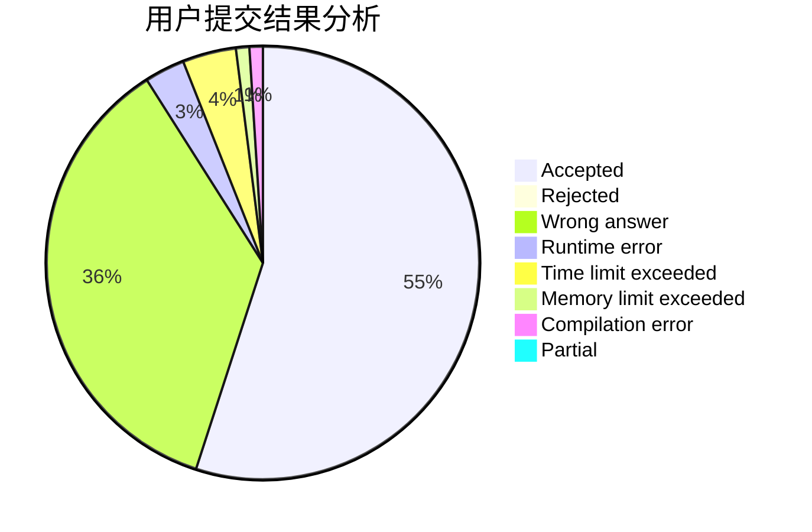
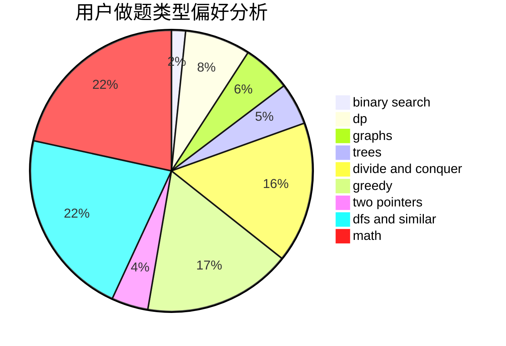

# SorryNaCN

<!-- tabs:start -->

#### **用户提交结果分析**

#### **用户做题类型偏好分析**

<!-- tabs:end -->
# 推荐题目
[933B](https://codeforces.com/contest/933/problem/B)
[1243A](https://codeforces.com/contest/1243/problem/A)
[13571](https://codeforces.com/contest/1357/problem/1)
[1131F](https://codeforces.com/contest/1131/problem/F)
[1198F](https://codeforces.com/contest/1198/problem/F)
[1423C](https://codeforces.com/contest/1423/problem/C)
[158C](https://codeforces.com/contest/158/problem/C)
[12102](https://codeforces.com/contest/1210/problem/2)
[11162](https://codeforces.com/contest/1116/problem/2)
[1190E](https://codeforces.com/contest/1190/problem/E)
