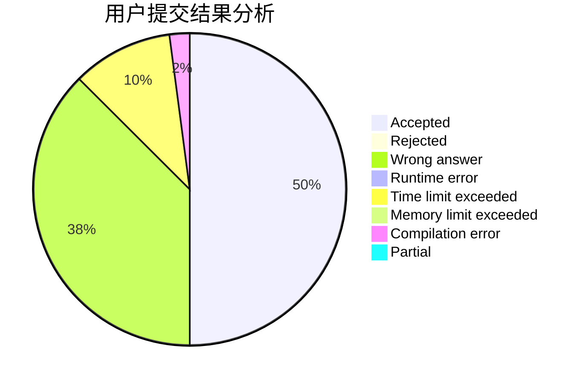
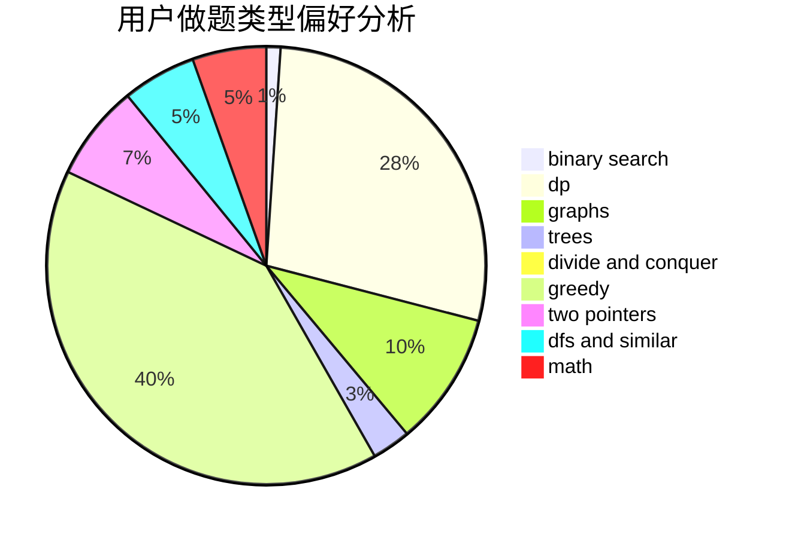

# Soulist_s

<!-- tabs:start -->

#### **用户提交结果分析**

#### **用户做题类型偏好分析**

<!-- tabs:end -->
# 推荐题目
[1481C](https://codeforces.com/contest/1481/problem/C)
[1397C](https://codeforces.com/contest/1397/problem/C)
[1458A](https://codeforces.com/contest/1458/problem/A)
[975E](https://codeforces.com/contest/975/problem/E)
[1446E](https://codeforces.com/contest/1446/problem/E)
[291A](https://codeforces.com/contest/291/problem/A)
[1380F](https://codeforces.com/contest/1380/problem/F)
[1293C](https://codeforces.com/contest/1293/problem/C)
[723D](https://codeforces.com/contest/723/problem/D)
[1152A](https://codeforces.com/contest/1152/problem/A)
