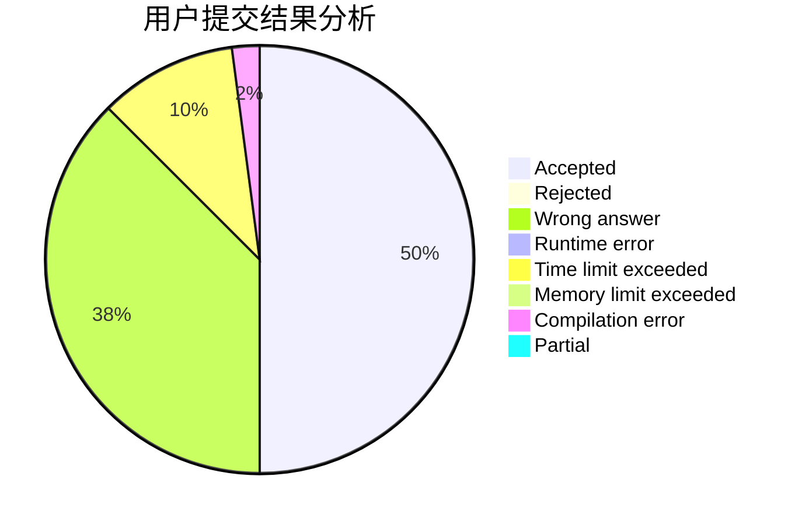
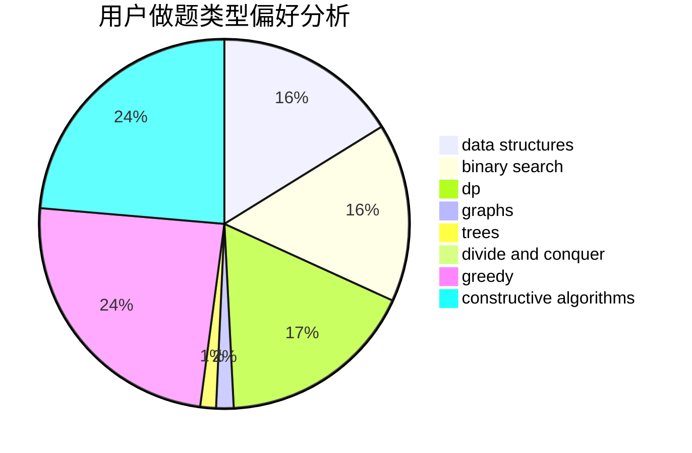
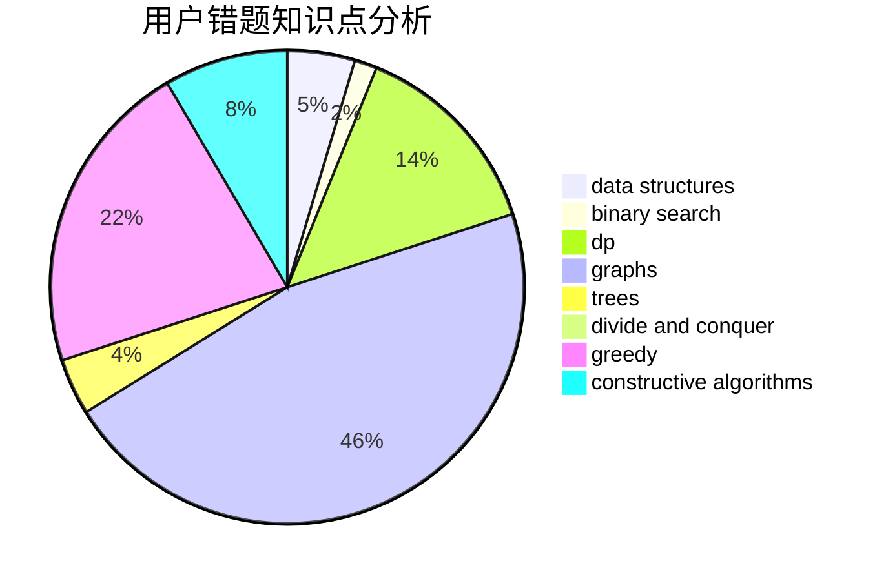

# Soulist_s

<!-- tabs:start -->

#### **用户提交结果分析**

#### **用户做题类型偏好分析**

#### **用户错题知识点分析**

<!-- tabs:end -->
# 推荐题目
[1472G](https://codeforces.com/contest/1472/problem/G)		dfs and similar,
                        dp,
                        graphs,
                        shortest paths		  
[1387C](https://codeforces.com/contest/1387/problem/C)		*special problem,
                        dp,
                        shortest paths,
                        string suffix structures		  
[144D](https://codeforces.com/contest/144/problem/D)		data structures,
                        dfs and similar,
                        graphs,
                        shortest paths		  
[952F](https://codeforces.com/contest/952/problem/F)		nan		  
[1436F](https://codeforces.com/contest/1436/problem/F)		combinatorics,
                        math,
                        number theory		  
[276D](https://codeforces.com/contest/276/problem/D)		bitmasks,
                        dp,
                        greedy,
                        implementation,
                        math		  
[1372A](https://codeforces.com/contest/1372/problem/A)		constructive algorithms,
                        implementation		  
[1286B](https://codeforces.com/contest/1286/problem/B)		constructive algorithms,
                        data structures,
                        dfs and similar,
                        graphs,
                        greedy,
                        trees		  
[704D](https://codeforces.com/contest/704/problem/D)		flows,
                        greedy		  
[1150A](https://codeforces.com/contest/1150/problem/A)		greedy,
                        implementation		  
