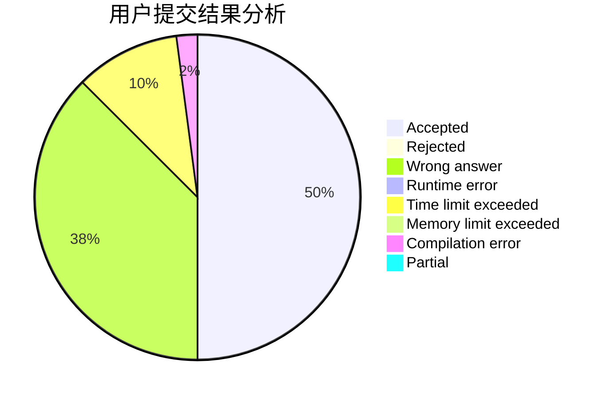
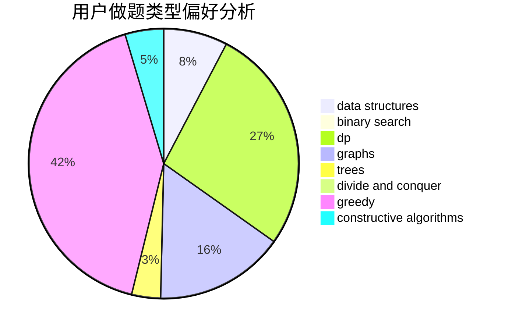
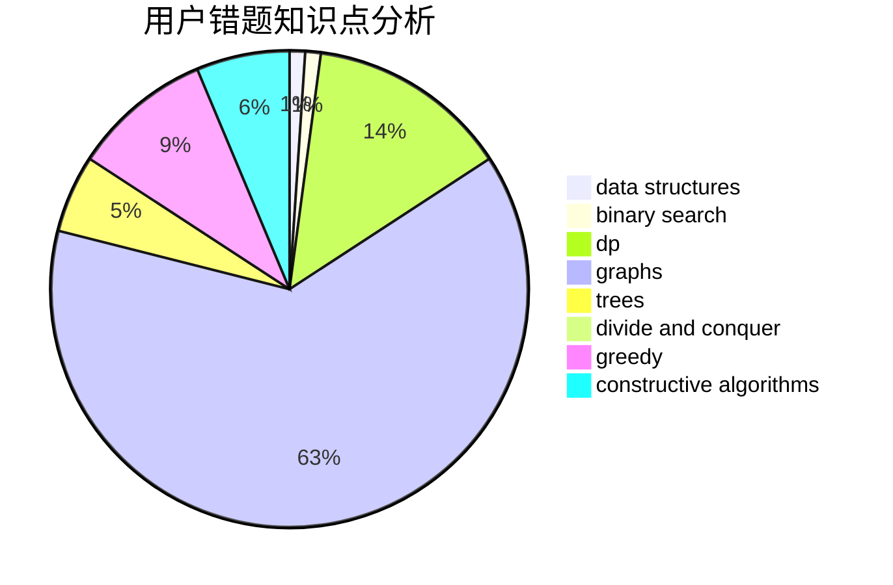

# Soulist_s

<!-- tabs:start -->

#### **用户提交结果分析**

#### **用户做题类型偏好分析**

#### **用户错题知识点分析**

<!-- tabs:end -->
# 推荐题目
[1481C](https://codeforces.com/contest/1481/problem/C)		brute force,
                        constructive algorithms,
                        greedy		  
[1397C](https://codeforces.com/contest/1397/problem/C)		dsu,graphs,sortings,trees		  
[1458A](https://codeforces.com/contest/1458/problem/A)		math,
                        number theory		  
[975E](https://codeforces.com/contest/975/problem/E)		geometry		  
[1446E](https://codeforces.com/contest/1446/problem/E)		constructive algorithms,
                        dfs and similar		  
[291A](https://codeforces.com/contest/291/problem/A)		*special problem,
                        implementation,
                        sortings		  
[1380F](https://codeforces.com/contest/1380/problem/F)		data structures,
                        dp,
                        matrices		  
[1293C](https://codeforces.com/contest/1293/problem/C)		dsu,graphs,sortings,trees		  
[723D](https://codeforces.com/contest/723/problem/D)		dfs and similar,
                        dsu,
                        graphs,
                        greedy,
                        implementation		  
[1152A](https://codeforces.com/contest/1152/problem/A)		greedy,
                        implementation,
                        math		  
