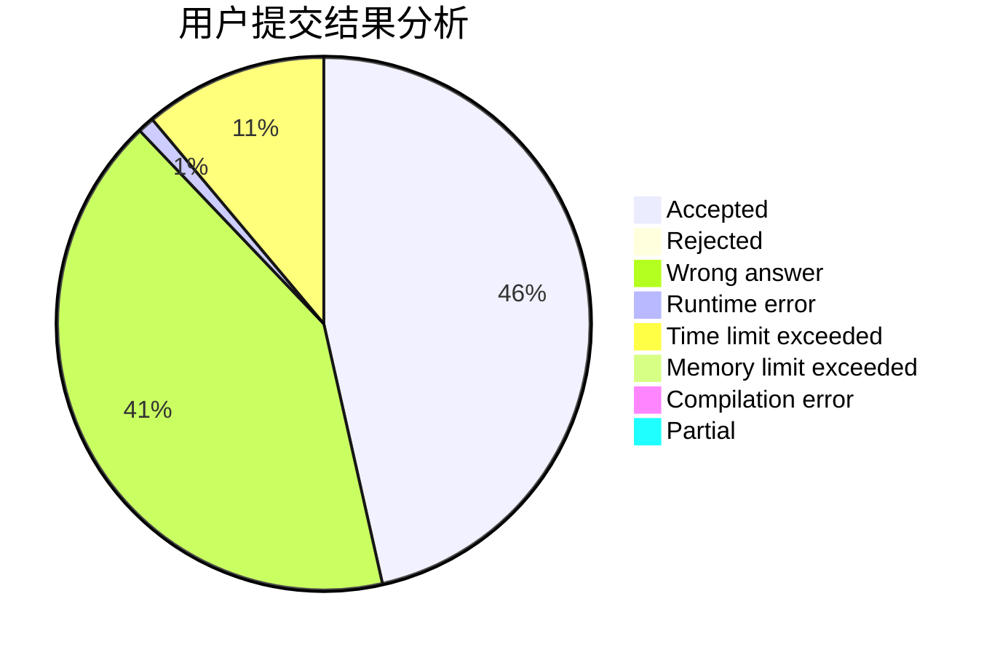
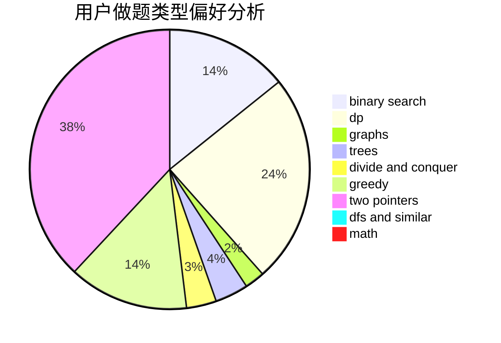

# Soulless7s

<!-- tabs:start -->

#### **用户提交结果分析**

#### **用户做题类型偏好分析**

<!-- tabs:end -->
# 推荐题目
[792C](https://codeforces.com/contest/792/problem/C)
[735A](https://codeforces.com/contest/735/problem/A)
[1130E](https://codeforces.com/contest/1130/problem/E)
[1279F](https://codeforces.com/contest/1279/problem/F)
[988E](https://codeforces.com/contest/988/problem/E)
[150A](https://codeforces.com/contest/150/problem/A)
[1271E](https://codeforces.com/contest/1271/problem/E)
[1056E](https://codeforces.com/contest/1056/problem/E)
[50D](https://codeforces.com/contest/50/problem/D)
[11841](https://codeforces.com/contest/1184/problem/1)
