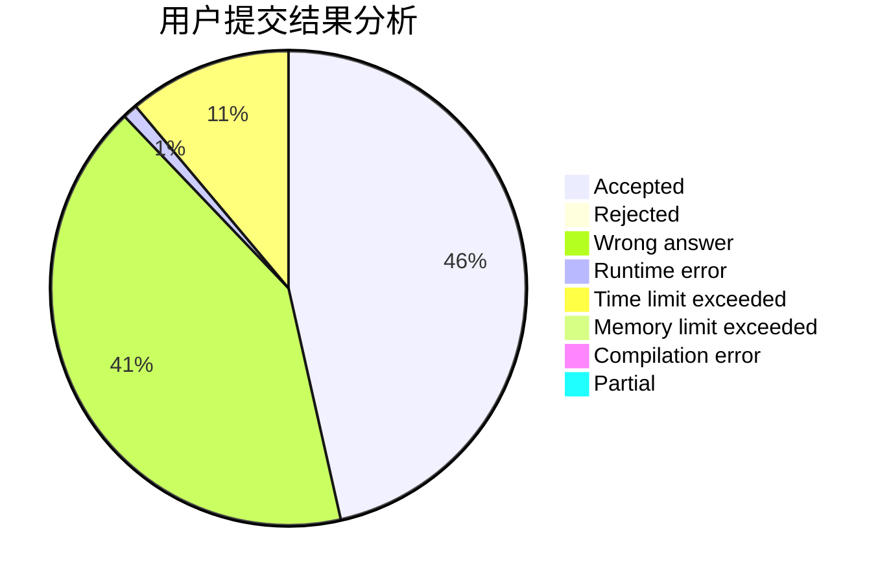
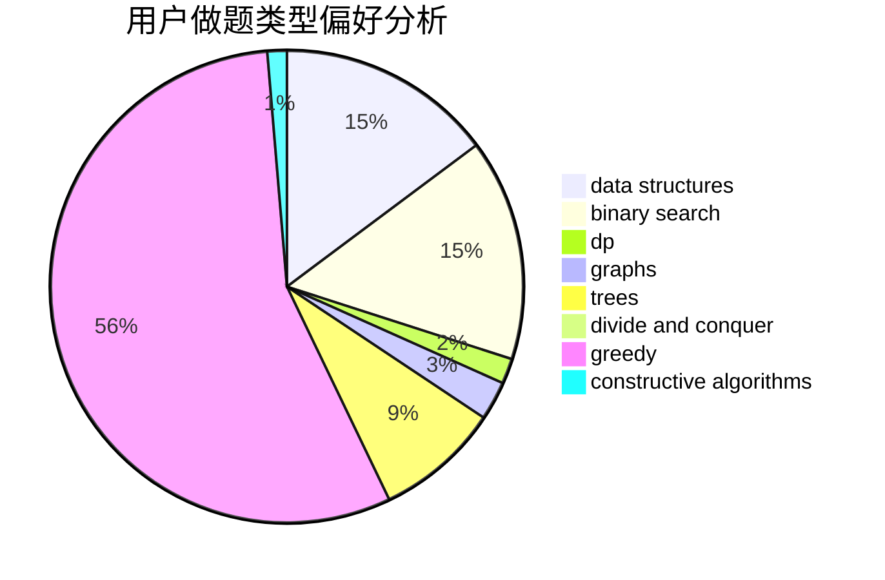
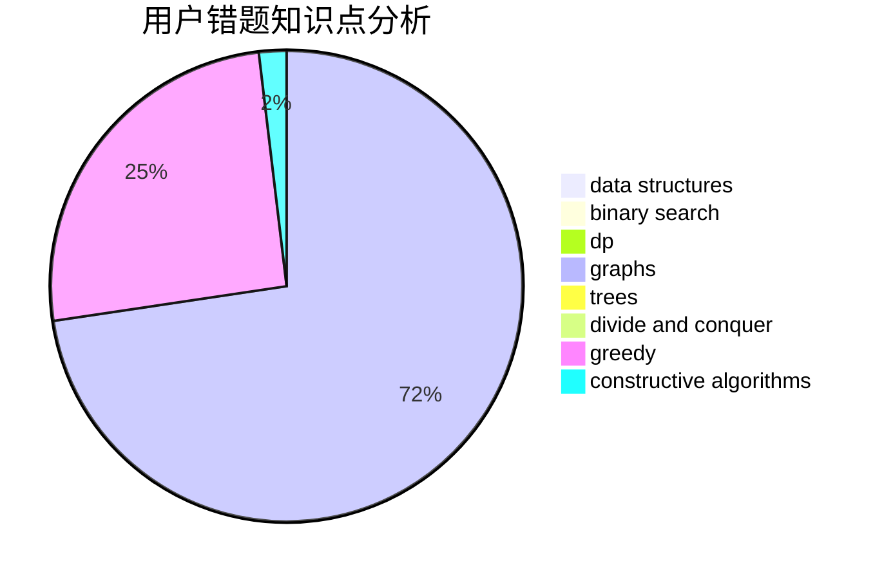

# Soulless7s

<!-- tabs:start -->

#### **用户提交结果分析**

#### **用户做题类型偏好分析**

#### **用户错题知识点分析**

<!-- tabs:end -->
# 推荐题目
[772E](https://codeforces.com/contest/772/problem/E)		binary search,
                        divide and conquer,
                        interactive,
                        trees		  
[717E](https://codeforces.com/contest/717/problem/E)		dfs and similar		  
[1129A1](https://codeforces.com/contest/1129A/problem/1)		brute force,
                        greedy		  
[1270F](https://codeforces.com/contest/1270/problem/F)		math,
                        strings		  
[967B](https://codeforces.com/contest/967/problem/B)		math,
                        sortings		  
[1499G](https://codeforces.com/contest/1499/problem/G)		data structures,
                        graphs,
                        interactive		  
[1266D](https://codeforces.com/contest/1266/problem/D)		constructive algorithms,
                        data structures,
                        graphs,
                        greedy,
                        implementation,
                        math,
                        two pointers		  
[1056B](https://codeforces.com/contest/1056/problem/B)		math,
                        number theory		  
[489F](https://codeforces.com/contest/489/problem/F)		combinatorics,
                        dp		  
[1181D](https://codeforces.com/contest/1181/problem/D)		binary search,
                        data structures,
                        implementation,
                        sortings,
                        trees,
                        two pointers		  
