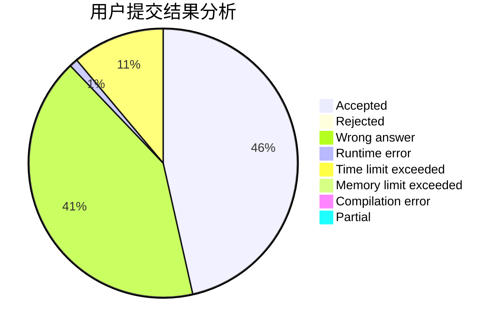
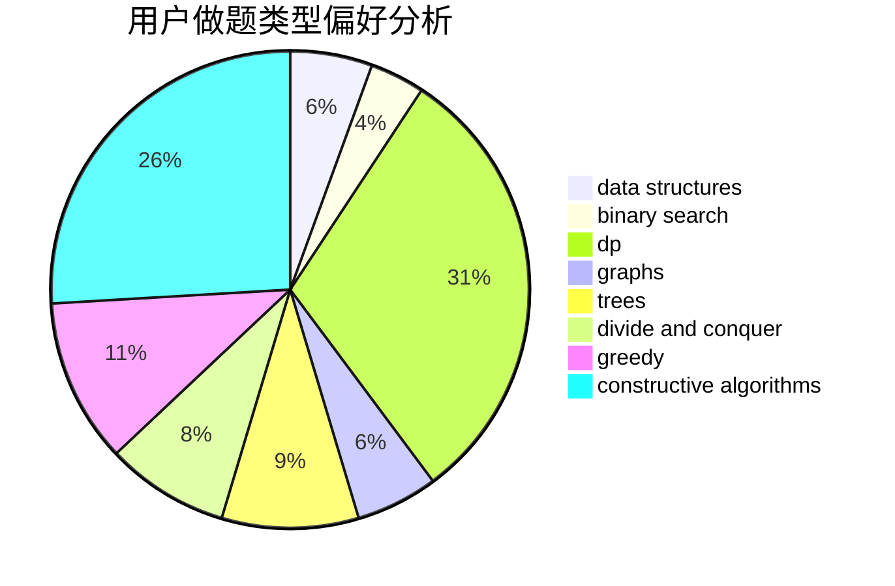
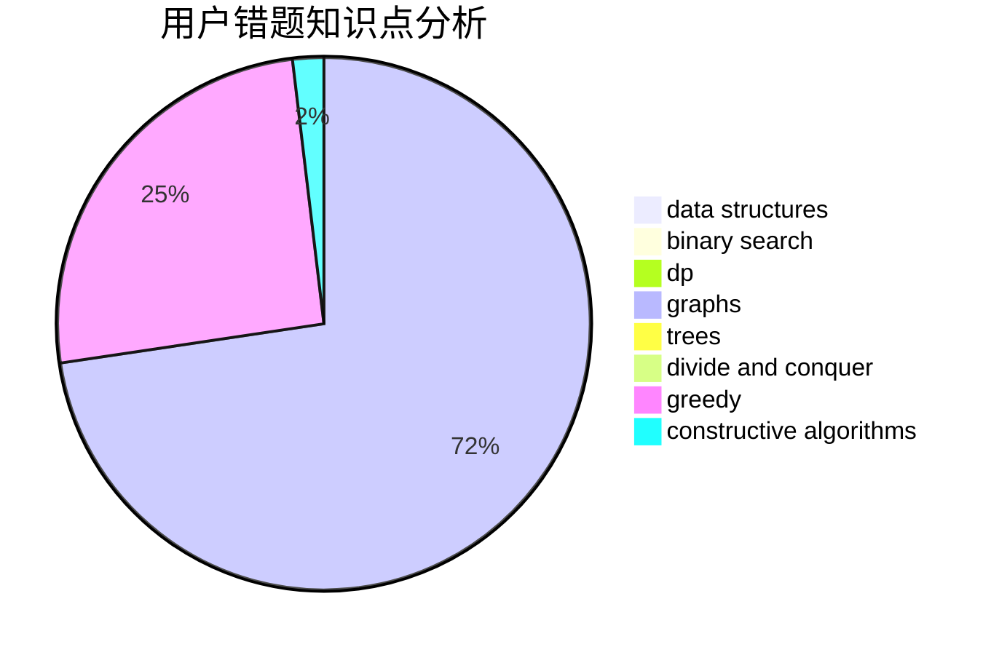

# Soulless7s

<!-- tabs:start -->

#### **用户提交结果分析**

#### **用户做题类型偏好分析**

#### **用户错题知识点分析**

<!-- tabs:end -->
# 推荐题目
[792C](https://codeforces.com/contest/792/problem/C)		dp,
                        greedy,
                        math,
                        number theory		  
[735A](https://codeforces.com/contest/735/problem/A)		implementation,
                        strings		  
[1130E](https://codeforces.com/contest/1130/problem/E)		dsu,graphs,sortings,trees		  
[1279F](https://codeforces.com/contest/1279/problem/F)		binary search,
                        dp		  
[988E](https://codeforces.com/contest/988/problem/E)		brute force,
                        greedy		  
[150A](https://codeforces.com/contest/150/problem/A)		games,
                        math,
                        number theory		  
[1271E](https://codeforces.com/contest/1271/problem/E)		binary search,
                        combinatorics,
                        dp,
                        math		  
[1056E](https://codeforces.com/contest/1056/problem/E)		brute force,
                        data structures,
                        hashing,
                        strings		  
[50D](https://codeforces.com/contest/50/problem/D)		binary search,
                        dp,
                        probabilities		  
[11841](https://codeforces.com/contest/1184/problem/1)		dsu,graphs,sortings,trees		  
