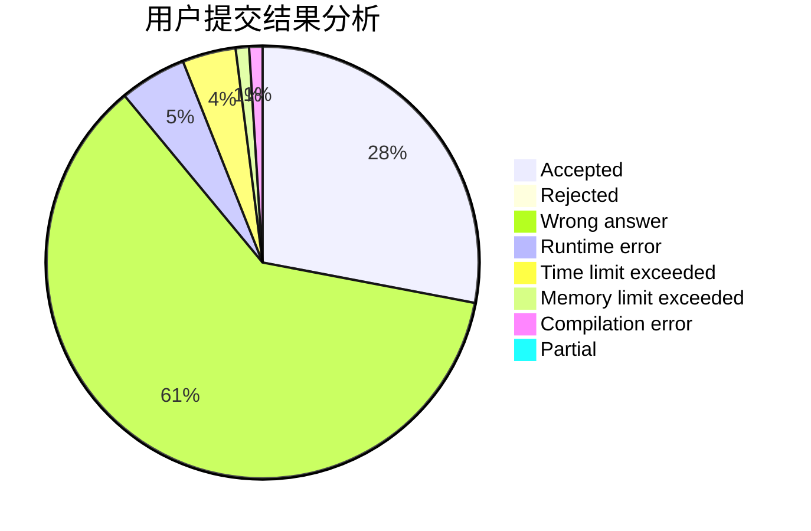
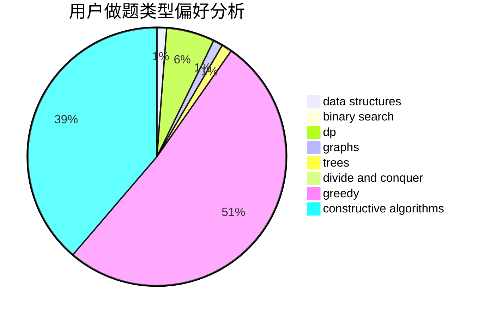
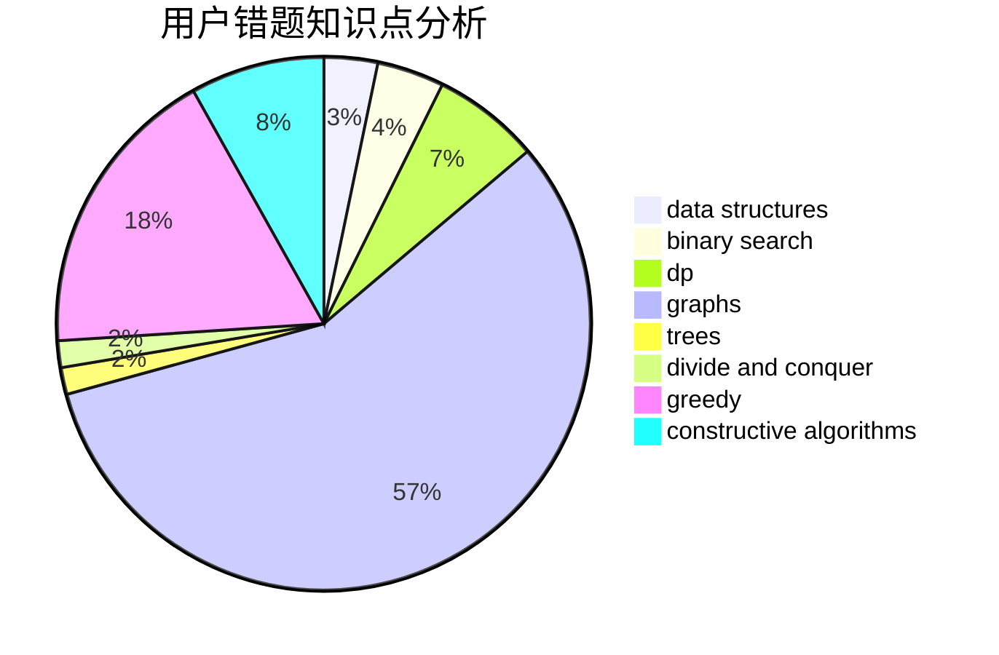

# SovietPower

<!-- tabs:start -->

#### **用户提交结果分析**

#### **用户做题类型偏好分析**

#### **用户错题知识点分析**

<!-- tabs:end -->
# 推荐题目
[730J](https://codeforces.com/contest/730/problem/J)		dp		  
[367B](https://codeforces.com/contest/367/problem/B)		binary search,
                        data structures		  
[1068C](https://codeforces.com/contest/1068/problem/C)		constructive algorithms,
                        graphs		  
[771D](https://codeforces.com/contest/771/problem/D)		dp		  
[794G](https://codeforces.com/contest/794/problem/G)		combinatorics,
                        dp,
                        math		  
[979C](https://codeforces.com/contest/979/problem/C)		dfs and similar,
                        trees		  
[554A](https://codeforces.com/contest/554/problem/A)		brute force,
                        math,
                        strings		  
[283E](https://codeforces.com/contest/283/problem/E)		combinatorics,
                        data structures,
                        math		  
[863D](https://codeforces.com/contest/863/problem/D)		data structures,
                        implementation		  
[1468F](https://codeforces.com/contest/1468/problem/F)		geometry,
                        hashing,
                        number theory		  
