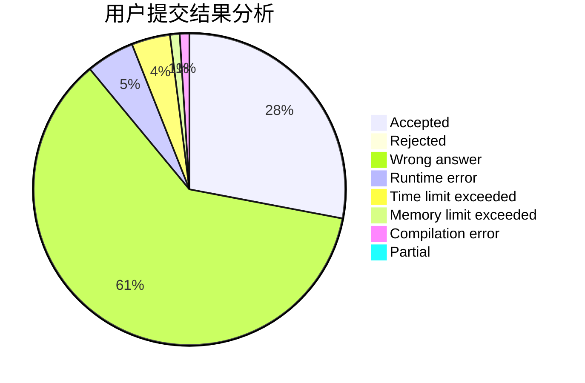
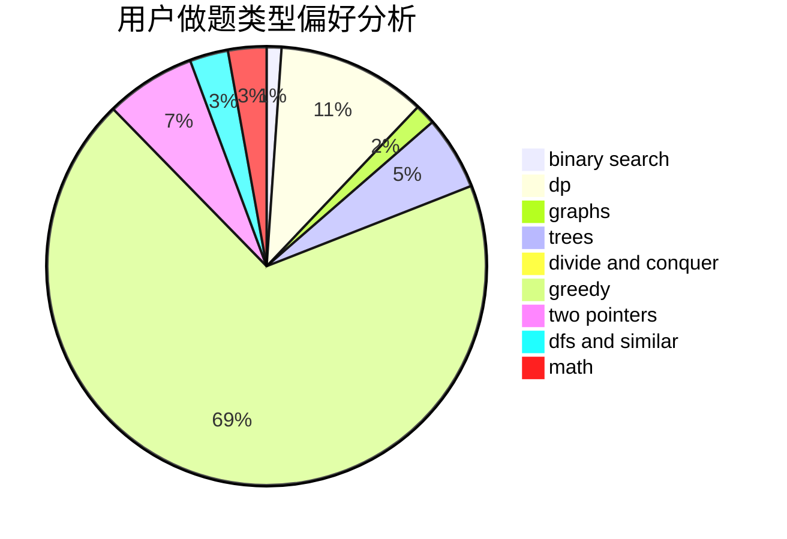

# SovietPower

<!-- tabs:start -->

#### **用户提交结果分析**

#### **用户做题类型偏好分析**

<!-- tabs:end -->
# 推荐题目
[730J](https://codeforces.com/contest/730/problem/J)
[367B](https://codeforces.com/contest/367/problem/B)
[1068C](https://codeforces.com/contest/1068/problem/C)
[771D](https://codeforces.com/contest/771/problem/D)
[794G](https://codeforces.com/contest/794/problem/G)
[979C](https://codeforces.com/contest/979/problem/C)
[554A](https://codeforces.com/contest/554/problem/A)
[283E](https://codeforces.com/contest/283/problem/E)
[863D](https://codeforces.com/contest/863/problem/D)
[1468F](https://codeforces.com/contest/1468/problem/F)
