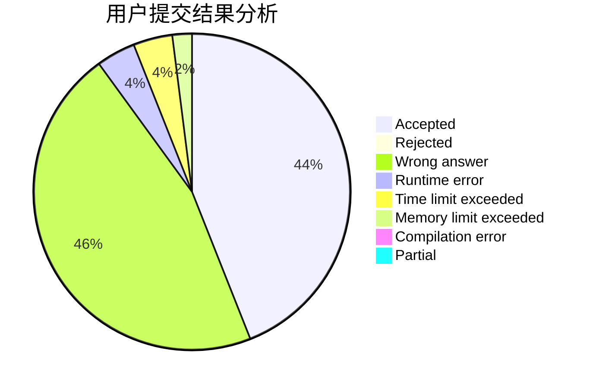
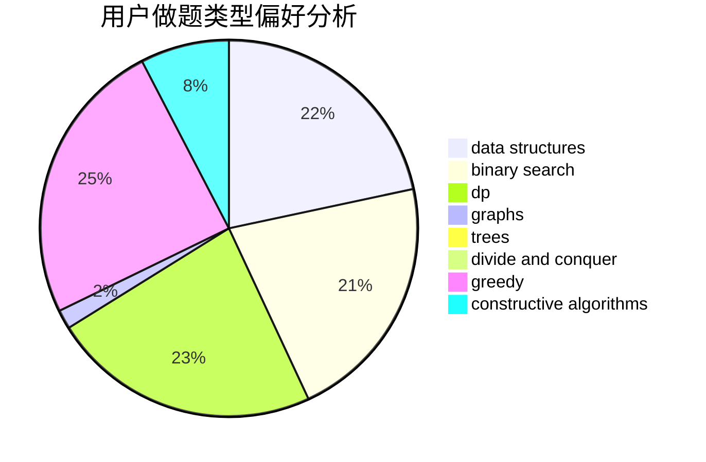
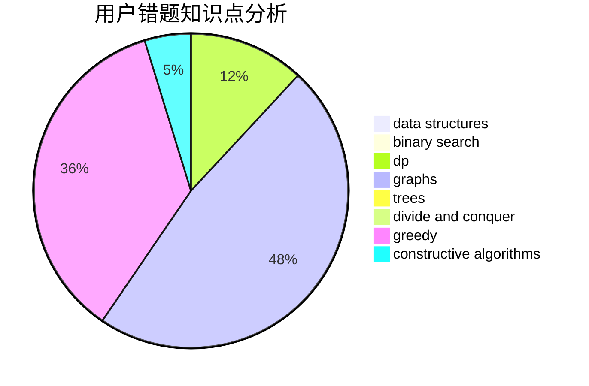

# SovietPower_

<!-- tabs:start -->

#### **用户提交结果分析**

#### **用户做题类型偏好分析**

#### **用户错题知识点分析**

<!-- tabs:end -->
# 推荐题目
[1101F](https://codeforces.com/contest/1101/problem/F)		binary search,
                        dp		  
[205B](https://codeforces.com/contest/205/problem/B)		brute force,
                        greedy		  
[1205E](https://codeforces.com/contest/1205/problem/E)		combinatorics,
                        strings		  
[611B](https://codeforces.com/contest/611/problem/B)		bitmasks,
                        brute force,
                        implementation		  
[1086D](https://codeforces.com/contest/1086/problem/D)		dsu,graphs,sortings,trees		  
[1099B](https://codeforces.com/contest/1099/problem/B)		binary search,
                        constructive algorithms,
                        math		  
[609C](https://codeforces.com/contest/609/problem/C)		implementation,
                        math		  
[187C](https://codeforces.com/contest/187/problem/C)		dfs and similar,
                        dsu		  
[1179B](https://codeforces.com/contest/1179/problem/B)		constructive algorithms		  
[510E](https://codeforces.com/contest/510/problem/E)		flows		  
