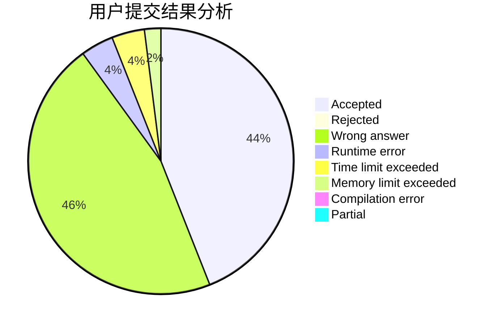
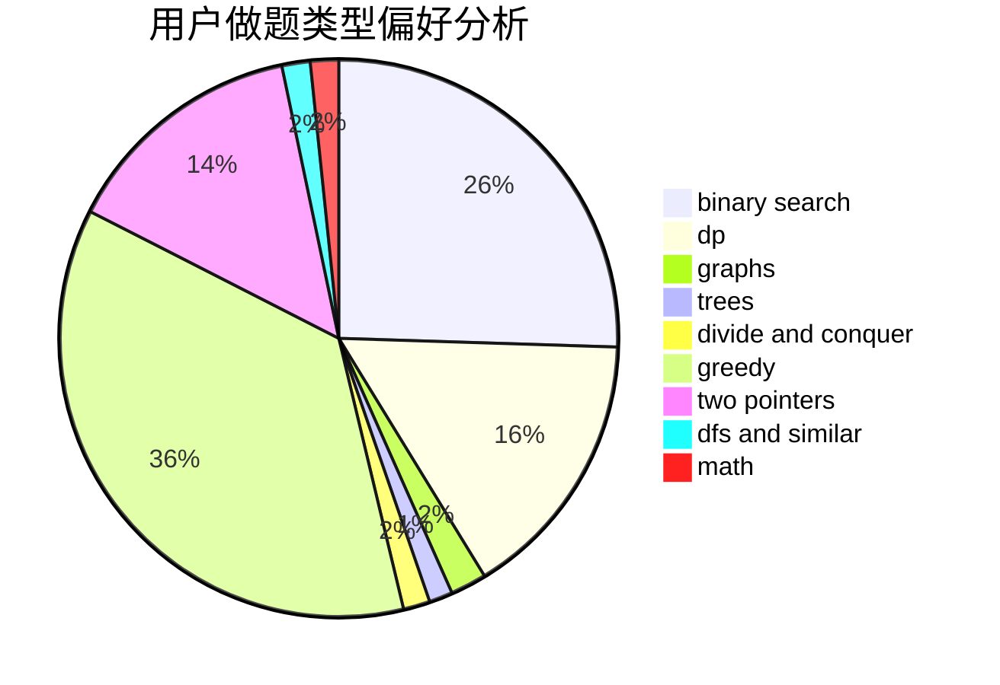

# SovietPower_

<!-- tabs:start -->

#### **用户提交结果分析**

#### **用户做题类型偏好分析**

<!-- tabs:end -->
# 推荐题目
[1102B](https://codeforces.com/contest/1102/problem/B)
[229D](https://codeforces.com/contest/229/problem/D)
[120H](https://codeforces.com/contest/120/problem/H)
[630C](https://codeforces.com/contest/630/problem/C)
[1087B](https://codeforces.com/contest/1087/problem/B)
[1099E](https://codeforces.com/contest/1099/problem/E)
[628C](https://codeforces.com/contest/628/problem/C)
[212C](https://codeforces.com/contest/212/problem/C)
[1182A](https://codeforces.com/contest/1182/problem/A)
[534F](https://codeforces.com/contest/534/problem/F)
