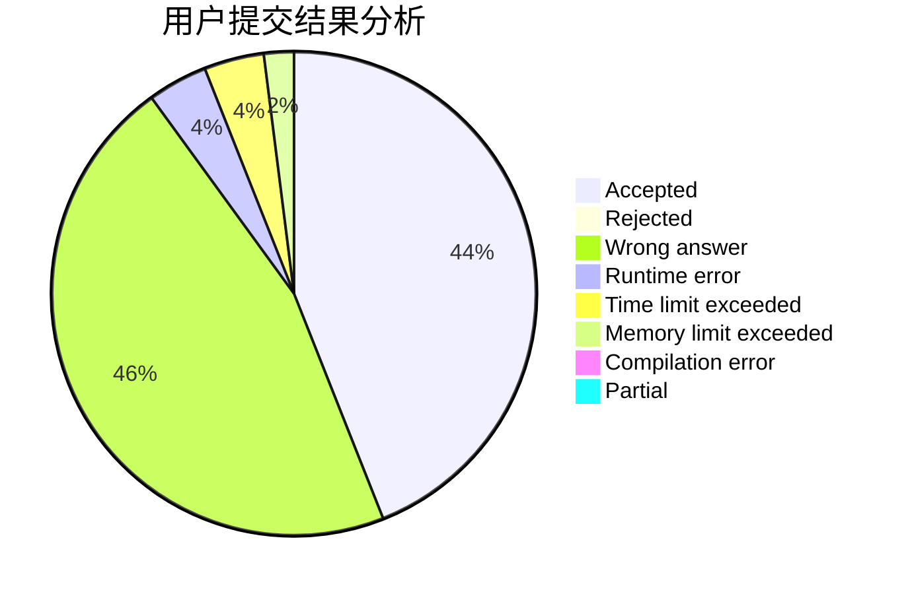
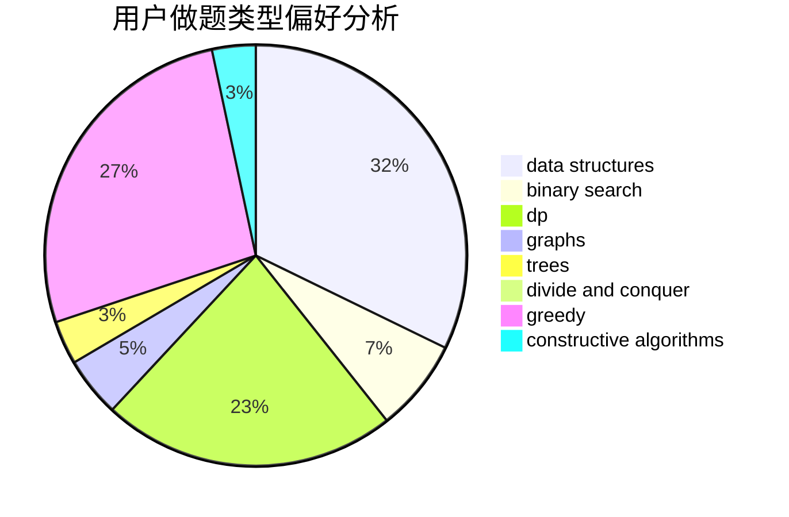
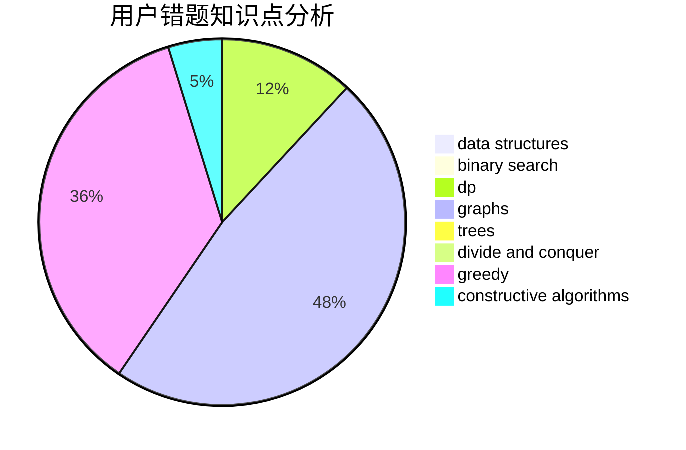

# SovietPower_

<!-- tabs:start -->

#### **用户提交结果分析**

#### **用户做题类型偏好分析**

#### **用户错题知识点分析**

<!-- tabs:end -->
# 推荐题目
[1102B](https://codeforces.com/contest/1102/problem/B)		greedy,
                        sortings		  
[229D](https://codeforces.com/contest/229/problem/D)		dp,
                        greedy,
                        two pointers		  
[120H](https://codeforces.com/contest/120/problem/H)		graph matchings		  
[630C](https://codeforces.com/contest/630/problem/C)		combinatorics,
                        math		  
[1087B](https://codeforces.com/contest/1087/problem/B)		dsu,graphs,sortings,trees		  
[1099E](https://codeforces.com/contest/1099/problem/E)		dsu,graphs,sortings,trees		  
[628C](https://codeforces.com/contest/628/problem/C)		greedy,
                        strings		  
[212C](https://codeforces.com/contest/212/problem/C)		combinatorics,
                        dp,
                        math		  
[1182A](https://codeforces.com/contest/1182/problem/A)		dp,
                        math		  
[534F](https://codeforces.com/contest/534/problem/F)		bitmasks,
                        dp,
                        hashing,
                        meet-in-the-middle		  
