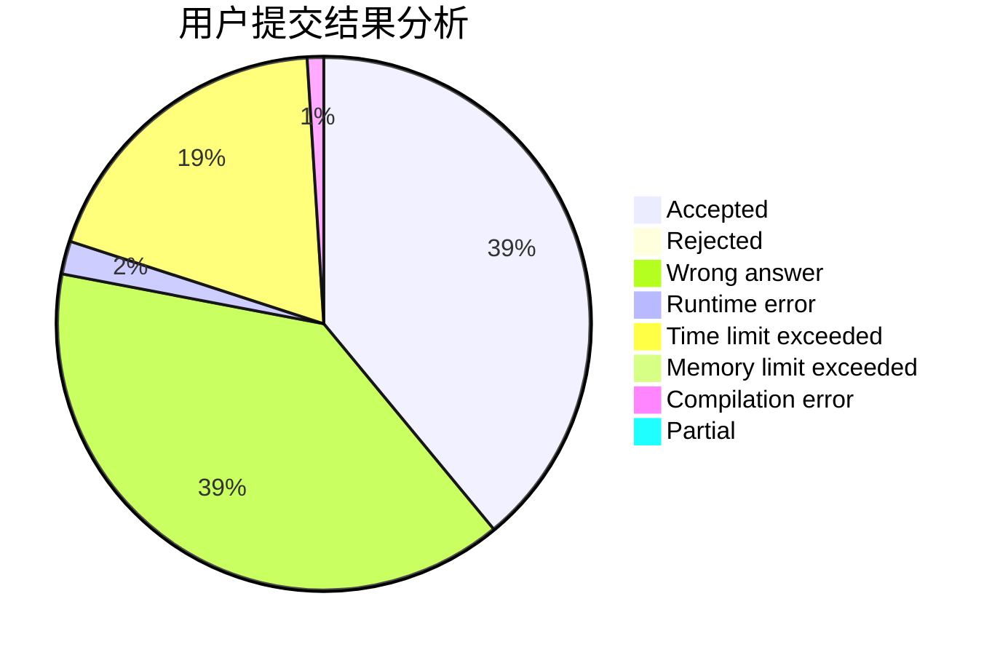
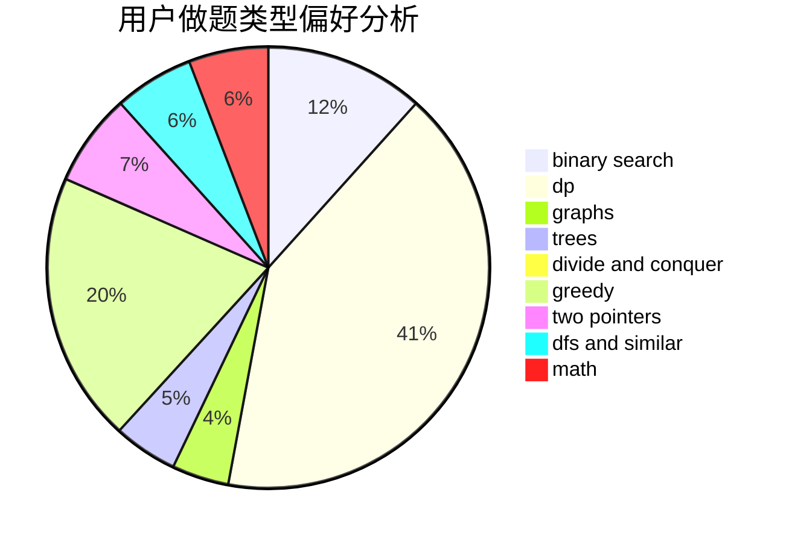

# A_zjzj

<!-- tabs:start -->

#### **用户提交结果分析**

#### **用户做题类型偏好分析**

<!-- tabs:end -->
# 推荐题目
[1272B](https://codeforces.com/contest/1272/problem/B)
[167B](https://codeforces.com/contest/167/problem/B)
[163D](https://codeforces.com/contest/163/problem/D)
[126B](https://codeforces.com/contest/126/problem/B)
[163A](https://codeforces.com/contest/163/problem/A)
[1030B](https://codeforces.com/contest/1030/problem/B)
[16E](https://codeforces.com/contest/16/problem/E)
[166A](https://codeforces.com/contest/166/problem/A)
[1464B](https://codeforces.com/contest/1464/problem/B)
[1101C](https://codeforces.com/contest/1101/problem/C)
