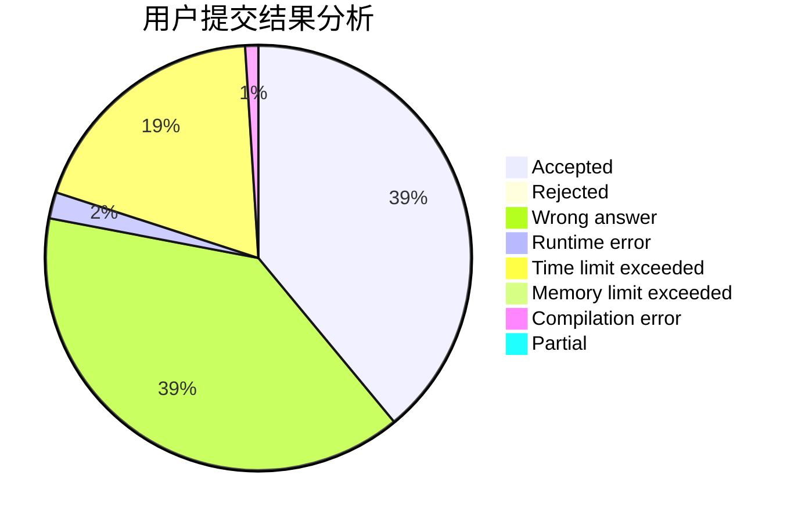
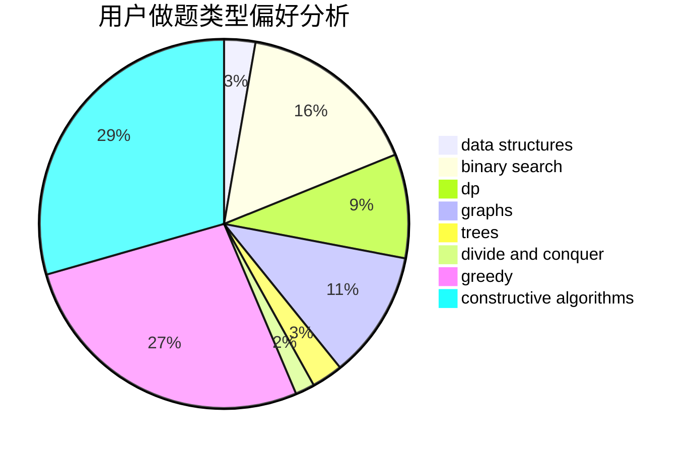
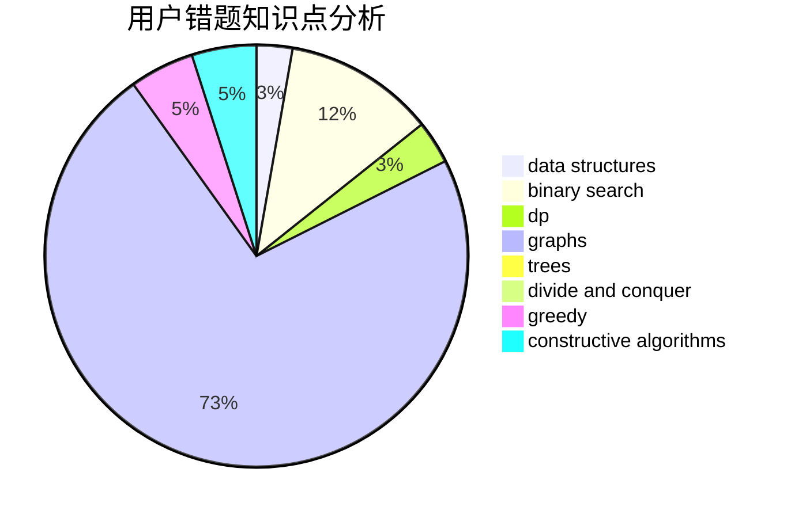

# A_zjzj

<!-- tabs:start -->

#### **用户提交结果分析**

#### **用户做题类型偏好分析**

#### **用户错题知识点分析**

<!-- tabs:end -->
# 推荐题目
[1266G](https://codeforces.com/contest/1266/problem/G)		string suffix structures		  
[1511A](https://codeforces.com/contest/1511/problem/A)		greedy		  
[1510B](https://codeforces.com/contest/1510/problem/B)		flows,
                        graph matchings,
                        graphs		  
[1264B](https://codeforces.com/contest/1264/problem/B)		brute force,
                        constructive algorithms,
                        greedy		  
[1510A](https://codeforces.com/contest/1510/problem/A)		nan		  
[102A](https://codeforces.com/contest/102/problem/A)		brute force		  
[1511G](https://codeforces.com/contest/1511/problem/G)		bitmasks,
                        brute force,
                        data structures,
                        games,
                        two pointers		  
[1510I](https://codeforces.com/contest/1510/problem/I)		greedy,
                        interactive,
                        math,
                        probabilities		  
[1454E](https://codeforces.com/contest/1454/problem/E)		combinatorics,
                        dfs and similar,
                        graphs,
                        trees		  
[1100F](https://codeforces.com/contest/1100/problem/F)		data structures,
                        divide and conquer,
                        greedy,
                        math		  
