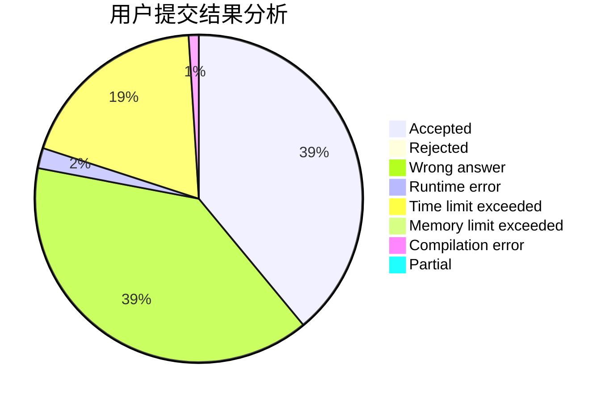
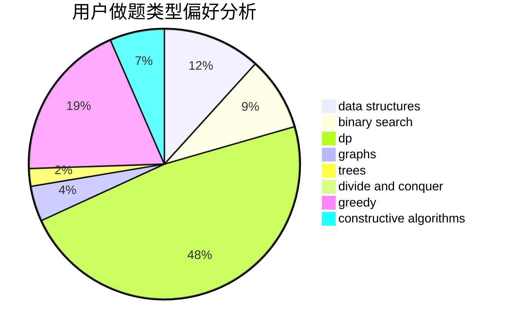
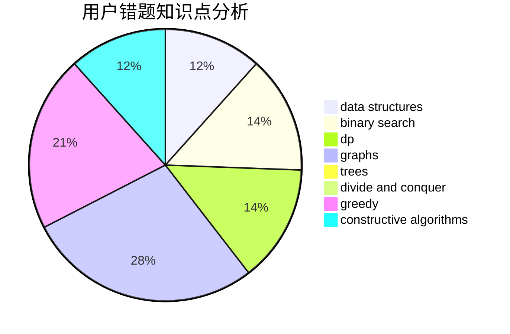

# A_zjzj

<!-- tabs:start -->

#### **用户提交结果分析**

#### **用户做题类型偏好分析**

#### **用户错题知识点分析**

<!-- tabs:end -->
# 推荐题目
[1272B](https://codeforces.com/contest/1272/problem/B)		constructive algorithms,
                        greedy,
                        implementation		  
[167B](https://codeforces.com/contest/167/problem/B)		dp,
                        math,
                        probabilities		  
[163D](https://codeforces.com/contest/163/problem/D)		brute force		  
[126B](https://codeforces.com/contest/126/problem/B)		binary search,
                        dp,
                        hashing,
                        string suffix structures,
                        strings		  
[163A](https://codeforces.com/contest/163/problem/A)		dp		  
[1030B](https://codeforces.com/contest/1030/problem/B)		geometry		  
[16E](https://codeforces.com/contest/16/problem/E)		bitmasks,
                        dp,
                        probabilities		  
[166A](https://codeforces.com/contest/166/problem/A)		binary search,
                        implementation,
                        sortings		  
[1464B](https://codeforces.com/contest/1464/problem/B)		dsu,graphs,sortings,trees		  
[1101C](https://codeforces.com/contest/1101/problem/C)		sortings		  
