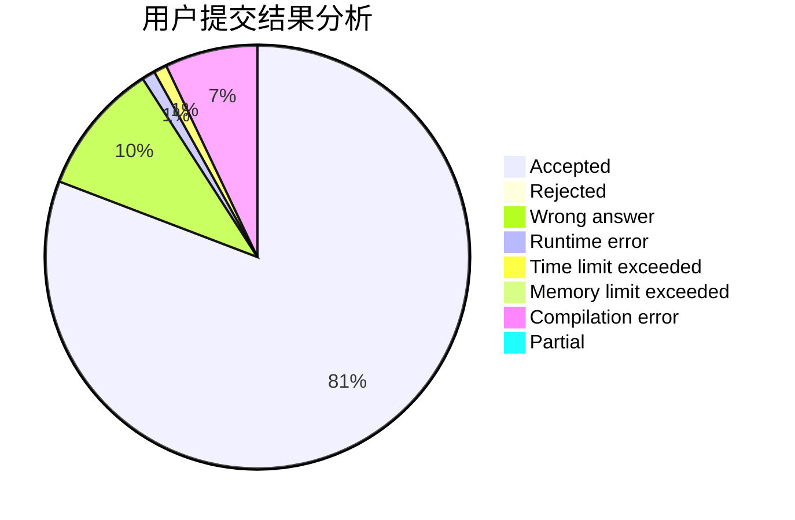
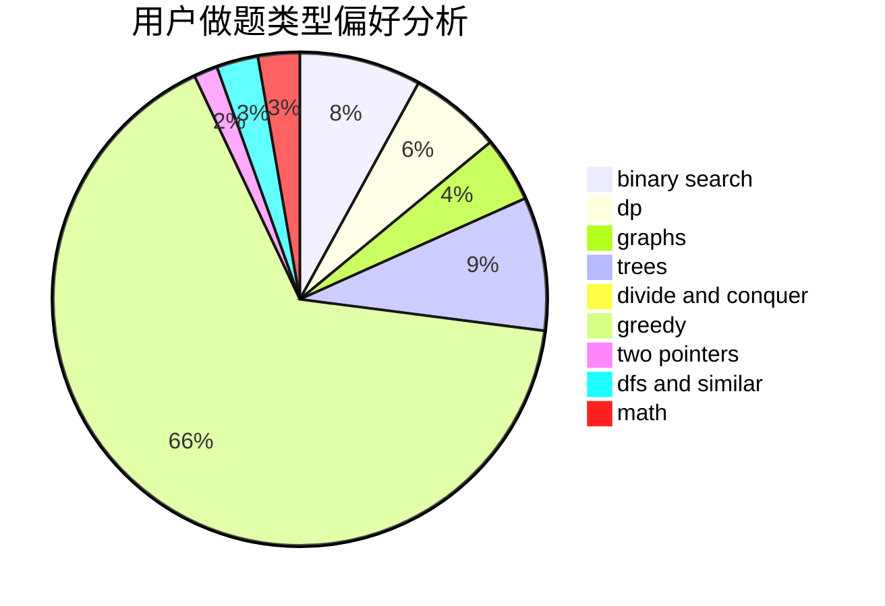

# Spacelessd

<!-- tabs:start -->

#### **用户提交结果分析**

#### **用户做题类型偏好分析**

<!-- tabs:end -->
# 推荐题目
[1437G](https://codeforces.com/contest/1437/problem/G)
[1509F](https://codeforces.com/contest/1509/problem/F)
[12471](https://codeforces.com/contest/1247/problem/1)
[576C](https://codeforces.com/contest/576/problem/C)
[246A](https://codeforces.com/contest/246/problem/A)
[141B](https://codeforces.com/contest/141/problem/B)
[862E](https://codeforces.com/contest/862/problem/E)
[1119G](https://codeforces.com/contest/1119/problem/G)
[765F](https://codeforces.com/contest/765/problem/F)
[979D](https://codeforces.com/contest/979/problem/D)
