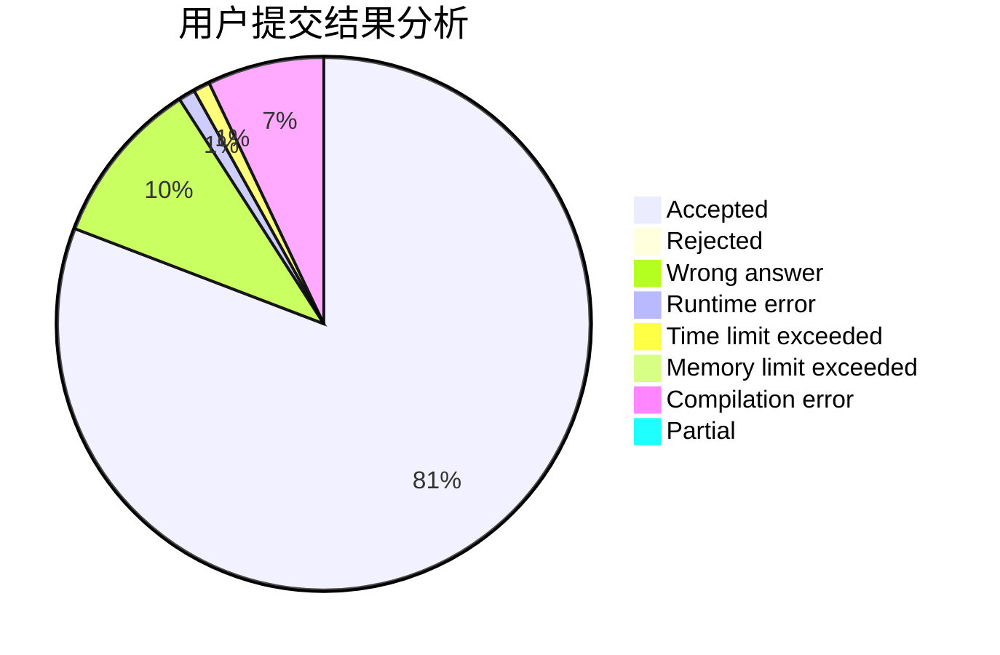
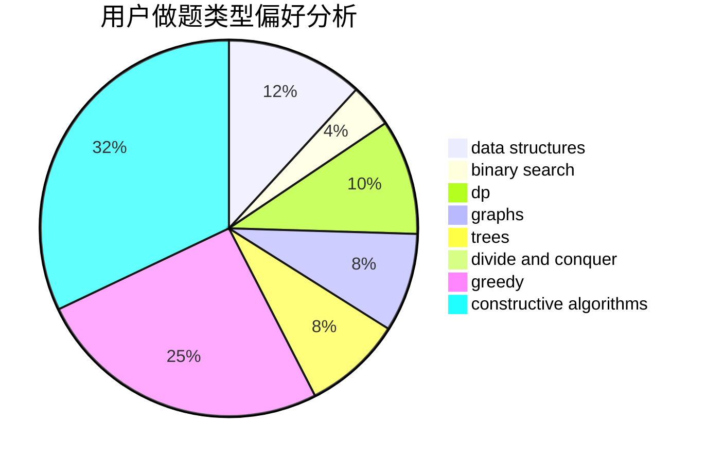
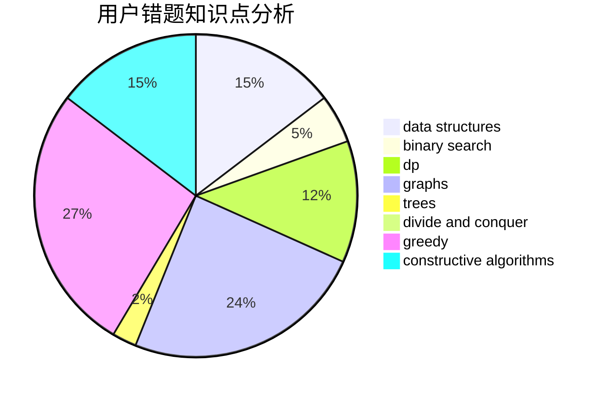

# Spacelessd

<!-- tabs:start -->

#### **用户提交结果分析**

#### **用户做题类型偏好分析**

#### **用户错题知识点分析**

<!-- tabs:end -->
# 推荐题目
[1437G](https://codeforces.com/contest/1437/problem/G)		data structures,
                        string suffix structures,
                        strings,
                        trees		  
[1509F](https://codeforces.com/contest/1509/problem/F)		dsu,graphs,sortings,trees		  
[12471](https://codeforces.com/contest/1247/problem/1)		dsu,graphs,sortings,trees		  
[576C](https://codeforces.com/contest/576/problem/C)		constructive algorithms,
                        divide and conquer,
                        geometry,
                        greedy,
                        sortings		  
[246A](https://codeforces.com/contest/246/problem/A)		constructive algorithms,
                        greedy,
                        sortings		  
[141B](https://codeforces.com/contest/141/problem/B)		geometry,
                        math		  
[862E](https://codeforces.com/contest/862/problem/E)		binary search,
                        data structures,
                        sortings		  
[1119G](https://codeforces.com/contest/1119/problem/G)		constructive algorithms,
                        implementation		  
[765F](https://codeforces.com/contest/765/problem/F)		data structures		  
[979D](https://codeforces.com/contest/979/problem/D)		binary search,
                        bitmasks,
                        brute force,
                        data structures,
                        dp,
                        dsu,
                        greedy,
                        math,
                        number theory,
                        strings,
                        trees		  
