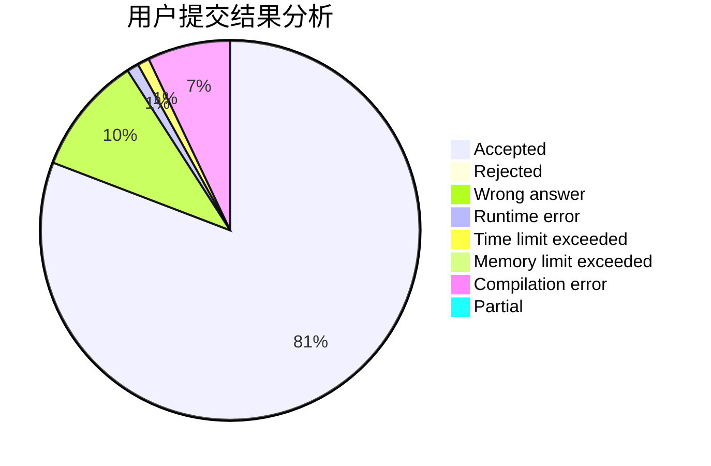
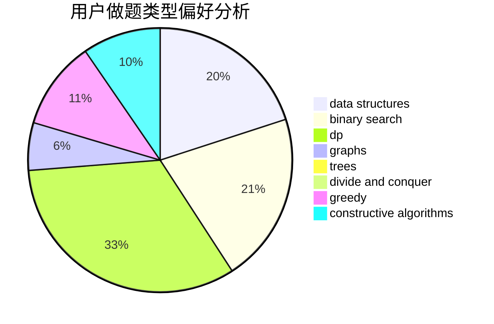
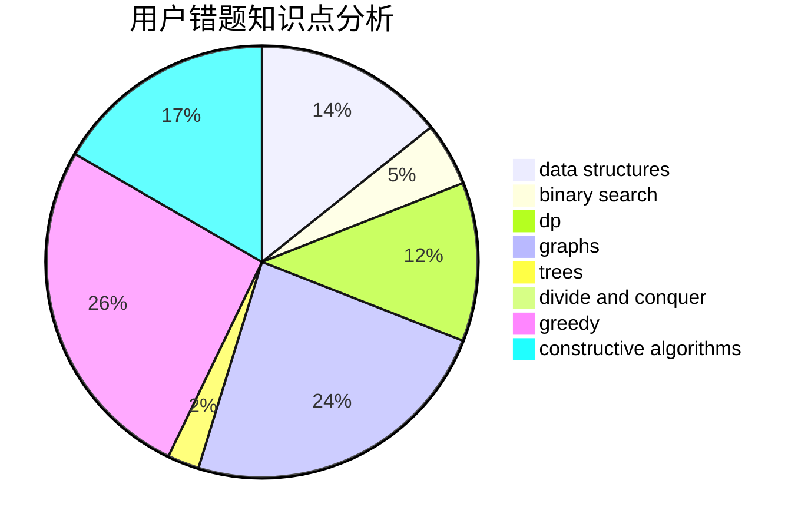

# Spacelessd

<!-- tabs:start -->

#### **用户提交结果分析**

#### **用户做题类型偏好分析**

#### **用户错题知识点分析**

<!-- tabs:end -->
# 推荐题目
[1428G1](https://codeforces.com/contest/1428G/problem/1)		dp,
                        greedy		  
[1499F](https://codeforces.com/contest/1499/problem/F)		combinatorics,
                        dfs and similar,
                        dp,
                        trees		  
[1241C](https://codeforces.com/contest/1241/problem/C)		dsu,graphs,sortings,trees		  
[551B](https://codeforces.com/contest/551/problem/B)		brute force,
                        constructive algorithms,
                        implementation,
                        strings		  
[226E](https://codeforces.com/contest/226/problem/E)		data structures,
                        trees		  
[1409C](https://codeforces.com/contest/1409/problem/C)		brute force,
                        math,
                        number theory		  
[843D](https://codeforces.com/contest/843/problem/D)		graphs,
                        shortest paths		  
[1118B](https://codeforces.com/contest/1118/problem/B)		implementation		  
[746D](https://codeforces.com/contest/746/problem/D)		constructive algorithms,
                        greedy,
                        math		  
[958B1](https://codeforces.com/contest/958B/problem/1)		implementation		  
