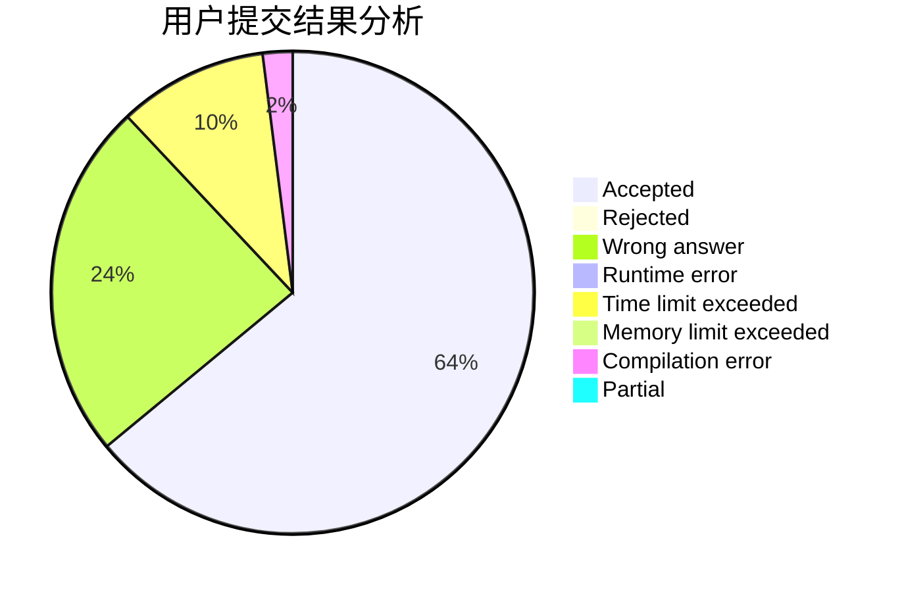
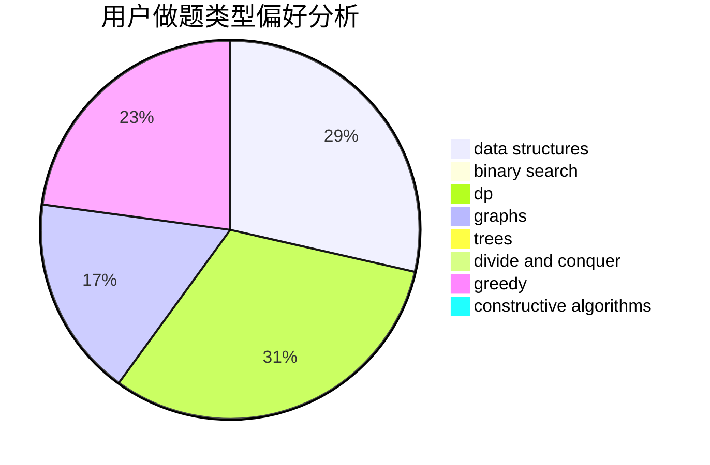
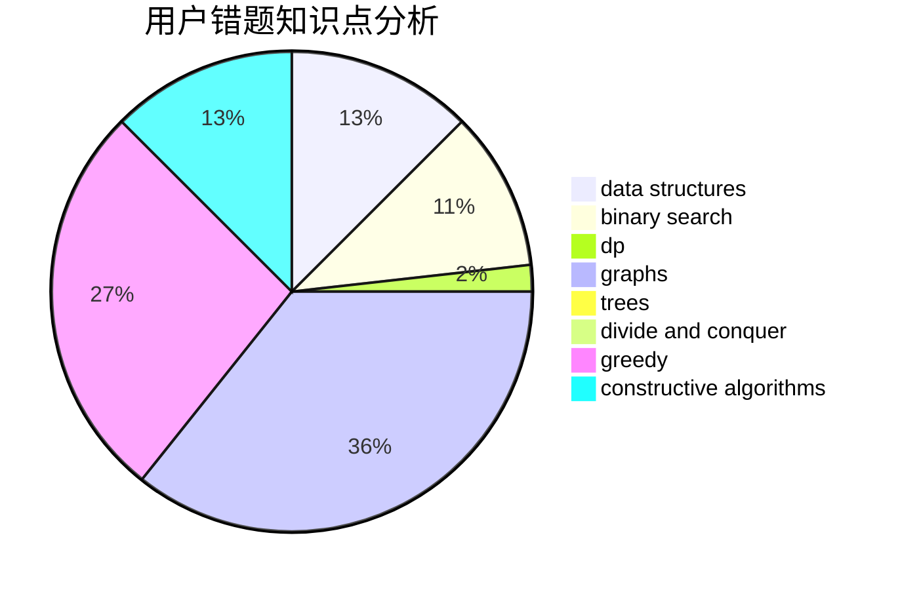

# Sparky_14145

<!-- tabs:start -->

#### **用户提交结果分析**

#### **用户做题类型偏好分析**

#### **用户错题知识点分析**

<!-- tabs:end -->
# 推荐题目
[343A](https://codeforces.com/contest/343/problem/A)		math,
                        number theory		  
[960A](https://codeforces.com/contest/960/problem/A)		implementation		  
[22E](https://codeforces.com/contest/22/problem/E)		dfs and similar,
                        graphs,
                        trees		  
[1365G](https://codeforces.com/contest/1365/problem/G)		bitmasks,
                        combinatorics,
                        constructive algorithms,
                        interactive,
                        math		  
[977A](https://codeforces.com/contest/977/problem/A)		implementation		  
[1272F](https://codeforces.com/contest/1272/problem/F)		dp,
                        strings,
                        two pointers		  
[733A](https://codeforces.com/contest/733/problem/A)		implementation		  
[1174D](https://codeforces.com/contest/1174/problem/D)		bitmasks,
                        constructive algorithms		  
[545D](https://codeforces.com/contest/545/problem/D)		greedy,
                        implementation,
                        sortings		  
[1155B](https://codeforces.com/contest/1155/problem/B)		games,
                        greedy,
                        implementation		  
