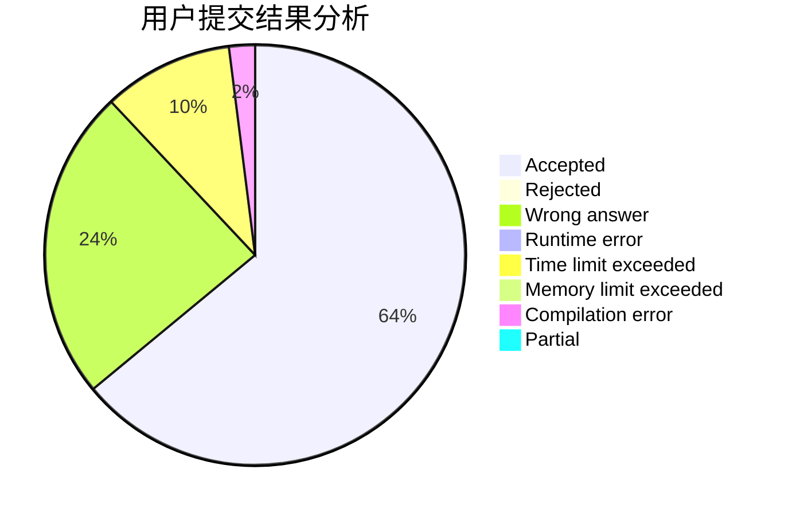
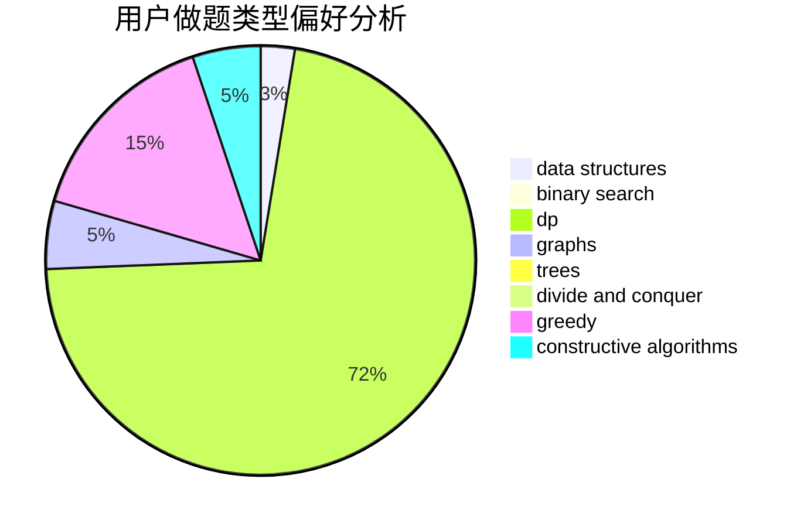
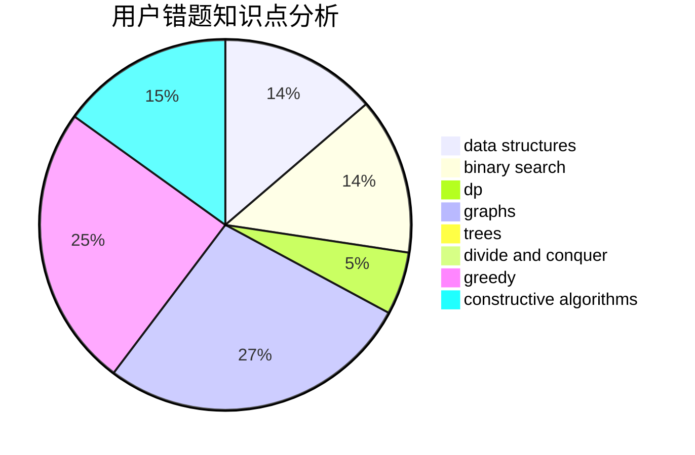

# Sparky_14145

<!-- tabs:start -->

#### **用户提交结果分析**

#### **用户做题类型偏好分析**

#### **用户错题知识点分析**

<!-- tabs:end -->
# 推荐题目
[316E2](https://codeforces.com/contest/316E/problem/2)		data structures,
                        math		  
[938E](https://codeforces.com/contest/938/problem/E)		combinatorics,
                        math		  
[208C](https://codeforces.com/contest/208/problem/C)		dp,
                        graphs,
                        shortest paths		  
[1357D5](https://codeforces.com/contest/1357D/problem/5)		nan		  
[955A](https://codeforces.com/contest/955/problem/A)		greedy,
                        math		  
[1267C](https://codeforces.com/contest/1267/problem/C)		constructive algorithms		  
[714B](https://codeforces.com/contest/714/problem/B)		implementation,
                        sortings		  
[1172B](https://codeforces.com/contest/1172/problem/B)		combinatorics,
                        dfs and similar,
                        dp,
                        trees		  
[51F](https://codeforces.com/contest/51/problem/F)		dfs and similar,
                        dp,
                        graphs,
                        trees		  
[1153B](https://codeforces.com/contest/1153/problem/B)		constructive algorithms,
                        greedy		  
