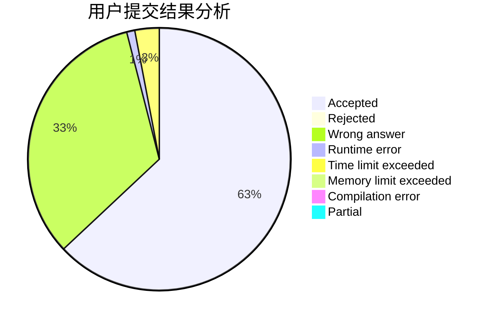
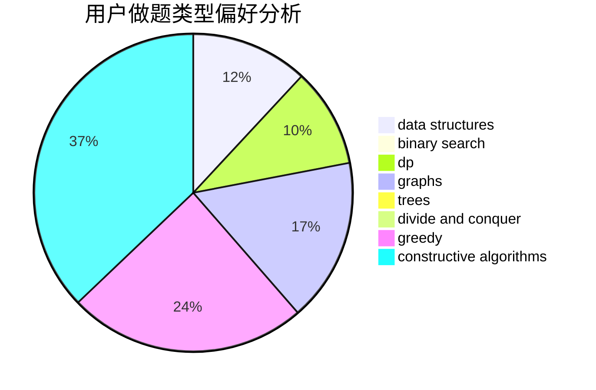
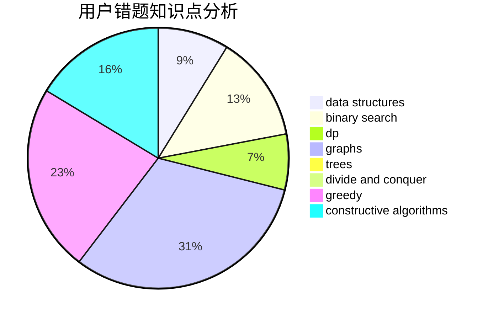

# Sparrow_Guo
<!-- tabs:start -->
#### **用户提交结果分析**

#### **用户做题类型偏好分析**

#### **用户错题知识点分析**

<!-- tabs:end -->
# 推荐题目
[Souvenirs](http://codeforces.com/problemset/problem/765/F)		data structures		  
[Strange List](http://codeforces.com/problemset/problem/1471/B)		brute force,
                        greedy,
                        implementation,
                        math		  
[Captain Flint and Crew Recruitment](http://codeforces.com/problemset/problem/1388/A)		brute force,
                        greedy,
                        math,
                        number theory		  
[Sea Battle](http://codeforces.com/problemset/problem/1131/A)		math		  
[Azamon Web Services](http://codeforces.com/problemset/problem/1281/B)		greedy		  
[Little Artem and Random Variable](https://codeforces.com/contest/668/problem/C)		dp,
                        implementation,
                        math,
                        probabilities		  
[Fake News (easy)](http://codeforces.com/problemset/problem/802/G)		implementation,
                        strings		  
[Babaei and Birthday Cake](http://codeforces.com/problemset/problem/629/D)		data structures,
                        dp		  
[Nested Segments](http://codeforces.com/problemset/problem/652/D)		data structures,
                        sortings		  
[New Year Cards](http://codeforces.com/problemset/problem/140/B)		brute force,
                        greedy,
                        implementation		  
<!-- tabs:start -->
#### **data structures**
[Souvenirs](http://codeforces.com/problemset/problem/765/F)		data structures		  
[Strange List](http://codeforces.com/problemset/problem/629/D)		data structures,
                        dp		  
[Captain Flint and Crew Recruitment](http://codeforces.com/problemset/problem/652/D)		data structures,
                        sortings		  
[Sea Battle](https://codeforces.com/contest/740/problem/D)		binary search,
                        data structures,
                        dfs and similar,
                        graphs,
                        trees		  
[Azamon Web Services](http://codeforces.com/problemset/problem/1070/B)		data structures,
                        greedy		  
[Little Artem and Random Variable](http://codeforces.com/problemset/problem/1109/F)		data structures,
                        trees		  
[Fake News (easy)](http://codeforces.com/problemset/problem/1492/C)		binary search,
                        data structures,
                        dp,
                        greedy,
                        two pointers		  
[Babaei and Birthday Cake](http://codeforces.com/problemset/problem/1490/G)		binary search,
                        data structures,
                        math		  
[Nested Segments](http://codeforces.com/problemset/problem/1479/D)		binary search,
                        bitmasks,
                        brute force,
                        data structures,
                        probabilities,
                        trees		  
[New Year Cards](http://codeforces.com/problemset/problem/1497/A)		brute force,
                        data structures,
                        greedy,
                        sortings		  
#### **binary search**
[Souvenirs](http://codeforces.com/problemset/problem/760/B)		binary search,
                        greedy		  
[Strange List](https://codeforces.com/contest/740/problem/D)		binary search,
                        data structures,
                        dfs and similar,
                        graphs,
                        trees		  
[Captain Flint and Crew Recruitment](http://codeforces.com/problemset/problem/1060/C)		binary search,
                        implementation,
                        two pointers		  
[Sea Battle](http://codeforces.com/problemset/problem/1492/C)		binary search,
                        data structures,
                        dp,
                        greedy,
                        two pointers		  
[Azamon Web Services](http://codeforces.com/problemset/problem/1463/D)		binary search,
                        constructive algorithms,
                        greedy,
                        two pointers		  
[Little Artem and Random Variable](http://codeforces.com/problemset/problem/1490/G)		binary search,
                        data structures,
                        math		  
[Fake News (easy)](http://codeforces.com/problemset/problem/1479/D)		binary search,
                        bitmasks,
                        brute force,
                        data structures,
                        probabilities,
                        trees		  
[Babaei and Birthday Cake](http://codeforces.com/problemset/problem/1436/E)		binary search,
                        data structures,
                        two pointers		  
[Nested Segments](http://codeforces.com/problemset/problem/1461/D)		binary search,
                        brute force,
                        data structures,
                        divide and conquer,
                        implementation,
                        sortings		  
[New Year Cards](http://codeforces.com/problemset/problem/1493/C)		binary search,
                        brute force,
                        constructive algorithms,
                        greedy,
                        strings		  
#### **dp**
[Souvenirs](https://codeforces.com/contest/668/problem/C)		dp,
                        implementation,
                        math,
                        probabilities		  
[Strange List](http://codeforces.com/problemset/problem/629/D)		data structures,
                        dp		  
[Captain Flint and Crew Recruitment](http://codeforces.com/problemset/problem/546/D)		constructive algorithms,
                        dp,
                        math,
                        number theory		  
[Sea Battle](http://codeforces.com/problemset/problem/140/E)		combinatorics,
                        dp		  
[Azamon Web Services](http://codeforces.com/problemset/problem/1193/A)		*special problem,
                        dp,
                        math		  
[Little Artem and Random Variable](http://codeforces.com/problemset/problem/710/E)		dfs and similar,
                        dp		  
[Fake News (easy)](http://codeforces.com/problemset/problem/1499/D)		dp,
                        math,
                        number theory		  
[Babaei and Birthday Cake](https://codeforces.com/contest/871/problem/A)		dp,
                        greedy,
                        math,
                        number theory		  
[Nested Segments](http://codeforces.com/problemset/problem/1172/C1)		dp,
                        probabilities		  
[New Year Cards](http://codeforces.com/problemset/problem/1492/C)		binary search,
                        data structures,
                        dp,
                        greedy,
                        two pointers		  
#### **graph**
[Souvenirs](https://codeforces.com/contest/740/problem/D)		binary search,
                        data structures,
                        dfs and similar,
                        graphs,
                        trees		  
[Strange List](http://codeforces.com/problemset/problem/269/C)		constructive algorithms,
                        flows,
                        graphs,
                        greedy		  
[Captain Flint and Crew Recruitment](https://codeforces.com/contest/791/problem/B)		dfs and similar,
                        dsu,
                        graphs		  
[Sea Battle](http://codeforces.com/problemset/problem/1510/K)		brute force,
                        graphs,
                        implementation		  
[Azamon Web Services](http://codeforces.com/problemset/problem/300/B)		brute force,
                        dfs and similar,
                        graphs		  
[Little Artem and Random Variable](http://codeforces.com/problemset/problem/1167/C)		dfs and similar,
                        dsu,
                        graphs		  
[Fake News (easy)](http://codeforces.com/problemset/problem/1242/E)		constructive algorithms,
                        graphs		  
[Babaei and Birthday Cake](http://codeforces.com/problemset/problem/1487/C)		brute force,
                        constructive algorithms,
                        dfs and similar,
                        graphs,
                        greedy,
                        implementation,
                        math		  
[Nested Segments](http://codeforces.com/problemset/problem/1437/C)		dp,
                        flows,
                        graph matchings,
                        greedy,
                        math,
                        sortings		  
[New Year Cards](http://codeforces.com/problemset/problem/1470/D)		constructive algorithms,
                        dfs and similar,
                        graph matchings,
                        graphs,
                        greedy		  
#### **trees**
[Souvenirs](https://codeforces.com/contest/740/problem/D)		binary search,
                        data structures,
                        dfs and similar,
                        graphs,
                        trees		  
[Strange List](http://codeforces.com/problemset/problem/1109/F)		data structures,
                        trees		  
[Captain Flint and Crew Recruitment](http://codeforces.com/problemset/problem/1479/D)		binary search,
                        bitmasks,
                        brute force,
                        data structures,
                        probabilities,
                        trees		  
[Sea Battle](http://codeforces.com/problemset/problem/1511/C)		brute force,
                        data structures,
                        implementation,
                        trees		  
[Azamon Web Services](http://codeforces.com/problemset/problem/1499/F)		combinatorics,
                        dfs and similar,
                        dp,
                        trees		  
[Little Artem and Random Variable](http://codeforces.com/problemset/problem/1491/E)		brute force,
                        dfs and similar,
                        divide and conquer,
                        number theory,
                        trees		  
[Fake News (easy)](http://codeforces.com/problemset/problem/1466/D)		data structures,
                        greedy,
                        sortings,
                        trees		  
[Babaei and Birthday Cake](http://codeforces.com/problemset/problem/1495/D)		combinatorics,
                        dfs and similar,
                        graphs,
                        math,
                        shortest paths,
                        trees		  
[Nested Segments](http://codeforces.com/problemset/problem/1303/G)		data structures,
                        divide and conquer,
                        geometry,
                        trees		  
[New Year Cards](http://codeforces.com/problemset/problem/1454/E)		combinatorics,
                        dfs and similar,
                        graphs,
                        trees		  
#### **divide and conquer**
[Souvenirs](http://codeforces.com/problemset/problem/1461/D)		binary search,
                        brute force,
                        data structures,
                        divide and conquer,
                        implementation,
                        sortings		  
[Strange List](http://codeforces.com/problemset/problem/1466/G)		combinatorics,
                        divide and conquer,
                        hashing,
                        math,
                        string suffix structures,
                        strings		  
[Captain Flint and Crew Recruitment](http://codeforces.com/problemset/problem/1490/D)		dfs and similar,
                        divide and conquer,
                        implementation		  
[Sea Battle](https://codeforces.com/contest/1483/problem/C)		data structures,
                        divide and conquer,
                        dp		  
[Azamon Web Services](http://codeforces.com/problemset/problem/1491/E)		brute force,
                        dfs and similar,
                        divide and conquer,
                        number theory,
                        trees		  
[Little Artem and Random Variable](http://codeforces.com/problemset/problem/1303/G)		data structures,
                        divide and conquer,
                        geometry,
                        trees		  
[Fake News (easy)](http://codeforces.com/problemset/problem/1494/D)		constructive algorithms,
                        data structures,
                        dfs and similar,
                        divide and conquer,
                        dsu,
                        greedy,
                        sortings,
                        trees		  
[Babaei and Birthday Cake](http://codeforces.com/problemset/problem/1482/E)		data structures,
                        divide and conquer,
                        dp		  
[Nested Segments](http://codeforces.com/problemset/problem/566/C)		dfs and similar,
                        divide and conquer,
                        trees		  
[New Year Cards](http://codeforces.com/problemset/problem/1428/F)		binary search,
                        data structures,
                        divide and conquer,
                        dp,
                        two pointers		  
#### **greedy**
[Souvenirs](http://codeforces.com/problemset/problem/1471/B)		brute force,
                        greedy,
                        implementation,
                        math		  
[Strange List](http://codeforces.com/problemset/problem/1388/A)		brute force,
                        greedy,
                        math,
                        number theory		  
[Captain Flint and Crew Recruitment](http://codeforces.com/problemset/problem/1281/B)		greedy		  
[Sea Battle](http://codeforces.com/problemset/problem/140/B)		brute force,
                        greedy,
                        implementation		  
[Azamon Web Services](http://codeforces.com/problemset/problem/760/B)		binary search,
                        greedy		  
[Little Artem and Random Variable](http://codeforces.com/problemset/problem/1070/B)		data structures,
                        greedy		  
[Fake News (easy)](http://codeforces.com/problemset/problem/269/C)		constructive algorithms,
                        flows,
                        graphs,
                        greedy		  
[Babaei and Birthday Cake](http://codeforces.com/problemset/problem/570/B)		constructive algorithms,
                        games,
                        greedy,
                        implementation,
                        math		  
[Nested Segments](http://codeforces.com/problemset/problem/1418/B)		greedy,
                        sortings		  
[New Year Cards](https://codeforces.com/contest/871/problem/A)		dp,
                        greedy,
                        math,
                        number theory		  
#### **constructive algorithms**
[Souvenirs](http://codeforces.com/problemset/problem/546/D)		constructive algorithms,
                        dp,
                        math,
                        number theory		  
[Strange List](http://codeforces.com/problemset/problem/756/A)		constructive algorithms,
                        dfs and similar		  
[Captain Flint and Crew Recruitment](http://codeforces.com/problemset/problem/1355/F)		constructive algorithms,
                        interactive,
                        number theory		  
[Sea Battle](http://codeforces.com/problemset/problem/269/C)		constructive algorithms,
                        flows,
                        graphs,
                        greedy		  
[Azamon Web Services](http://codeforces.com/problemset/problem/679/A)		constructive algorithms,
                        interactive,
                        math		  
[Little Artem and Random Variable](http://codeforces.com/problemset/problem/570/B)		constructive algorithms,
                        games,
                        greedy,
                        implementation,
                        math		  
[Fake News (easy)](http://codeforces.com/problemset/problem/1242/E)		constructive algorithms,
                        graphs		  
[Babaei and Birthday Cake](http://codeforces.com/problemset/problem/1493/A)		constructive algorithms,
                        greedy		  
[Nested Segments](http://codeforces.com/problemset/problem/1463/D)		binary search,
                        constructive algorithms,
                        greedy,
                        two pointers		  
[New Year Cards](https://codeforces.com/contest/1456/problem/B)		bitmasks,
                        brute force,
                        constructive algorithms		  
#### **sortings**
[Souvenirs](http://codeforces.com/problemset/problem/652/D)		data structures,
                        sortings		  
[Strange List](http://codeforces.com/problemset/problem/1418/B)		greedy,
                        sortings		  
[Captain Flint and Crew Recruitment](https://codeforces.com/contest/1496/problem/C)		geometry,
                        greedy,
                        math,
                        sortings		  
[Sea Battle](http://codeforces.com/problemset/problem/1495/A)		geometry,
                        greedy,
                        math,
                        sortings		  
[Azamon Web Services](http://codeforces.com/problemset/problem/1497/A)		brute force,
                        data structures,
                        greedy,
                        sortings		  
[Little Artem and Random Variable](http://codeforces.com/problemset/problem/1427/A)		math,
                        sortings		  
[Fake News (easy)](http://codeforces.com/problemset/problem/1461/D)		binary search,
                        brute force,
                        data structures,
                        divide and conquer,
                        implementation,
                        sortings		  
[Babaei and Birthday Cake](http://codeforces.com/problemset/problem/1437/C)		dp,
                        flows,
                        graph matchings,
                        greedy,
                        math,
                        sortings		  
[Nested Segments](http://codeforces.com/problemset/problem/1473/A)		greedy,
                        implementation,
                        math,
                        sortings		  
[New Year Cards](http://codeforces.com/problemset/problem/1486/B)		binary search,
                        geometry,
                        shortest paths,
                        sortings		  
<!-- tabs:end -->
