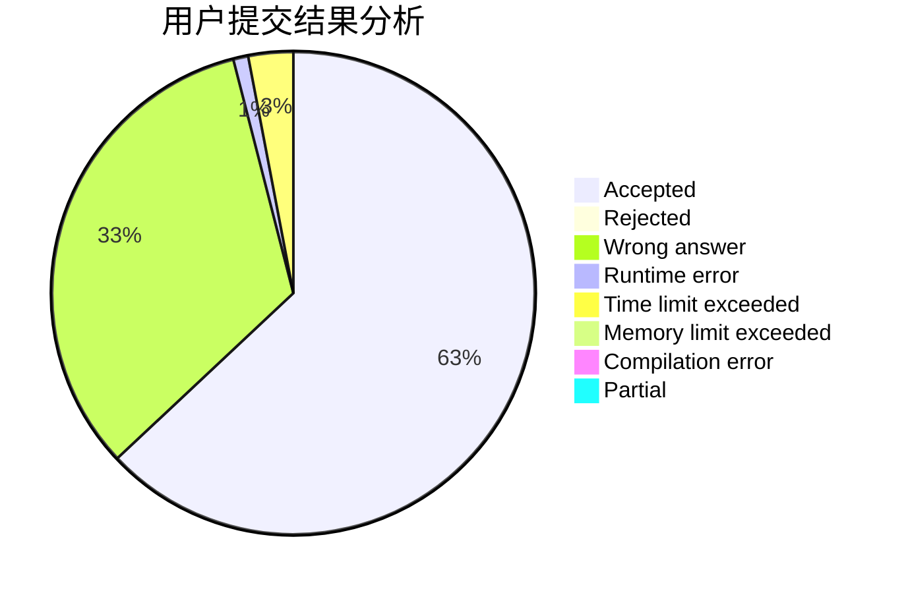
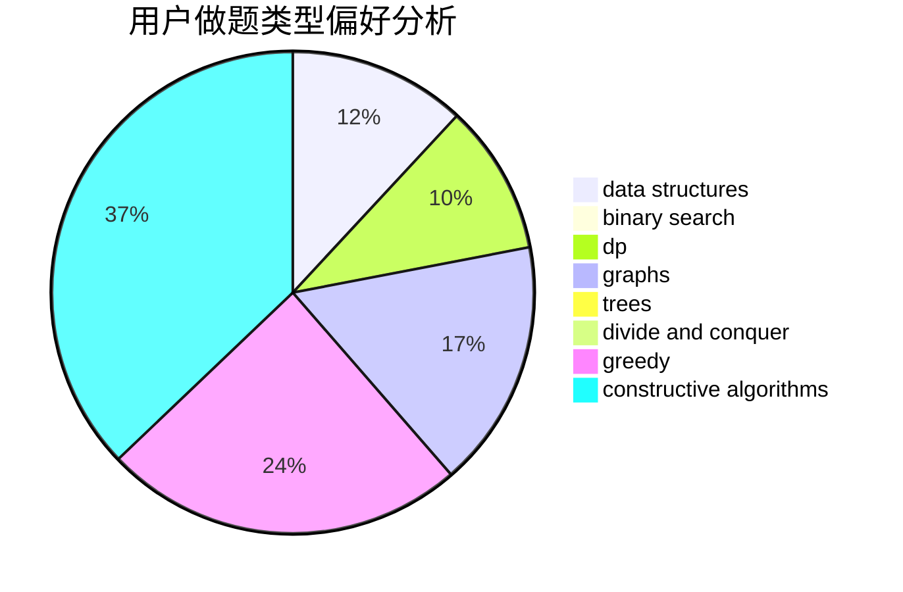
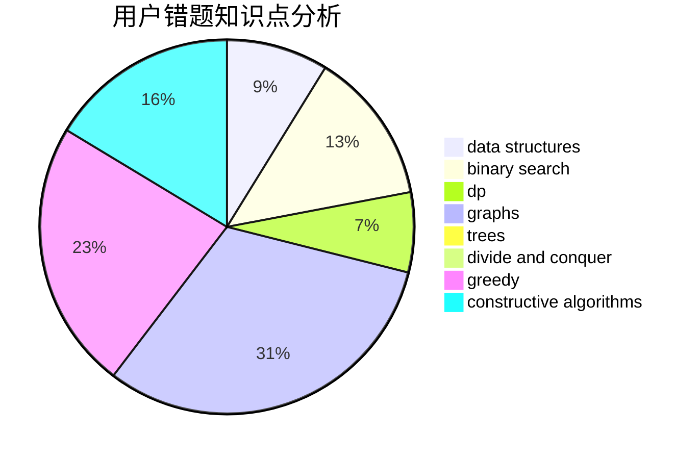

# Sparrow_Guo

<!-- tabs:start -->

#### **用户提交结果分析**

#### **用户做题类型偏好分析**

#### **用户错题知识点分析**

<!-- tabs:end -->
# 推荐题目
[140E](https://codeforces.com/contest/140/problem/E)		combinatorics,
                        dp		  
[1471B](https://codeforces.com/contest/1471/problem/B)		brute force,
                        greedy,
                        implementation,
                        math		  
[1281B](https://codeforces.com/contest/1281/problem/B)		greedy		  
[1388A](https://codeforces.com/contest/1388/problem/A)		brute force,
                        greedy,
                        math,
                        number theory		  
[1131A](https://codeforces.com/contest/1131/problem/A)		math		  
[1145D](https://codeforces.com/contest/1145/problem/D)		implementation		  
[1060C](https://codeforces.com/contest/1060/problem/C)		binary search,
                        implementation,
                        two pointers		  
[652D](https://codeforces.com/contest/652/problem/D)		data structures,
                        sortings		  
[740D](https://codeforces.com/contest/740/problem/D)		dsu,graphs,sortings,trees		  
[952B](https://codeforces.com/contest/952/problem/B)		brute force,
                        interactive		  
