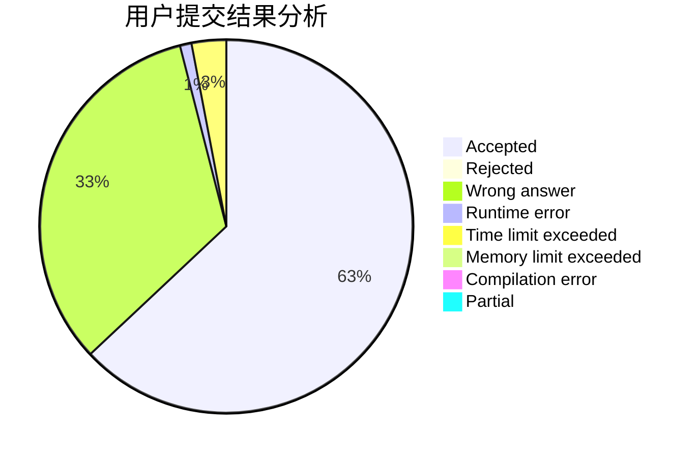
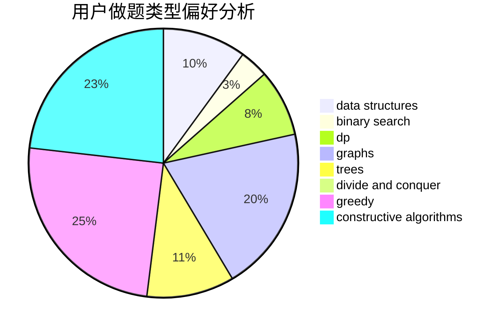
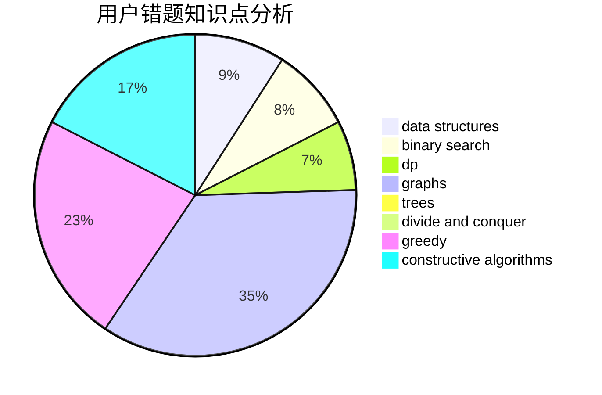

# Sparrow_Guo

<!-- tabs:start -->

#### **用户提交结果分析**

#### **用户做题类型偏好分析**

#### **用户错题知识点分析**

<!-- tabs:end -->
# 推荐题目
[1421A](https://codeforces.com/contest/1421/problem/A)		bitmasks,
                        greedy,
                        math		  
[1479D](https://codeforces.com/contest/1479/problem/D)		binary search,
                        bitmasks,
                        brute force,
                        data structures,
                        probabilities,
                        trees		  
[1287B](https://codeforces.com/contest/1287/problem/B)		brute force,
                        data structures,
                        implementation		  
[1397D](https://codeforces.com/contest/1397/problem/D)		dsu,graphs,sortings,trees		  
[1132G](https://codeforces.com/contest/1132/problem/G)		data structures,
                        dp,
                        trees		  
[1147E](https://codeforces.com/contest/1147/problem/E)		interactive		  
[1060F](https://codeforces.com/contest/1060/problem/F)		combinatorics,
                        dp		  
[676C](https://codeforces.com/contest/676/problem/C)		binary search,
                        dp,
                        strings,
                        two pointers		  
[761F](https://codeforces.com/contest/761/problem/F)		brute force,
                        data structures,
                        dp,
                        implementation		  
[975A](https://codeforces.com/contest/975/problem/A)		implementation,
                        strings		  
