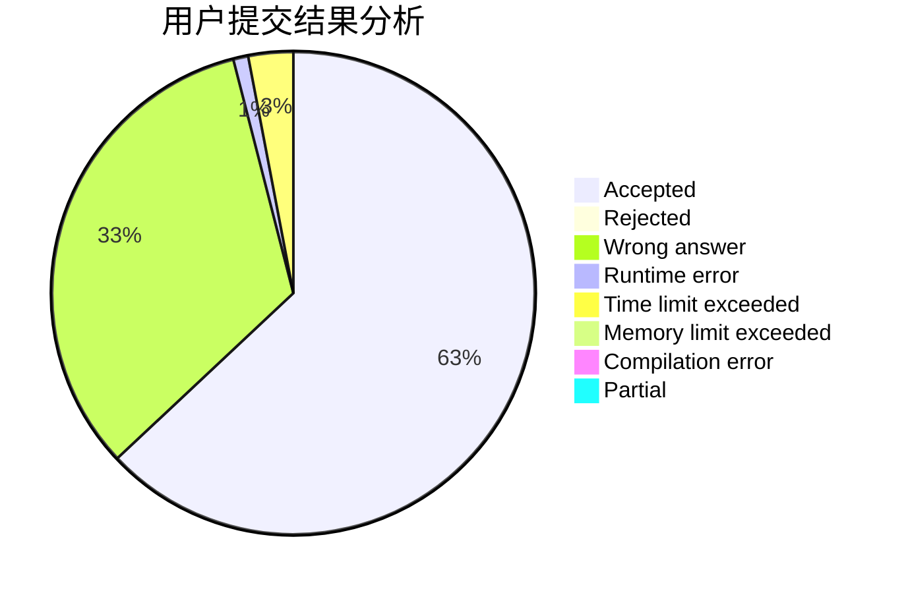
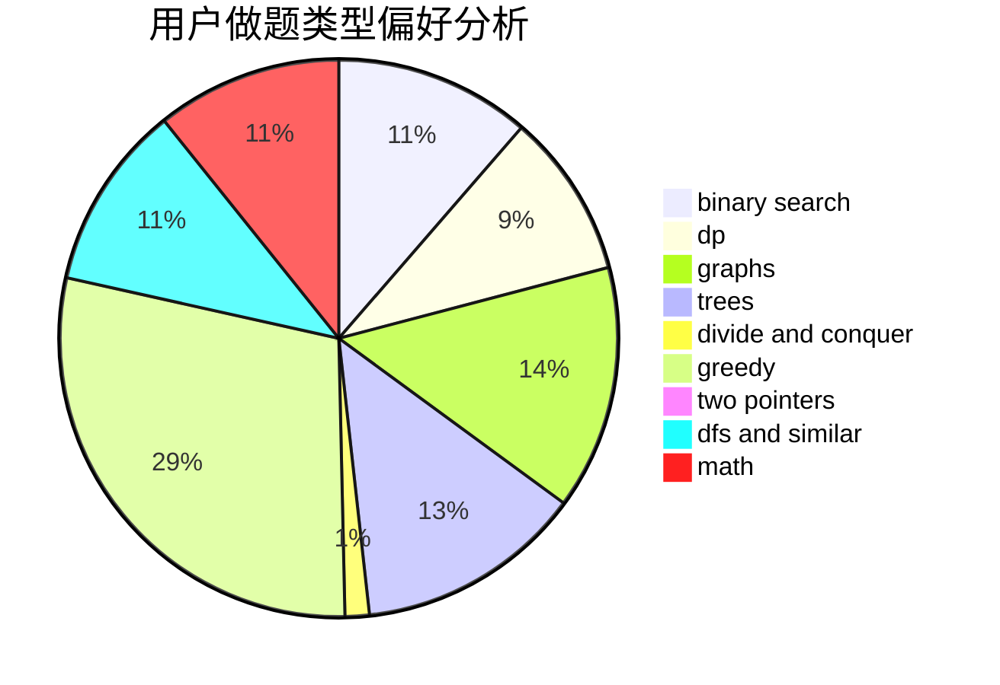

# Sparrow_Guo

<!-- tabs:start -->

#### **用户提交结果分析**

#### **用户做题类型偏好分析**

<!-- tabs:end -->
# 推荐题目
[1421A](https://codeforces.com/contest/1421/problem/A)
[1479D](https://codeforces.com/contest/1479/problem/D)
[1287B](https://codeforces.com/contest/1287/problem/B)
[1397D](https://codeforces.com/contest/1397/problem/D)
[1132G](https://codeforces.com/contest/1132/problem/G)
[1147E](https://codeforces.com/contest/1147/problem/E)
[1060F](https://codeforces.com/contest/1060/problem/F)
[676C](https://codeforces.com/contest/676/problem/C)
[761F](https://codeforces.com/contest/761/problem/F)
[975A](https://codeforces.com/contest/975/problem/A)
