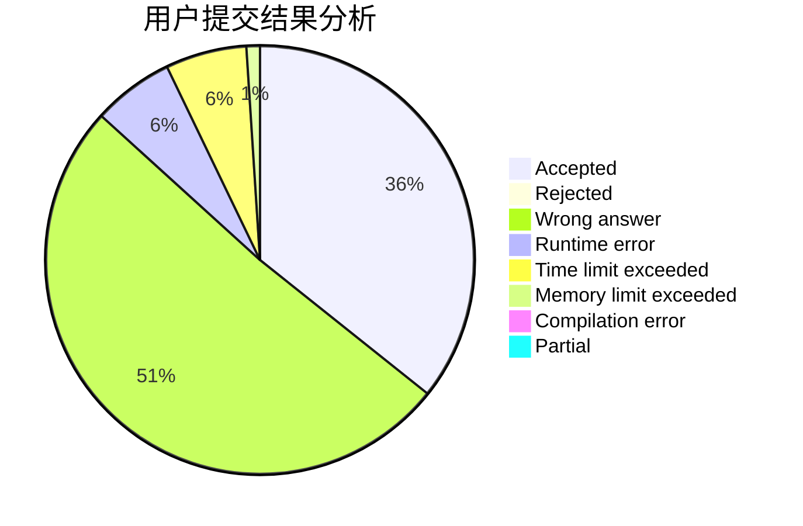
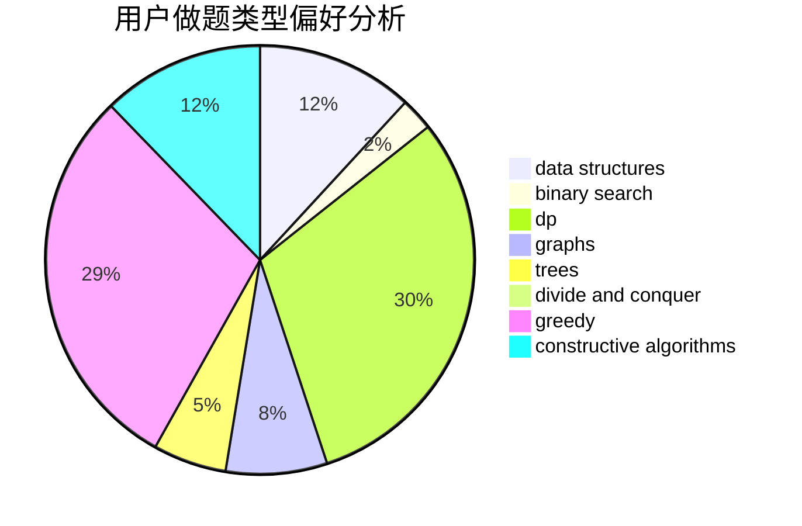
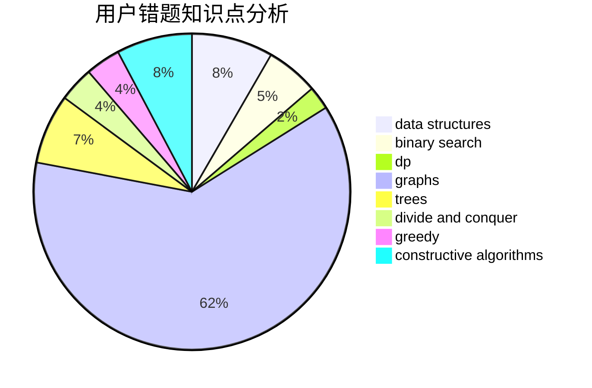

# Spectre2017

<!-- tabs:start -->

#### **用户提交结果分析**

#### **用户做题类型偏好分析**

#### **用户错题知识点分析**

<!-- tabs:end -->
# 推荐题目
[1081E](https://codeforces.com/contest/1081/problem/E)		binary search,
                        constructive algorithms,
                        greedy,
                        math,
                        number theory		  
[1301F](https://codeforces.com/contest/1301/problem/F)		dfs and similar,
                        graphs,
                        implementation,
                        shortest paths		  
[1238F](https://codeforces.com/contest/1238/problem/F)		dfs and similar,
                        dp,
                        graphs,
                        trees		  
[1264A](https://codeforces.com/contest/1264/problem/A)		greedy,
                        implementation		  
[1016E](https://codeforces.com/contest/1016/problem/E)		binary search,
                        geometry		  
[677A](https://codeforces.com/contest/677/problem/A)		implementation		  
[376A](https://codeforces.com/contest/376/problem/A)		implementation,
                        math		  
[888C](https://codeforces.com/contest/888/problem/C)		binary search,
                        implementation,
                        two pointers		  
[594A](https://codeforces.com/contest/594/problem/A)		games		  
[449B](https://codeforces.com/contest/449/problem/B)		graphs,
                        greedy,
                        shortest paths		  
