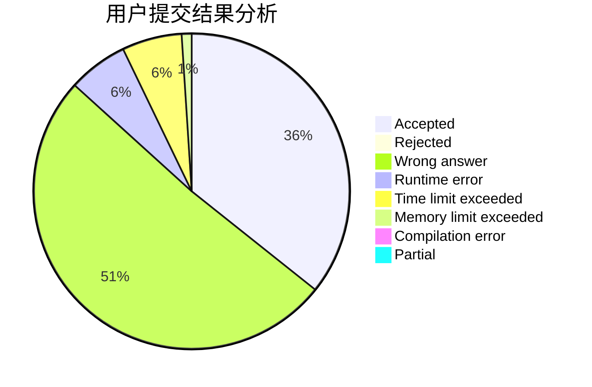
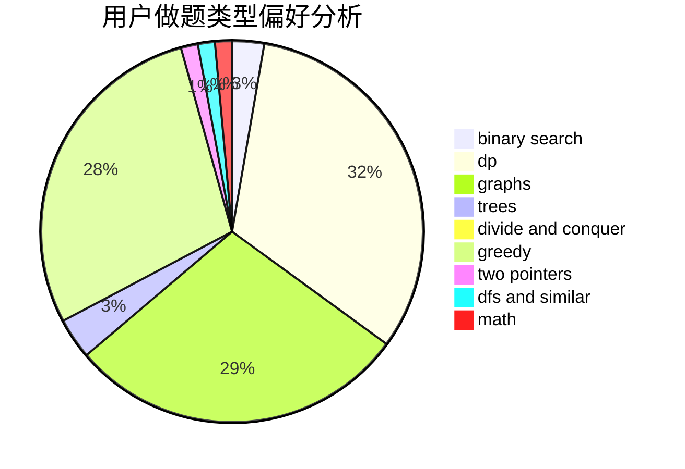

# Spectre2017

<!-- tabs:start -->

#### **用户提交结果分析**

#### **用户做题类型偏好分析**

<!-- tabs:end -->
# 推荐题目
[1082A](https://codeforces.com/contest/1082/problem/A)
[1311C](https://codeforces.com/contest/1311/problem/C)
[1244A](https://codeforces.com/contest/1244/problem/A)
[1269E](https://codeforces.com/contest/1269/problem/E)
[1017A](https://codeforces.com/contest/1017/problem/A)
[701A](https://codeforces.com/contest/701/problem/A)
[404C](https://codeforces.com/contest/404/problem/C)
[908A](https://codeforces.com/contest/908/problem/A)
[612C](https://codeforces.com/contest/612/problem/C)
[468E](https://codeforces.com/contest/468/problem/E)
