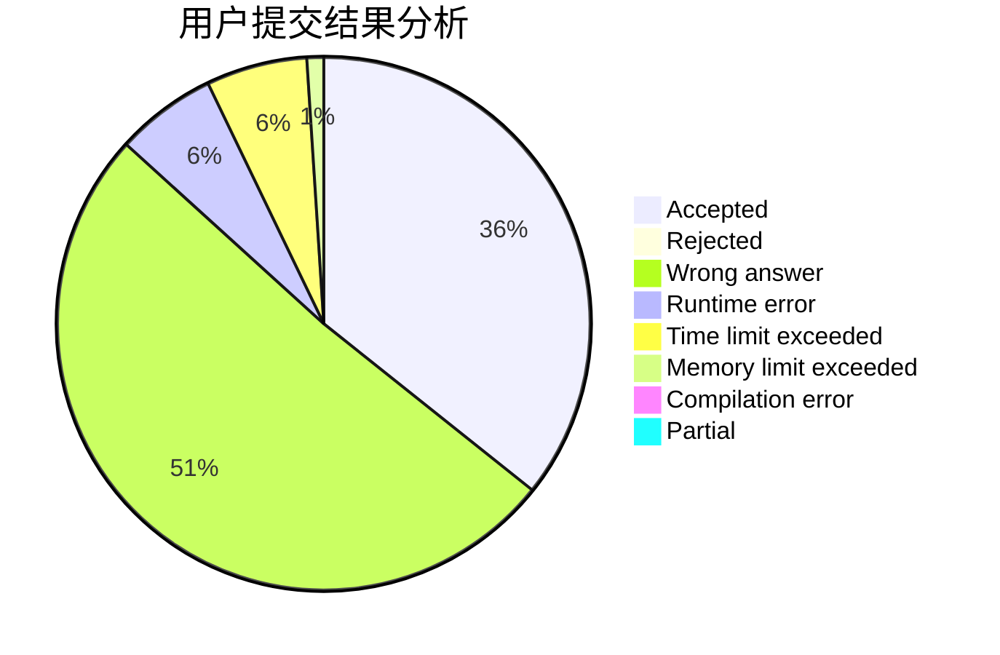
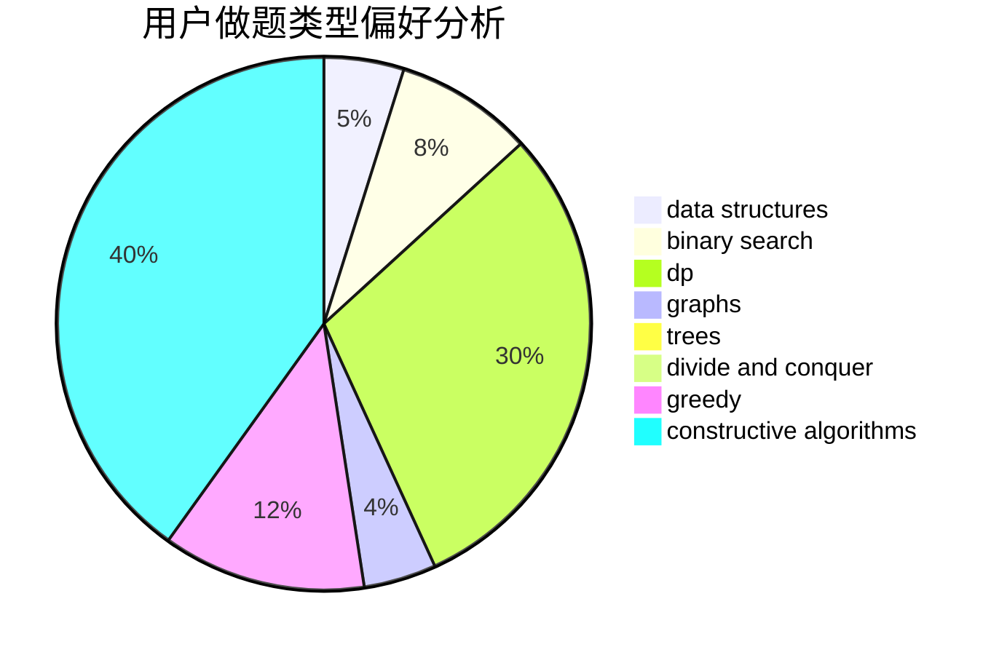
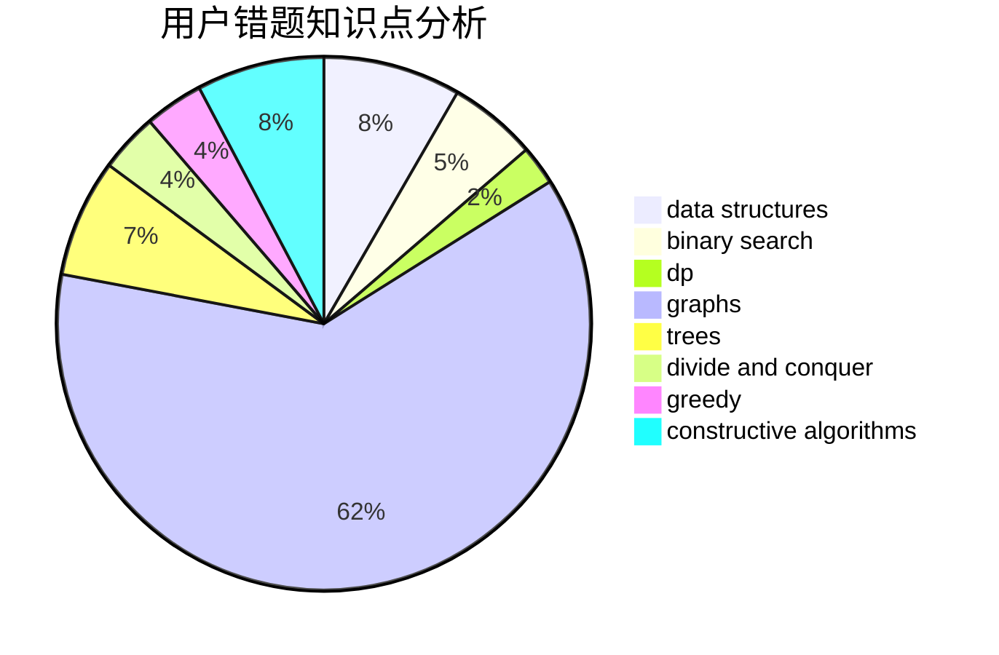

# Spectre2017

<!-- tabs:start -->

#### **用户提交结果分析**

#### **用户做题类型偏好分析**

#### **用户错题知识点分析**

<!-- tabs:end -->
# 推荐题目
[1082A](https://codeforces.com/contest/1082/problem/A)		implementation,
                        math		  
[1311C](https://codeforces.com/contest/1311/problem/C)		brute force		  
[1244A](https://codeforces.com/contest/1244/problem/A)		math		  
[1269E](https://codeforces.com/contest/1269/problem/E)		dsu,graphs,sortings,trees		  
[1017A](https://codeforces.com/contest/1017/problem/A)		implementation		  
[701A](https://codeforces.com/contest/701/problem/A)		greedy,
                        implementation		  
[404C](https://codeforces.com/contest/404/problem/C)		dfs and similar,
                        graphs,
                        sortings		  
[908A](https://codeforces.com/contest/908/problem/A)		brute force,
                        implementation		  
[612C](https://codeforces.com/contest/612/problem/C)		data structures,
                        expression parsing,
                        math		  
[468E](https://codeforces.com/contest/468/problem/E)		dp,
                        graph matchings,
                        math,
                        meet-in-the-middle		  
