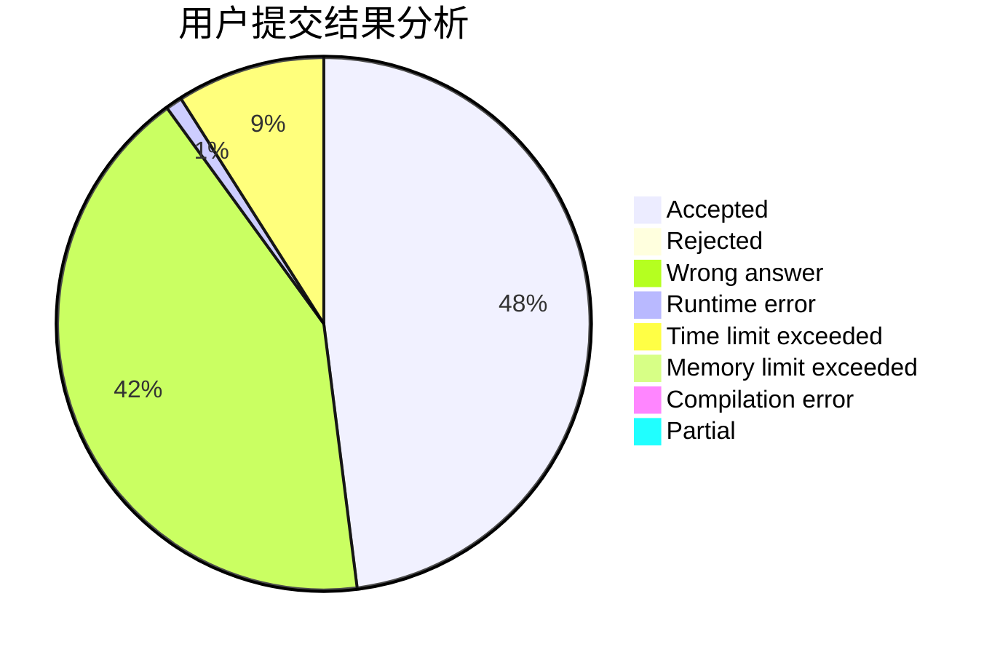
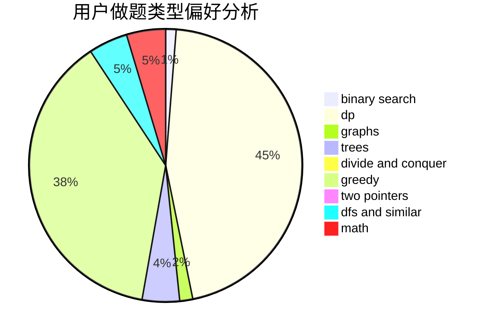

# SrO

<!-- tabs:start -->

#### **用户提交结果分析**

#### **用户做题类型偏好分析**

<!-- tabs:end -->
# 推荐题目
[1488B](https://codeforces.com/contest/1488/problem/B)
[991E](https://codeforces.com/contest/991/problem/E)
[1140D](https://codeforces.com/contest/1140/problem/D)
[12471](https://codeforces.com/contest/1247/problem/1)
[716B](https://codeforces.com/contest/716/problem/B)
[653A](https://codeforces.com/contest/653/problem/A)
[294B](https://codeforces.com/contest/294/problem/B)
[908B](https://codeforces.com/contest/908/problem/B)
[591B](https://codeforces.com/contest/591/problem/B)
[523A](https://codeforces.com/contest/523/problem/A)
